# 🗄️ MASTER SUPABASE — Model Horse Hub Schema Reference

> **Single Source of Truth for all database schema, RLS policies, and RPCs.**
> Update this file whenever a new migration is deployed.
> Last updated: 2026-07-11 | Migration count: 128 (001–128) | SQL files: 124 (045/047/049/051/090 skipped)
> Source: Live production data via `npx supabase inspect db table-sizes --linked` (row-count
> snapshot below predates migrations 117–128 — the Shows v2/Groups Forum/Stable v2 tables plus
> catalog anon-read (124), facets RPC (125/128), market read path (126), and watermark custom
> text (127) aren't reflected in row counts; re-run the inspect command for current sizes)

**Environment:** Supabase Pro (PostgreSQL 15, East US / North Virginia) | Project ref: `bdmwubihwinsxfykjqfe` | Extensions: `pg_trgm` (in `extensions` schema), `uuid-ossp`

---

## 📊 Live Production Metrics (as of 2026-04-03)

**Note:** These metrics are a static snapshot captured on 2026-04-03. Refresh them periodically by running `npx supabase inspect db table-sizes --linked` and updating this file.

| Table | Rows | Total Size | Notes |
|-------|------|-----------|-------|
| `catalog_items` | 10,964 | 12 MB | Largest table — 10 MB indexes (trigram GIN) |
| `user_horses` | 903 | 584 kB | Core inventory, soft-delete |
| `activity_events` | 438 | 272 kB | Legacy feed |
| `horse_images` | 234 | 160 kB | Private bucket |
| `financial_vault` | 179 | 88 kB | Private, owner-only |
| `notifications` | 127 | 176 kB | 330K seq scans — highest traffic |
| `horse_favorites` | 93 | 56 kB | Social engagement |
| `users` | 84 | 128 kB | Auth profiles |
| `user_follows` | 83 | 72 kB | Social graph |
| `horse_collections` | 86 | 104 kB | Collection junction |
| `show_records` | 80 | 152 kB | Provenance |
| `user_badges` | 67 | 64 kB | Gamification |
| `posts` | 48 | 192 kB | Social content |
| `user_collections` | 27 | 48 kB | Named groups |
| `badges` | 24 | 32 kB | Achievement dictionary |
| `rate_limits` | 22 | 64 kB | Rate limiting |
| `messages` | 21 | 96 kB | DM chat |
| `event_classes` | 20 | 64 kB | Competition classes |
| `database_suggestions` | 16 | 64 kB | Catalog additions |
| `transactions` | 15 | 136 kB | Commerce state machine |
| `group_memberships` | 15 | 48 kB | Community |
| `commission_updates` | 13 | 64 kB | Art Studio WIP |
| `conversations` | 12 | 96 kB | DM threads |
| `likes` | 12 | 40 kB | Post engagement |
| `user_wishlists` | 10 | 72 kB | ISO listings |
| `horse_transfers` | 8 | 144 kB | Transfer codes |
| `groups` | 7 | 96 kB | Communities |
| `event_rsvps` | 7 | 48 kB | Attendance |
| `show_string_entries` | 7 | 80 kB | Show Packer |
| `events` | 5 | 88 kB | Shows & meetups |
| `event_divisions` | 5 | 48 kB | Show divisions |
| `show_strings` | 5 | 48 kB | Show Packer strings |
| `horse_ownership_history` | 4 | 64 kB | Transfer chain |
| `artist_profiles` | 4 | 96 kB | Art Studios |
| `reviews` | 3 | 96 kB | Transaction ratings |
| `event_entries` | 3 | 120 kB | Show entries |
| `catalog_suggestions` | 3 | 112 kB | Catalog curation |
| `catalog_changelog` | 3 | 112 kB | Catalog audit log |
| `commissions` | 2 | 96 kB | Art commissions |
| `id_requests` | 2 | 64 kB | Help ID |

**Total active tables:** 61 in the last live snapshot **+ 13 added by migrations 117–123**
(see "Shows v2 / Groups Forum / Stable v2 Domain" below) = 74, including legacy retained for
FK integrity
**Total database size:** ~16 MB as of the last snapshot (compact — Supabase Pro well within limits; re-check after the new domain accumulates data)

---

## Table Overview by Domain

### 🐴 Core Inventory

- **`users`** *(84 rows, 128 kB)* — User profiles linked to Supabase Auth via `id` (UUID matches `auth.users.id`). Key columns: `alias_name` (unique slug for public URLs), `display_name`, `avatar_url`, `bio`, `tier` (free/pro), `show_badges` (toggle badge display), `watermark_photos` (photo watermarking — **on by default / opt-out** since migration 127), `watermark_text` (optional custom watermark string; blank ⇒ default `© @alias — ModelHorseHub`, migration 127), `currency_preference`, `is_test_account` (hidden from Discover). Updated via profile settings.

- **`user_horses`** *(903 rows, 584 kB)* — Model horse inventory. FK `owner_id → users(id)`, FK `catalog_id → catalog_items(id)`. Soft delete via `deleted_at` timestamp (never hard-deleted — preserves provenance). `visibility` column (`public`/`private`/`unlisted`) is authoritative; `is_public` boolean is kept in sync via `trg_sync_visibility` trigger (migration 109). Key columns: `custom_name`, `life_stage`, `horse_condition`, `trade_status`, `scale`, `medium`, `body_quality_grade`, `is_promoted_until`, `purchase_date_fuzzy`.

- **`horse_images`** *(234 rows, 160 kB)* — Photo storage references per horse. FK `horse_id → user_horses(id)`. `angle_profile` enum differentiates `Primary_Thumbnail` vs detail angles (`Left_Side`, `Right_Side`, `Front`, `Back`, `Top`, `Extra_Detail`). **Public** `horse-images` bucket — CDN-cacheable URLs via `getPublicImageUrl()` (no signed URLs needed). `display_order` for user-controlled photo ordering. `short_slug` (unique, 8-char URL-safe, auto-assigned via `trg_horse_images_auto_slug` trigger, Migration 112) for friendly share URLs (`/photo/[slug]`). Backfill RPC: `backfill_photo_short_slugs()`.

- **`financial_vault`** *(179 rows, 88 kB)* — Private financial data. FK `horse_id → user_horses(id)`. Columns: `purchase_price`, `estimated_current_value`, `purchased_from`, `purchase_date`, `insurance_policy_number`. **NEVER exposed on public routes** — owner-only via RLS. One row per horse.

- **`user_collections`** — Named groupings of horses. FK `user_id → users(id)`. `is_public` controls visibility on profile page. Many-to-many via `horse_collections` junction table.

- **`horse_collections`** — Junction table linking `horse_id → user_horses(id)` and `collection_id → user_collections(id)`. Created in migration 077.

- **`customization_logs`** — Modification history tracked per horse. FK `horse_id → user_horses(id)`. Records custom work (repaints, repairs, customizations) with `description`, `date`, and `artist`.

- **`stable_saved_views`** *(migration 123, Stable v2, flag `NEXT_PUBLIC_STABLE_V2` — LIVE in prod)* — Collector's saved faceted-filter slices for the digital stable. FK `user_id → users(id)`. `name` (1–60 chars, unique per user), `params` JSONB (the serialized filter state). Full CRUD RLS, all scoped to the owning user.

### 📖 Universal Catalog

- **`catalog_items`** *(10,964 rows, 12 MB — largest table)* — Polymorphic via `item_type` enum: `plastic_mold`, `plastic_release`, `artist_resin`, `tack`. Self-referencing `parent_id` links releases to their parent mold. `attributes` JSONB stores type-specific data (`model_number`, `color_description`, `cast_medium`, `release_year_start`, `release_year_end`, and `material` — Plastic/Resin/Pewter/China, backfilled + faceted in migration 128; delta imports also stamp `source`/`source_id` for idempotency). GIN index on `title || maker` for `pg_trgm` fuzzy search via `search_catalog_fuzzy()` RPC. Key columns: `title`, `maker`, `scale`, `status` (current/discontinued). Also includes `micro_mini`, `medallion`, `prop`, `diorama` item types (migration 053). Approved attribute *corrections* merge into `attributes` JSONB via `src/lib/catalog/corrections.ts` (never top-level columns).

- **`database_suggestions`** — Community-submitted catalog additions. FK `user_id → users(id)`. Includes `status` (pending/approved/rejected) and `votes` counter.

- **`catalog_suggestions`** — Structured catalog curation proposals with voting and discussion. FK `submitted_by → users(id)`. Linked to `catalog_suggestion_votes` and `catalog_suggestion_comments`.

- **`catalog_suggestion_votes`** — Per-user votes on catalog suggestions. `UNIQUE(suggestion_id, user_id)`.

- **`catalog_suggestion_comments`** — Discussion threads on catalog suggestions.

- **`catalog_changelog`** — Audit log of approved catalog changes.

### 💬 Social & Content

- **`posts`** — Universal text content replacing legacy comment/post tables. Exclusive arc FKs: `horse_id`, `group_id`, `event_id`, `studio_id`, `help_request_id` with `CHECK (num_nonnulls(...) <= 1)`. `parent_id` for 1-level threading. Atomic counters: `likes_count`, `replies_count`. `content` supports `@mentions`. `is_pinned` for group pinned posts. Migration 122 (Notice Board / Groups Forum) added `title` (thread subject) and `bumped_at` (bumps on new reply via the reworked `add_post_reply()` RPC — powers "recently active thread" sort).

- **`media_attachments`** — File references for casual uploads (feed photos, event photos, **DM chat photos**). Exclusive arc FKs: `post_id`, `event_id`, `message_id`. Storage paths to `horse-images` bucket (public) or `chat-attachments` bucket (private, signed URLs). FK `uploader_id → users(id)`. DM attachments added via Migration 111.

- **`likes`** — Post likes. `UNIQUE(user_id, post_id)`. Managed atomically via `toggle_post_like()` RPC.

- **`notifications`** — Push notification store. FK `user_id → users(id)`, `actor_id → users(id)`. `type` enum (like, comment, follow, transfer, offer, etc.). `is_read` boolean. `link_url` for deep-linking to referenced item (migration 096).

- **`activity_events`** — Legacy feed events (new_horse, transfer, etc.). Being superseded by `posts` for social content but still used for system-generated activity.

- **`horse_favorites`** — Saved/bookmarked horses by users. FK `user_id → users(id)`, `horse_id → user_horses(id)`.

### 🤝 Commerce & Trust

- **`conversations`** — DM threads between two users. `buyer_id` + `seller_id` FKs. `horse_id` for horse-specific negotiations. Unique constraint on participant pair.

- **`messages`** — Chat messages within conversations. FK `conversation_id → conversations(id)`. `is_read` for unread tracking. `sender_id → users(id)`.

- **`transactions`** — Formal commerce state machine. `status` enum: `offer_made → pending_payment → funds_verified → completed` (+ `pending`, `cancelled`). `party_a_id` (seller), `party_b_id` (buyer). FK `horse_id → user_horses(id)`, `conversation_id → conversations(id)`. `offer_amount`, `currency`. Managed by `make_offer_atomic()` and `respond_to_offer_atomic()` RPCs with `FOR UPDATE` locks.

- **`reviews`** — Post-transaction ratings. FK `transaction_id → transactions(id)`. `UNIQUE(transaction_id, reviewer_id)`. `stars` (1-5), `content` text. Feeds into `mv_trusted_sellers` materialized view.

- **`user_blocks`** — Block system. `blocker_id → users(id)`, `blocked_id → users(id)`. Prevents all interaction including DMs, follows, and comments.

- **`user_reports`** — Community moderation flagging. `reporter_id`, `reported_user_id`, `reason`, `status` (pending/reviewed/dismissed). Migration 066.

### 🏇 Provenance & History

- **`show_records`** — Competition placings per horse. FK `horse_id → user_horses(id)`, `user_id → users(id)`. Columns: `show_name`, `show_date`, `class_name`, `placing`, `judge_name`, `judge_notes`, `show_type` (live/photo/virtual), `verification_tier` (3-tier trust: `self_reported` / `host_verified` / `platform_generated` — V42). `nan_card_type`, `nan_year` for NAN tracking with 4-year expiry rule. Fed into `v_horse_hoofprint` view for timeline display. Trust badges displayed in `ShowRecordTimeline.tsx`.

- **`horse_ownership_history`** — Transfer chain. FK `horse_id → user_horses(id)`. Records `previous_owner_id`, `new_owner_id`, `transferred_at`. Created automatically on claim.

- **`horse_transfers`** — Active/expired transfer codes. FK `horse_id → user_horses(id)`. Cryptographic PIN via `crypto.randomInt()`. `status` enum (active/claimed/expired). `expires_at` with auto-unpark via `auto_unpark_expired_transfers()`.

- **`condition_history`** — Condition grade changes over time. FK `horse_id → user_horses(id)`. Auto-logged via `log_condition_change()` trigger.

- **`horse_pedigrees`** — Dam/sire lineage data. FK `horse_id → user_horses(id)`. Relational references to other `user_horses` rows via `dam_id`, `sire_id`.

- **`horse_photo_stages`** — WIP progress photos. FK `horse_id → user_horses(id)`. `stage` text, `storage_path`, `notes`.

### 🏆 Competition Engine

- **`events`** — All events (shows, meetups, sales). FK `organizer_id → users(id)`. `event_type` enum differentiates. `is_virtual_show` boolean for photo shows. `status` (draft/open/judging/closed/cancelled). `judging_type` (community/expert). `show_template` for NAMHSA presets. `sanctioning_body` (nullable TEXT — `'namhsa'` for NAMHSA-sanctioned shows, set via CreateShowForm toggle — V42). Contains `entry_limit_per_class`, `entries_per_class_per_user`. Judge COI check runs on `addEventJudge()` — advisory only.

- **`event_divisions`** — Show divisions within an event. FK `event_id → events(id)`. `name`, `description`, `display_order`. Part of the Live Show Relational Tree (migration 054).

- **`event_classes`** — Classes within divisions. FK `division_id → event_divisions(id)`. `name`, `description`, `scale_filter`, `display_order`.

- **`event_entries`** — Horse entries in show classes. FK `horse_id → user_horses(id)`, `event_id → events(id)`, `class_id → event_classes(id)`, `user_id → users(id)`. `placing`, `votes_count` (for photo shows). `judge_critique`. `photo_url`, `caption` for entry photos.

- **`event_votes`** — Show voting. FK `entry_id → event_entries(id)`, `user_id → users(id)`. `UNIQUE(entry_id, user_id)`. Managed by `vote_for_entry()` RPC.

- **`event_judges`** — Judge assignments per event. FK `event_id → events(id)`, `user_id → users(id)`. Migration 076.

- **`event_rsvps`** — Attendance tracking. FK `event_id → events(id)`, `user_id → users(id)`.

- **`show_strings`** — Live Show Packer strings. FK `user_id → users(id)`. Named groups of horses prepared for a physical show.

- **`show_string_entries`** — Entries within Show Packer strings. FK `show_string_id → show_strings(id)`, `horse_id → user_horses(id)`.

- **`event_comments`** — Legacy event-specific comments. Being migrated to `posts` (with `event_id` context).

- **`event_photos`** — Legacy event photo uploads. Being migrated to `media_attachments`.

### 🏇 Shows v2 Domain (migrations 117–119, flag `NEXT_PUBLIC_SHOWS_V2` — LIVE in prod)

> First-class competition domain, NOT bolted onto `events`. A show may link to a community
> `events` row for discovery, but competition data lives entirely in these tables. The legacy
> `events`/`event_divisions`/`event_classes`/`event_entries`/`event_votes` cluster (Competition
> Engine, above) is **not** superseded yet — it still serves real-world/live-show entrants via
> `competition.ts` and the Show Packer (`show_strings`/`show_string_entries`); it becomes
> deletable only after a data migration moves its historical shows into v2. Pure domain logic
> (state machines, card issuance, callback ladders, results export) lives in
> `src/lib/shows/`, not in the actions layer.

- **`shows`** — Root aggregate. FK `host_id → users(id)`. `mode` (`live`/`online`), `judging`
  (`judged`/`community_vote`), `status` state machine (`draft → published → entries_open →
  entries_closed → running|judging → results_review → completed → archived`), venue/date
  fields, `entries_open_at`/`entries_close_at`/`judging_ends_at`, `fee_info` (manual checklist
  v1 — Stripe checkout is a later phase), `capacity`, `is_mhh_qualifying` (host opt-in, default
  on), `show_year` (hobby-native May 1 → Apr 30 year, trigger-maintained). `host_id` is
  immutable by trigger — reassignment requires a dedicated future transfer flow.
- **`show_staff`** — Delegated roles. FK `show_id`, `user_id → users(id)`. `role`
  (`host`/`co_host`/`steward`/`judge`), `coi_flag`/`coi_note` for conflict-of-interest
  (advisory).
- **`show_divisions`** — Finish×axis groupings ("OF Plastic Halter"). FK `show_id`. `axis`
  (`halter`/`performance`/`workmanship`/`collectibility`/`other`) powers the server-side
  one-breed-halter-class-per-horse rule.
- **`show_sections`** — Breed groups within a division ("Stock", "Light"). FK `division_id`.
- **`show_classes`** — The judged unit. FK `section_id`. `status` state machine (`scheduled →
  called → judging → placed`, plus terminal `combined`/`cancelled`). `split_from_class_id` /
  `combined_into_class_id` preserve split/combine lineage — the published classlist is never
  destructively edited, entries are moved to new linked rows. `allowed_scales`/
  `allowed_finishes` entry filters, `is_qualifying` flag.
- **`show_class_entries`** — One horse in one class (design-doc name `show_entries` was a
  dropped migration-016/052 legacy table; renamed for clarity, no collision). FK `show_id`
  (denormalized, integrity-trigger-checked against `class_id`'s real show), `class_id`,
  `horse_id → user_horses(id)`, `owner_id`, `handler_id` (proxy showing — nullable, differs
  from owner), `entry_number` (leg tag), `photo_id` (online mode). `status`
  (`entered`/`scratched`/`placed`) — scratched rows are permanent history; re-entry inserts a
  new row (partial-unique index enforces at most one *live* entry per horse per class).
- **`show_placings`** — One result vocabulary, integer `place` 1–6 or NULL (participation);
  labels/ribbon colors derive from `src/lib/shows/placings.ts`, replacing the old system's six
  duplicated lookup tables. FK `class_id`, `entry_id`, `judge_id`. Integrity trigger confirms
  the entry actually belongs to the class being placed.
- **`show_callbacks`** — Champion/reserve ladder. FK `show_id`, `scope`
  (`section`/`division`/`show`) + `scope_id`, `champion_entry_id`/`reserve_entry_id`,
  `judge_id`. Integrity trigger confirms champion/reserve entries and the scoped
  section/division all belong to the callback's own show.
- **`qualification_cards`** — Bearer tokens on the horse's Hoofprint. `id` **is** the short
  code (8-char URL-safe, collision-checked at insert) — powers public `/cards/[code]`
  verification. FK `show_id`/`class_id` (`ON DELETE RESTRICT` — a completed show's earned
  cards must never silently vaporize), `horse_id`, `earned_by_owner_id`, `current_owner_id`.
  `earned_place` (1 or 2 only), `status` (`issued`/`transferred`/`redeemed`/`void`),
  `show_year`. `current_owner_id` auto-follows the horse on sale via the
  `trg_qualification_cards_follow_horse()` trigger (migration 120) — issued/transferred cards
  re-point on ownership change; redeemed/void cards are untouched.
- **`show_results_docs`** — Archival NAMHSA-format results export (their 30-day results
  requirement). FK `show_id`. `format`, `storage_path`.
- **`show_entry_votes`** *(migration 119, online judging)* — Community voting, one row per
  `(entry_id, voter_id)`. FK `entry_id → show_class_entries(id)`, `voter_id → users(id)`. Vote
  **counts are world-readable** on visible shows by design ("the live tally is the spectator
  sport"); insert requires the show to be actively `judging` with `judging='community_vote'`
  and blocks self-votes on your own entry.

Also in this domain: migration 120 adds `show_string_entries.v2_class_id` (nullable FK →
`show_classes`, packer→v2 classlist link — schema-only so far, no UI writes yet) and
`shows.blind_browsing` (migration 119, default true).

### 👥 Community

- **`groups`** — User-created communities. FK `created_by → users(id)`. `group_type` enum, `region`, `slug` (unique URL path). `is_private` boolean.

- **`group_memberships`** — Join tracking. FK `group_id → groups(id)`, `user_id → users(id)`. `role` enum: `member`, `admin`, `moderator`.

- **`group_files`** — Shared documents/files per group. FK `group_id → groups(id)`, `uploaded_by → users(id)`. Migration 058. Backing storage is the private `group-files` bucket (migration 121, 10MB limit, PDF/Word/image MIME allowlist) — user uploads are RLS-scoped to their own folder; other group members read via server-generated signed URLs (service role, gated by this table's own RLS), not directly via storage policy.

- **`group_channels`** — Sub-channels within groups for topic organization. FK `group_id → groups(id)`. Migration 058.

- **`group_last_read`** *(migration 122, Notice Board / Groups Forum, flag `NEXT_PUBLIC_GROUPS_FORUM` — LIVE in prod)* — Per-user, per-group read-state powering the brass unread dots. Composite PK `(group_id, user_id)`, `last_read_at`. No DELETE policy — a read marker is never removed, only advanced.

- **`user_follows`** — Social graph. `follower_id → users(id)`, `following_id → users(id)`. `UNIQUE(follower_id, following_id)`.

- **`featured_horses`** — Curated spotlight models. FK `horse_id → user_horses(id)`.

### 🎨 Art Studio

- **`artist_profiles`** — Studio metadata. FK `user_id → users(id)`. `studio_slug` (unique URL), `studio_name`, commission settings (`accepts_commissions`, `commission_types`, `price_range`), `portfolio_urls`, `verified_artist` boolean.

- **`commissions`** — Art commission workflow. FK `artist_id → users(id)`, `client_id → users(id)`. `status` tracking (requested/accepted/in_progress/completed/cancelled). Pricing and description.

- **`commission_updates`** — WIP progress posts on commissions. FK `commission_id → commissions(id)`. Photos stored via `media_attachments` or direct storage paths.

### 💰 Monetization

- **`purchased_reports`** — A-la-carte PDF purchases tracking. FK `user_id → users(id)`. `report_type`, `stripe_session_id`, `purchased_at`. Tracks insurance reports and other paid exports.

### 🏅 Gamification

- **`badges`** — Badge dictionary (achievement definitions). `slug` (unique), `name`, `description`, `icon`, `category`, `is_automatic`. Seeded with initial achievements.

- **`user_badges`** — Earned badges per user. FK `user_id → users(id)`, `badge_id → badges(id)`. `UNIQUE(user_id, badge_id)`. `awarded_at` timestamp.

### 🔧 Infrastructure

- **`rate_limits`** — Rate limiting tracking per user/action. `user_id`, `action`, `window_start`, `count`. Cleaned by `cleanup_rate_limits()` function.

- **`contact_messages`** — Public contact form submissions. `name`, `email`, `message`.

- **`id_requests`** — Help ID community feature. Users post photos of unidentified models. FK `user_id → users(id)`.

- **`id_suggestions`** — Community suggestions for ID requests. FK `request_id → id_requests(id)`, `user_id → users(id)`.

- **`user_wishlists`** — ISO (In Search Of) wishlist items. FK `user_id → users(id)`. `title`, `description`, `is_boosted_until` for promoted ISO entries.

### 🪦 Legacy Tables (Retained for FK integrity)

> These tables exist from early migrations but have been superseded by unified tables. They may still have data or FK references.

- `reference_molds`, `reference_releases`, `artist_resins` — Superseded by `catalog_items` (migration 048)
- `horse_comments` — Superseded by `posts` with `horse_id` context (migration 042)
- `group_posts`, `group_post_replies` — Superseded by `posts` with `group_id` context (migration 042)
- `horse_timeline` — Superseded by `v_horse_hoofprint` view (migration 050)
- `photo_shows`, `show_entries`, `show_votes` — Superseded by `events`/`event_entries`/`event_votes` (migration 046)
- `user_ratings` — Superseded by `reviews` + `transactions` (migration 044)
- `activity_likes`, `group_post_likes`, `comment_likes` — Superseded by `likes` (migration 042)

---

## Key RLS Patterns

### Standard User-Owns Pattern (most tables):
- **SELECT:** `(SELECT auth.uid()) = owner_id` or `(SELECT auth.uid()) = user_id`
- **INSERT:** `(SELECT auth.uid()) = owner_id`
- **UPDATE:** `(SELECT auth.uid()) = owner_id`
- **DELETE:** `(SELECT auth.uid()) = owner_id`

### ⚠️ All policies use `(SELECT auth.uid())` — the InitPlan pattern, NOT bare `auth.uid()`

### Special Patterns:

| Table | Pattern |
|-------|---------|
| `user_horses` SELECT | Owner sees all. Others see only `visibility = 'public'` AND `deleted_at IS NULL`. Policy grants `TO authenticated, anon` (Migration 112 — anon support for social crawlers on public horses) |
| `financial_vault` | Owner-only (all CRUD). No public access ever |
| `horse_images` | Owner sees all. Others see images for public, non-deleted horses only. Policy grants `TO authenticated, anon` (Migration 112 — anon support for OG preview crawlers) |
| `messages` | Both conversation participants can read/write |
| `notifications` | User can only see/update their own |
| `transactions` | Both `party_a` and `party_b` can read. Status transitions restricted |
| `catalog_items` | Public read (authenticated). Insert/update restricted to admins + trusted curators |
| `posts` | Public read. Author can insert/update/delete. Group context checks membership |
| `event_entries` | Entrant can manage own. Judge can update placings. Host can manage all |
| `mv_market_prices` | Authenticated only (no `anon` role access) |

---

## Views

| View | Type | Purpose | Refresh |
|------|------|---------|---------|
| `v_horse_hoofprint` | Regular VIEW | UNION ALL across 6 tables (user_horses, horse_ownership_history, condition_history, show_records, posts, commission_updates) for horse timeline. `security_invoker = true` | Real-time (view) |
| `discover_users_view` | Regular VIEW | Public user directory with `public_horse_count`, `total_horse_count`, filtered to exclude test accounts and deleted accounts | Real-time (view) |

## Materialized Views

| View | Purpose | Refresh |
|------|---------|---------|
| `mv_market_prices` | Blue Book price aggregation from completed transactions + catalog_items. Median, avg, min, max prices. Finish-type split | Cron: `refresh_market_prices()` via `/api/cron/refresh-market` |
| `mv_trusted_sellers` | Sellers with ≥3 completed transactions to distinct buyers AND ≥4.5 avg review rating | Cron: `refresh_mv_trusted_sellers()` via same cron route |

## Key RPCs (Postgres Functions)

### Commerce & Transfer
| Function | Purpose | Security |
|----------|---------|----------|
| `make_offer_atomic(...)` | Create offer with `FOR UPDATE` lock on horse + transaction check | SECURITY INVOKER |
| `respond_to_offer_atomic(...)` | Accept/reject offer with row lock, auto-generates transfer on accept | SECURITY INVOKER |
| `claim_transfer_atomic(code, claimant_id)` | Claim horse via transfer code — atomic ownership swap | SECURITY INVOKER |
| `claim_parked_horse_atomic(pin, claimant_id)` | Claim parked horse with PIN verification — atomic ownership swap | SECURITY INVOKER |
| `trg_transaction_complete_price()` | Trigger: copies sale price to `mv_market_prices` input on completion | TRIGGER |

### Social & Content
| Function | Purpose | Security |
|----------|---------|----------|
| `toggle_post_like(post_id, user_id)` | Atomic like/unlike with `likes_count` counter update | SECURITY INVOKER |
| `add_post_reply(parent_id, author_id, content)` | Atomic reply insertion with `replies_count` increment | SECURITY INVOKER |
| `toggle_activity_like(activity_id, user_id)` | Legacy activity event like toggle (deprecated path) | SECURITY INVOKER |

### Competition
| Function | Purpose | Security |
|----------|---------|----------|
| `vote_for_entry(entry_id, user_id)` | Show voting with duplicate prevention | SECURITY INVOKER |
| `toggle_show_vote(entry_id, user_id)` | Toggle vote on/off (photo shows) | SECURITY INVOKER |
| `close_virtual_show(event_id, user_id)` | End show + assign placings from vote counts | SECURITY INVOKER |

### Shows v2 (migrations 118–120 — app-facing RPCs called via `supabase.rpc(...)`)
| Function | Purpose | Security |
|----------|---------|----------|
| `get_show_staff_public(show_id)` | Public-safe roster subset (role, no COI columns) | SECURITY DEFINER, STABLE |
| `verify_qualification_card(code)` | Public `/cards/[code]` verification lookup; migration 120 added `horse_name` to the return shape | SECURITY DEFINER, STABLE |
| `reorder_show_nodes(kind, ids[], sort_orders[])` | Batch reorder divisions/sections/classes in one call | SECURITY INVOKER |
| `split_show_class(...)` | Transactional class split; refuses to split scratched entries | SECURITY INVOKER |
| `combine_show_classes(...)` | Transactional class combine; auto-scratches duplicate horse entries, single-show only | SECURITY INVOKER |

**Internal RLS-support helpers** (SECURITY DEFINER STABLE, called only from inside policy
`USING`/`WITH CHECK` clauses, not from the app): `show_role_check`, `show_is_public`,
`show_id_of_section`, `show_id_of_class` (migration 118); `show_id_of_entry`,
`entry_vote_open`, `entry_owner_of` (migration 119).

**Trigger functions** (migration 117, integrity — reject cross-show data injection): the
`shows`/`show_class_entries`/`show_placings`/`show_callbacks` guard triggers described in the
Shows v2 domain section above; plus `trg_qualification_cards_follow_horse()` (migration 120 —
fires on `user_horses` owner change, re-points card `current_owner_id`).

### Stable v2 & Groups Forum (migrations 122–123)
| Function | Purpose | Security |
|----------|---------|----------|
| `add_post_reply(parent_id, author_id, content)` | Reworked in migration 122 to also bump the parent post's `bumped_at` — powers Notice Board "recently active" thread sort | SECURITY INVOKER |
| `get_stable_summary(p_owner)` | One-round-trip sidebar aggregate: horse count, vault total, for-sale count, per-collection breakdown | SECURITY INVOKER |
| `get_stable_facets(p_owner)` | Distinct maker/scale/finish/category values across an owner's collection, as one JSONB blob — powers Stable v2 facet filters | SECURITY INVOKER |

### Catalog & Search
| Function | Purpose | Security |
|----------|---------|----------|
| `search_catalog_fuzzy(term, max_results)` | `pg_trgm` trigram search on `catalog_items(title \|\| maker)` | SECURITY INVOKER |
| `get_catalog_facets()` | Distinct `makers`, `scales`, and `materials` across `catalog_items` as one JSONB blob — powers the catalog filter dropdowns (migration 125; `materials` added 128) | SECURITY INVOKER |
| `get_market_rows(p_catalog_id, p_finish_type, p_life_stage)` | Anon-safe aggregate read over `mv_market_prices` for the public /market price panel (migration 126) | SECURITY DEFINER |
| `batch_import_horses(...)` | Bulk insert from CSV with FK resolution against catalog | SECURITY INVOKER |
| `increment_approved_suggestions(target_user_id)` | Increment approved suggestion count for trusted curator tracking | SECURITY DEFINER |
| `upvote_suggestion(suggestion_id)` | Atomic upvote on catalog suggestions | SECURITY DEFINER |

### Monetization & Tier
| Function | Purpose | Security |
|----------|---------|----------|
| `get_user_tier()` | Return `pro`/`free` from JWT `app_metadata.tier` | SECURITY DEFINER |
| `get_photo_limit()` | Return max photos per tier (10 free, 40 pro) | SECURITY DEFINER |
| `get_extra_photo_count(horse_id)` | Count extra detail photos for a specific horse | SECURITY DEFINER |
| `is_trusted_seller(user_id)` | Check user against `mv_trusted_sellers` | SECURITY DEFINER |

### Infrastructure & Maintenance
| Function | Purpose | Security |
|----------|---------|----------|
| `check_rate_limit(user_id, action, max, window)` | Rate limiting check and increment | SECURITY DEFINER |
| `cleanup_rate_limits()` | Purge expired rate limit rows | SECURITY DEFINER |
| `cleanup_system_garbage()` | Clean orphaned storage refs, expired tokens | SECURITY DEFINER |
| `auto_unpark_expired_transfers()` | Un-park horses with expired transfer codes | SECURITY DEFINER |
| `soft_delete_account(target_uid)` | Full account soft-delete (scrub PII, retain provenance) | SECURITY DEFINER |
| `refresh_market_prices()` | Refresh `mv_market_prices` materialized view | SECURITY DEFINER |
| `refresh_mv_trusted_sellers()` | Refresh `mv_trusted_sellers` materialized view | SECURITY DEFINER |
| `count_user_horses_total(user_id)` | Accurate total horse count bypassing RLS | SECURITY DEFINER |
| `count_user_horses_public(user_id)` | Public horse count bypassing RLS | SECURITY DEFINER |
| `backfill_photo_short_slugs()` | Backfill `short_slug` for all existing `horse_images` rows (Migration 112) | PL/pgSQL |

### Triggers
| Function | Fires On | Purpose |
|----------|----------|---------|
| `sync_is_public_from_visibility()` | `user_horses` INSERT/UPDATE | Keeps `is_public` ↔ `visibility` in sync bidirectionally |
| `log_condition_change()` | `user_horses` UPDATE (condition changes) | Auto-inserts `condition_history` row |
| `trg_horse_images_slug()` | `horse_images` BEFORE INSERT | Auto-assigns 8-char URL-safe `short_slug` if null (Migration 112) |

---

## Schema Diagram

```mermaid
erDiagram
    users ||--o{ user_horses : "owns"
    users ||--o{ posts : "authors"
    users ||--o{ transactions : "party_a / party_b"
    users ||--o{ reviews : "writes"
    users ||--o{ notifications : "receives"
    users ||--o{ conversations : "buyer / seller"
    users ||--o{ user_follows : "follows"
    users ||--o| artist_profiles : "has studio"
    users ||--o{ user_badges : "earns"
    users ||--o{ group_memberships : "joins"
    users ||--o{ user_collections : "creates"
    users ||--o{ show_strings : "plans"
    users ||--o{ event_judges : "assigned"
    users ||--o{ commissions : "client / artist"

    user_horses ||--o{ horse_images : "has photos"
    user_horses ||--o| financial_vault : "has vault"
    user_horses ||--o{ show_records : "earns"
    user_horses ||--o{ horse_ownership_history : "transferred"
    user_horses ||--o{ horse_transfers : "transfer codes"
    user_horses ||--o{ condition_history : "condition changes"
    user_horses ||--o{ event_entries : "entered in"
    user_horses ||--o| horse_pedigrees : "has pedigree"
    user_horses ||--o{ horse_photo_stages : "WIP photos"
    user_horses }o--o| catalog_items : "references"
    user_horses ||--o{ horse_collections : "grouped via"

    user_collections ||--o{ horse_collections : "contains"

    catalog_items ||--o{ catalog_items : "parent_id mold-release"
    catalog_items ||--o{ catalog_suggestions : "suggestions for"

    posts ||--o{ likes : "liked by"
    posts ||--o{ media_attachments : "has media"
    posts ||--o{ posts : "parent_id replies"

    conversations ||--o{ messages : "contains"
    transactions ||--o{ reviews : "reviewed via"

    events ||--o{ event_divisions : "has divisions"
    event_divisions ||--o{ event_classes : "has classes"
    event_classes ||--o{ event_entries : "has entries"
    events ||--o{ event_votes : "voting"
    events ||--o{ event_judges : "judged by"
    events ||--o{ event_rsvps : "attended by"
    events ||--o{ posts : "event comments"

    groups ||--o{ group_memberships : "has members"
    groups ||--o{ posts : "group posts"
    groups ||--o{ group_files : "shared files"
    groups ||--o{ group_channels : "sub-channels"

    artist_profiles ||--o{ commissions : "receives"
    commissions ||--o{ commission_updates : "has updates"

    badges ||--o{ user_badges : "awarded as"

    show_strings ||--o{ show_string_entries : "contains"
```

---

## Migration Policy

1. **CLI-only** — Migrations are created via `supabase migration new <name>` or manually in `supabase/migrations/`
2. **Sequential numbering** — Files named `NNN_description.sql` (currently at 123, 119 files — 045/047/049/051 skipped during Grand Unification, plus earlier gaps)
3. **Dry-run required** — Review SQL output before pushing
4. **Human approval** — AI must NEVER run `supabase db push` or `supabase migration up` directly
5. **Rollback plan** — Destructive changes (`DROP`, `ALTER ... DROP COLUMN`) must include a rollback script or `IF EXISTS` guards
6. **`SECURITY DEFINER` functions** must use `SET search_path = ''` with `public.` prefix on all table references
7. **Extensions** — `pg_trgm` lives in `extensions` schema (not `public`)
8. **When >50 users** — Never run destructive SQL without human approval and a verified backup
9. **`IF NOT EXISTS` guards** — All `CREATE TABLE` and `CREATE INDEX` must use `IF NOT EXISTS`

---

## Cron Jobs

| Route | Schedule | Actions |
|-------|----------|---------|
| `/api/cron/refresh-market` | Daily | `refresh_market_prices()` + `refresh_mv_trusted_sellers()` + `cleanup_system_garbage()` + `auto_unpark_expired_transfers()` + `cleanup_rate_limits()` |
| `/api/cron/stablemaster-agent` | Monthly | Pro-only AI collection analysis via Google Gemini → email via Resend |

Both secured via `CRON_SECRET` header validation.
