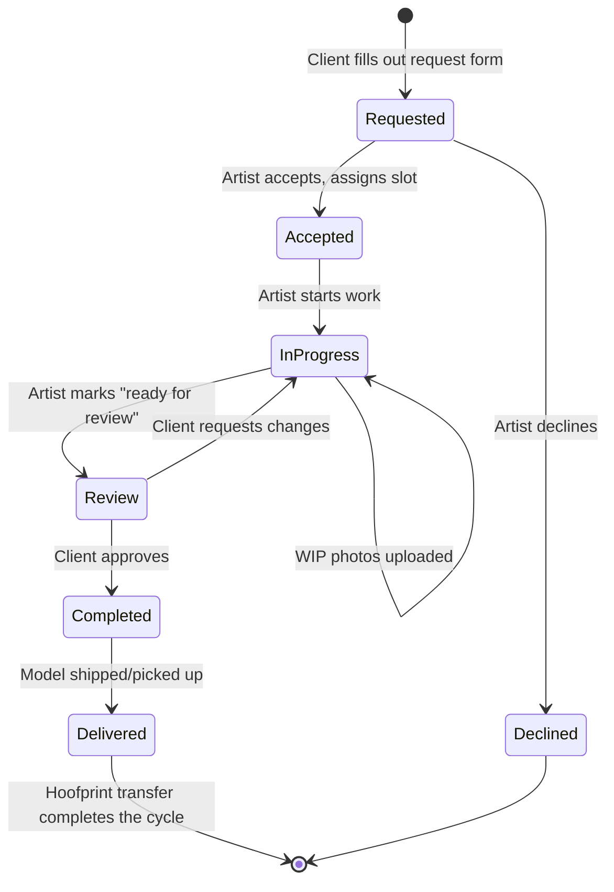
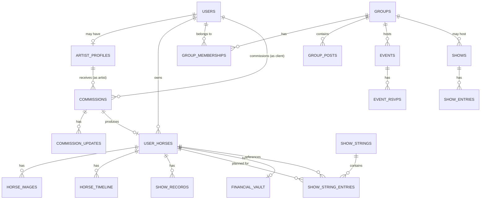

# 🏗️ Model Horse Hub — Platform Architecture Deep Dive

> **Vision:** Transform Model Horse Hub from a collection manager into the **operating system for the model horse hobby** — the single platform where models are created, cataloged, shown, traded, and celebrated.
>
> **Date:** March 8, 2026
> **Status:** Strategic Architecture Document — not for immediate execution
> **Audience:** Product planning, engineering decisions, roadmap prioritization

---

## Table of Contents

1. [The Platform Thesis](#the-platform-thesis)
2. [System 1: The Creator Economy](#system-1-the-creator-economy)
3. [System 2: The Community Fabric](#system-2-the-community-fabric)
4. [System 3: The Competition Engine](#system-3-the-competition-engine)
5. [The Unified Activity Graph](#the-unified-activity-graph)
6. [Data Architecture](#data-architecture)
7. [Implementation Phases](#implementation-phases)
8. [Risks & Mitigations](#risks--mitigations)

---

# The Platform Thesis

## Why This Matters

The model horse community is a **$200M+ hobby** split across 8 disconnected tools:

| What Collectors Do | Current Tool | Problem |
|---|---|---|
| Track collection | Spreadsheets, Etsy trackers | No social, no reference data |
| Sell/trade | Facebook Groups, MH$P, eBay | No provenance, no trust signal |
| Show competitively | Paper NAN cards, binders | Lost cards, no digital record |
| Commission artists | Instagram DMs, Google Forms | No tracking, lost WIP photos |
| Find community | Facebook, Discord, Blab | Fragmented, no integration |
| Document provenance | Word docs, memory | No chain of custody |
| Insure collection | Manual photo + Word doc | Tedious, never updated |
| Plan for shows | Spreadsheets, paper lists | No conflict detection, no integration |

**MHH already solves #1, #2, and #6.** The architecture below connects the remaining five into a unified platform.

## The Flywheel

```
Artists join → Artists bring clients → Clients become collectors
    ↓                                           ↓
Collectors catalog horses → Horses get Hoofprints → Hoofprints need provenance
    ↓                                                       ↓
Provenance includes WIP photos → WIP photos come from Art Studio
    ↓                                                       ↓
Collectors join groups → Groups host shows → Shows create NAN cards
    ↓                                               ↓
NAN cards live on passports → Passports drive marketplace trust
    ↓
Trust drives more transactions → Transactions create more Hoofprints
```

Every feature feeds every other feature. **This is what separates a platform from a tool.**

---

# System 1: The Creator Economy

> **Goal:** Make MHH the place where custom model horses are **commissioned, tracked, and delivered** — with the creation story permanently woven into the horse's identity.

## 1.1 The Artist Identity

### Concept: Artist ≠ Collector (But Can Be Both)

Today, every user is a "collector." We need to introduce a parallel identity: **Artist**. An artist can also be a collector (most are), but they gain additional capabilities:

- A **Studio** page (public)
- **Commission management** tools
- An **Artist Portfolio** auto-generated from their work
- The ability to **create WIP timelines** on horses they're working on (even horses they don't own)

### Database: `artist_profiles`

```sql
CREATE TABLE artist_profiles (
  user_id            UUID PRIMARY KEY REFERENCES auth.users(id) ON DELETE CASCADE,
  studio_name        TEXT NOT NULL,
  specialties        TEXT[] DEFAULT '{}',
  -- e.g. ['Custom Paint', 'Repaint', 'Tack', 'Sculpting', 'Etching', 'Hair']
  mediums            TEXT[] DEFAULT '{}',
  -- e.g. ['Acrylics', 'Pastels', 'Oils', 'Airbrush', 'Mixed Media']
  scales_offered     TEXT[] DEFAULT '{}',
  -- e.g. ['Traditional', 'Classic', 'Stablemate']
  bio_artist         TEXT,
  -- Separate from collector bio — their artist statement
  portfolio_visible  BOOLEAN DEFAULT true,
  status             TEXT NOT NULL DEFAULT 'closed'
    CHECK (status IN ('open', 'waitlist', 'closed')),
  max_slots          INTEGER DEFAULT 5 CHECK (max_slots BETWEEN 1 AND 20),
  turnaround_min_days INTEGER,
  turnaround_max_days INTEGER,
  price_range_min    DECIMAL(10,2),
  price_range_max    DECIMAL(10,2),
  terms_url          TEXT,
  -- Link to their commission terms (external or internal)
  terms_text         TEXT,
  -- Or inline terms
  accepting_types    TEXT[] DEFAULT '{}',
  -- e.g. ['Custom Paint', 'Repaint'] — what they're currently taking
  created_at         TIMESTAMPTZ DEFAULT now(),
  updated_at         TIMESTAMPTZ DEFAULT now()
);

-- Public read for all, owner-only write
ALTER TABLE artist_profiles ENABLE ROW LEVEL SECURITY;

CREATE POLICY "Anyone can view artist profiles"
  ON artist_profiles FOR SELECT TO authenticated
  USING (true);

CREATE POLICY "Owner manages own artist profile"
  ON artist_profiles FOR ALL TO authenticated
  USING (auth.uid() = user_id)
  WITH CHECK (auth.uid() = user_id);
```

### Key Design Decision: The `user_id` as PK

The artist profile is a 1:1 extension of the user, not a separate entity. This means:
- A user doesn't "create an artist account" — they "enable their studio"
- Their collector profile and artist profile share the same URL: `/profile/AmandaMount` shows both tabs
- Ratings, followers, and messages work identically for both roles

---

## 1.2 The Commission System

### The Commission Lifecycle



### Database: `commissions`

```sql
CREATE TABLE commissions (
  id                UUID PRIMARY KEY DEFAULT gen_random_uuid(),
  artist_id         UUID NOT NULL REFERENCES auth.users(id),
  client_id         UUID NOT NULL REFERENCES auth.users(id),
  
  -- What's being made
  commission_type   TEXT NOT NULL,
  -- e.g. 'Custom Paint', 'Repaint', 'Tack Set', 'Sculpture'
  description       TEXT NOT NULL,
  -- Client's description of what they want
  reference_images  TEXT[] DEFAULT '{}',
  -- URLs to reference photos the client uploads
  
  -- The horse (linked when known)
  horse_id          UUID REFERENCES user_horses(id) ON DELETE SET NULL,
  -- Set when: (a) client sends their horse to artist, or
  --           (b) artist creates a new horse entry for the commission
  
  -- Slot & scheduling
  slot_number       INTEGER,
  -- Position in the artist's queue
  estimated_start   DATE,
  estimated_completion DATE,
  actual_start      DATE,
  actual_completion DATE,
  
  -- Financial
  price_quoted      DECIMAL(10,2),
  deposit_amount    DECIMAL(10,2),
  deposit_paid      BOOLEAN DEFAULT false,
  final_paid        BOOLEAN DEFAULT false,
  
  -- Status
  status            TEXT NOT NULL DEFAULT 'requested'
    CHECK (status IN (
      'requested', 'accepted', 'declined', 'cancelled',
      'in_progress', 'review', 'revision',
      'completed', 'delivered'
    )),
  
  -- Communication
  last_update_at    TIMESTAMPTZ DEFAULT now(),
  
  -- Metadata
  is_public_in_queue BOOLEAN DEFAULT true,
  -- If true, appears anonymized in the artist's public queue
  -- (e.g., "Traditional Custom — In Progress")
  
  created_at        TIMESTAMPTZ DEFAULT now(),
  updated_at        TIMESTAMPTZ DEFAULT now(),
  
  CONSTRAINT artist_not_client CHECK (artist_id != client_id)
);
```

### Database: `commission_updates` (The WIP Timeline)

```sql
CREATE TABLE commission_updates (
  id              UUID PRIMARY KEY DEFAULT gen_random_uuid(),
  commission_id   UUID NOT NULL REFERENCES commissions(id) ON DELETE CASCADE,
  author_id       UUID NOT NULL REFERENCES auth.users(id),
  -- Can be artist or client (client can leave feedback)
  
  update_type     TEXT NOT NULL CHECK (update_type IN (
    'wip_photo',      -- Artist uploads progress photo
    'status_change',  -- Status transition
    'message',        -- Text-only message
    'revision_request', -- Client requests changes
    'approval',       -- Client approves
    'milestone'       -- Artist marks a milestone ("base coat done")
  )),
  
  title           TEXT,
  body            TEXT,
  image_urls      TEXT[] DEFAULT '{}',
  -- Storage paths for WIP photos
  
  -- For status changes
  old_status      TEXT,
  new_status      TEXT,
  
  is_visible_to_client BOOLEAN DEFAULT true,
  -- Artist can make internal notes that client doesn't see
  
  created_at      TIMESTAMPTZ DEFAULT now()
);
```

### The Magic: WIP → Hoofprint Pipeline

When a commission is marked `delivered`, the system:

1. **Links the horse:** If `commission.horse_id` is set, the horse's Hoofprint timeline gets enriched:
   - All WIP photos with `is_visible_to_client = true` become `horse_timeline` entries with `event_type = 'customization'`
   - The artist is recorded as the creator: `"Custom painted by @AmandaMount, March 2026"`
   
2. **Generates a transfer:** If the artist currently owns the horse entry (they created it during the commission), a Hoofprint transfer is auto-initiated to the client

3. **Updates the artist's portfolio:** The completed commission appears in the artist's portfolio gallery, with photos pulled from the WIP timeline

```
BEFORE: A custom horse arrives in the mail. The collector photographs it.
        Hoofprint says: "Registered by @collector, March 2026"
        
AFTER:  A custom horse arrives. The collector already has 11 WIP photos
        in the horse's timeline, showing every stage of creation.
        Hoofprint says:
          "Jan 15 — Commission requested by @collector"
          "Jan 20 — Blank body prepped [3 photos]"
          "Feb 8  — Base coat applied [2 photos]"
          "Feb 22 — Detail work [4 photos]"
          "Mar 5  — Clear coat + final photos [5 photos]"
          "Mar 8  — Completed and delivered by @AmandaMount"
          "Mar 10 — Claimed by @collector via Hoofprint Transfer"
```

**This is the single most compelling feature in the entire platform.** No other tool, in any hobby, connects the creator's process to the object's permanent identity this seamlessly.

---

## 1.3 Artist Discovery & Reputation

### The Artist Directory (`/artists`)

A searchable directory of all artists who've enabled their studio:

- Filter by: specialty, medium, scale, status (open/waitlist/closed), region, rating
- Sort by: most completed commissions, highest rated, newest
- Each card shows: studio name, specialties, status bar, rating, sample work

### Artist Reputation Score

Not a single number — a multi-dimensional trust signal:

```
@AmandaMount — Art Studio
━━━━━━━━━━━━━━━━━━━━━━━━
⭐ 4.9 (23 reviews)
📦 47 commissions completed
⏱️ Average turnaround: 6.2 weeks
🎯 On-time delivery: 89%
🔄 Revision rate: 12% (low = good)
📅 Member since: March 2026
━━━━━━━━━━━━━━━━━━━━━━━━
```

These metrics are **calculated from real data**, not self-reported:
- Completion count comes from `commissions` table
- Average turnaround from `actual_completion - actual_start`
- On-time from `actual_completion <= estimated_completion`
- Revision rate from `commission_updates` where `update_type = 'revision_request'`

---

# System 2: The Community Fabric

> **Goal:** Replace Facebook Groups, Discord servers, and email lists with an integrated community layer where groups, events, and discussions live alongside collections and shows.

## 2.1 Groups Architecture

### Design Philosophy: Groups Are Containers

A Group is not a separate app — it's a **container** that gives context to things that already exist:
- A Group can host **Shows** (existing show system, scoped to group members)
- A Group has a **Feed** (existing feed system, scoped to group posts)
- A Group can have an **Event Calendar** (new)
- Members can share **Horses** from their stables into the group feed

### Database: Core Group Tables

```sql
CREATE TABLE groups (
  id              UUID PRIMARY KEY DEFAULT gen_random_uuid(),
  name            TEXT NOT NULL,
  slug            TEXT UNIQUE NOT NULL,
  -- URL-safe name: e.g., "nw-breyer-club"
  description     TEXT,
  group_type      TEXT NOT NULL CHECK (group_type IN (
    'regional_club',    -- Geography-based club
    'breed_interest',   -- e.g., "Arabian Horse Collectors"
    'scale_interest',   -- e.g., "Stablemate Addicts"
    'show_circuit',     -- A show series/circuit
    'artist_collective', -- Group of artists
    'general'           -- Catch-all
  )),
  region          TEXT,
  -- Uses same region enum as user profiles
  visibility      TEXT NOT NULL DEFAULT 'public' CHECK (visibility IN (
    'public',     -- Anyone can find and join
    'restricted', -- Anyone can find, admin must approve membership
    'private'     -- Invite-only, hidden from search
  )),
  banner_url      TEXT,
  icon_url        TEXT,
  member_count    INTEGER DEFAULT 0,
  -- Denormalized for performance
  created_by      UUID NOT NULL REFERENCES auth.users(id),
  created_at      TIMESTAMPTZ DEFAULT now(),
  updated_at      TIMESTAMPTZ DEFAULT now()
);

CREATE TABLE group_memberships (
  group_id    UUID NOT NULL REFERENCES groups(id) ON DELETE CASCADE,
  user_id     UUID NOT NULL REFERENCES auth.users(id) ON DELETE CASCADE,
  role        TEXT NOT NULL DEFAULT 'member' CHECK (role IN (
    'owner',      -- Can delete group, transfer ownership
    'admin',      -- Can manage members, create shows, pin posts
    'moderator',  -- Can moderate posts
    'judge',      -- Can judge group-hosted shows
    'member'      -- Standard member
  )),
  joined_at   TIMESTAMPTZ DEFAULT now(),
  PRIMARY KEY (group_id, user_id)
);

CREATE TABLE group_posts (
  id          UUID PRIMARY KEY DEFAULT gen_random_uuid(),
  group_id    UUID NOT NULL REFERENCES groups(id) ON DELETE CASCADE,
  user_id     UUID NOT NULL REFERENCES auth.users(id),
  content     TEXT NOT NULL,
  horse_id    UUID REFERENCES user_horses(id) ON DELETE SET NULL,
  -- Optional: share a horse from your stable into the group
  image_urls  TEXT[] DEFAULT '{}',
  is_pinned   BOOLEAN DEFAULT false,
  likes_count INTEGER DEFAULT 0,
  reply_count INTEGER DEFAULT 0,
  created_at  TIMESTAMPTZ DEFAULT now(),
  updated_at  TIMESTAMPTZ DEFAULT now()
);

CREATE TABLE group_post_replies (
  id          UUID PRIMARY KEY DEFAULT gen_random_uuid(),
  post_id     UUID NOT NULL REFERENCES group_posts(id) ON DELETE CASCADE,
  user_id     UUID NOT NULL REFERENCES auth.users(id),
  content     TEXT NOT NULL,
  created_at  TIMESTAMPTZ DEFAULT now()
);
```

### Key Design Decision: Groups Scope Shows

The existing `shows` table gets a new optional column:

```sql
ALTER TABLE shows
  ADD COLUMN group_id UUID REFERENCES groups(id) ON DELETE SET NULL;

COMMENT ON COLUMN shows.group_id IS 
  'If set, this show is hosted by a group. Only group members can enter.';
```

This means:
- The admin show creation page gets a "Host as group show" option
- Group admins can create shows for their group
- The show appears in both the global shows list AND the group's page
- Entry is restricted to group members (enforced by RLS)

### RLS Strategy

Groups use a **membership-check pattern**:

```sql
-- Helper function
CREATE OR REPLACE FUNCTION is_group_member(g_id UUID) RETURNS BOOLEAN AS $$
  SELECT EXISTS (
    SELECT 1 FROM group_memberships
    WHERE group_id = g_id AND user_id = auth.uid()
  );
$$ LANGUAGE sql SECURITY DEFINER STABLE;

CREATE OR REPLACE FUNCTION is_group_admin(g_id UUID) RETURNS BOOLEAN AS $$
  SELECT EXISTS (
    SELECT 1 FROM group_memberships
    WHERE group_id = g_id AND user_id = auth.uid()
    AND role IN ('owner', 'admin')
  );
$$ LANGUAGE sql SECURITY DEFINER STABLE;
```

---

## 2.2 Regions

### Design: Regions as a First-Class Dimension

Regions aren't just a profile field — they're a **lens** on the entire platform:

```sql
-- Standard region taxonomy
CREATE TYPE region_code AS ENUM (
  'us_northeast',    -- ME, NH, VT, MA, RI, CT, NY, NJ, PA
  'us_southeast',    -- MD, DE, VA, WV, NC, SC, GA, FL, AL, MS, TN, KY, AR, LA
  'us_midwest',      -- OH, IN, MI, IL, WI, MN, IA, MO, ND, SD, NE, KS
  'us_southwest',    -- TX, OK, NM, AZ
  'us_mountain',     -- MT, ID, WY, CO, UT, NV
  'us_pacific',      -- WA, OR, CA, AK, HI
  'canada',
  'europe',
  'australia_nz',
  'international',
  'unset'
);

ALTER TABLE users ADD COLUMN region region_code DEFAULT 'unset';
```

### Where Region Shows Up

| Page | How Region Is Used |
|---|---|
| **Discover** | Filter collectors by region |
| **Marketplace** | "Local Pickup Available" badge, sort by distance |
| **Groups** | Auto-suggest regional groups |
| **Events** | Filter events by region |
| **Artist Directory** | Find local artists (for hand-delivery commissions) |
| **Profile** | Region badge with icon |

---

## 2.3 Events & Calendar

### Database: `events`

```sql
CREATE TABLE events (
  id              UUID PRIMARY KEY DEFAULT gen_random_uuid(),
  name            TEXT NOT NULL,
  description     TEXT,
  event_type      TEXT NOT NULL CHECK (event_type IN (
    'live_show',        -- NAMHSA-sanctioned or regional live show
    'photo_show',       -- MHH virtual photo show or MEPSA
    'swap_meet',        -- Virtual or in-person swap meet
    'meetup',           -- Informal gathering
    'breyerfest',       -- Annual event
    'studio_opening',   -- Artist opening commission slots
    'auction',          -- Charity or regular auction
    'workshop',         -- Educational event
    'other'
  )),
  
  -- Timing
  starts_at       TIMESTAMPTZ NOT NULL,
  ends_at         TIMESTAMPTZ,
  timezone        TEXT DEFAULT 'America/New_York',
  is_all_day      BOOLEAN DEFAULT false,
  
  -- Location
  is_virtual      BOOLEAN DEFAULT false,
  location_name   TEXT,
  location_address TEXT,
  region          region_code,
  virtual_url     TEXT,
  
  -- Links
  group_id        UUID REFERENCES groups(id) ON DELETE SET NULL,
  show_id         UUID REFERENCES shows(id) ON DELETE SET NULL,
  -- If this event IS a show, link to the show entry
  
  -- Hosting
  created_by      UUID NOT NULL REFERENCES auth.users(id),
  is_official     BOOLEAN DEFAULT false,
  -- Admin-curated events (BreyerFest, major shows)
  
  -- Engagement
  rsvp_count      INTEGER DEFAULT 0,
  
  created_at      TIMESTAMPTZ DEFAULT now()
);

CREATE TABLE event_rsvps (
  event_id    UUID NOT NULL REFERENCES events(id) ON DELETE CASCADE,
  user_id     UUID NOT NULL REFERENCES auth.users(id) ON DELETE CASCADE,
  status      TEXT NOT NULL DEFAULT 'going' CHECK (status IN ('going', 'interested', 'not_going')),
  created_at  TIMESTAMPTZ DEFAULT now(),
  PRIMARY KEY (event_id, user_id)
);
```

### Design: Events Link to Everything

An event isn't isolated — it links outward:
- **Event → Show:** "Spring Stampede" event links to the actual show entry where models are entered
- **Event → Group:** "NW Breyer Club Meetup" is hosted by the NW Breyer Club group
- **Event → Swap Meet:** Timed marketplace window with urgency mechanics
- **Event → Studio Opening:** Artist's commission slots opening at a specific time

---

# System 3: The Competition Engine

> **Goal:** Digitize the paper-based competitive showing world — from NAN qualification cards in binders to a searchable, transferable digital record that follows the horse.

## 3.1 Show Records Architecture

### The Current Problem

The competitive model horse world runs on **paper**:
- **NAN Cards:** Color-coded paper tickets (green=breed, yellow=color, pink=performance) earned at sanctioned shows. Stored in binders. Lost regularly.
- **Show Results:** Emailed as text files or posted on websites. No standard format.
- **Qualification Tracking:** Collectors manually track which horses are NAN-qualified using spreadsheets.
- **When Models Are Sold:** NAN cards must be physically mailed to the new owner. If lost, the qualification is gone.

### Database: `show_records`

```sql
-- Individual results from any show (live, photo, or MHH virtual)
CREATE TABLE show_records (
  id                UUID PRIMARY KEY DEFAULT gen_random_uuid(),
  horse_id          UUID NOT NULL REFERENCES user_horses(id) ON DELETE CASCADE,
  owner_id          UUID NOT NULL REFERENCES auth.users(id),
  -- The owner at the time of showing (important for provenance)
  
  -- Show identification
  show_name         TEXT NOT NULL,
  show_date         DATE NOT NULL,
  show_type         TEXT NOT NULL CHECK (show_type IN (
    'live_namhsa',    -- NAMHSA-sanctioned live show
    'live_regional',  -- Non-NAMHSA live show
    'photo_mepsa',    -- MEPSA mail-in photo show
    'photo_mhh',      -- MHH virtual photo show
    'photo_other',    -- Other online photo show
    'virtual_other'   -- Other virtual show
  )),
  sanctioning_body  TEXT,
  -- 'NAMHSA', 'MEPSA', 'OFCC', etc.
  
  -- Results
  class_name        TEXT NOT NULL,
  division          TEXT,
  -- 'Breed', 'Color', 'Performance', 'Workmanship', 'Other'
  placing           INTEGER,
  -- 1st through Nth place; NULL = no placing
  total_entries     INTEGER,
  -- How many entries were in this class
  
  -- NAN Qualification
  is_nan_qualifying BOOLEAN DEFAULT false,
  nan_card_type     TEXT CHECK (nan_card_type IN (
    'green',   -- Breed class
    'yellow',  -- Gender/Color class
    'pink',    -- Performance class
    NULL       -- Not NAN qualifying
  )),
  nan_year          INTEGER,
  -- Which NAN year this qualifies for
  
  -- Judge info (optional)
  judge_name        TEXT,
  judge_critique    TEXT,
  -- Written feedback from the judge
  
  -- Verification
  verified          BOOLEAN DEFAULT false,
  -- Admin or show host verified this result
  verified_by       UUID REFERENCES auth.users(id),
  verification_note TEXT,
  
  -- Integration
  mhh_show_id       UUID REFERENCES shows(id) ON DELETE SET NULL,
  -- If this result came from an MHH-hosted show, link it
  mhh_entry_id      UUID,
  -- Link to the specific show_entries row
  
  -- Metadata
  notes             TEXT,
  created_at        TIMESTAMPTZ DEFAULT now()
);

-- Critical index: find all NAN qualifications for a horse
CREATE INDEX idx_show_records_horse_nan 
  ON show_records (horse_id, nan_year, nan_card_type)
  WHERE is_nan_qualifying = true;

-- Find all results for an owner across all shows
CREATE INDEX idx_show_records_owner
  ON show_records (owner_id, show_date DESC);
```

### Design Decision: Show Records Belong to the Horse

When a horse is transferred via Hoofprint™:
- **Show records stay with the horse** (they're linked by `horse_id`)
- The `owner_id` field records WHO showed the horse, preserving history
- NAN cards digitally transfer with the horse — no physical mailing needed
- This is the **most impactful digitization** possible for competitive hobbyists

### The NAN Dashboard Widget

```
🏆 NAN 2026 Qualification Status
━━━━━━━━━━━━━━━━━━━━━━━━━━━━━━━━━━
7 horses qualified across 12 divisions

🟢 Midnight Dream — Arabian Stallion (Breed), Acrylics Custom (Workmanship)
🟢 Prairie Rose — QH Mare (Breed), Bay (Color)
🟡 Kronos — Warmblood Stallion (Breed) — needs 1 more card for Color
🔴 On the Fritz — No qualifications yet

[📋 View Full NAN Planner] [📄 Print NAN Entry Form]
━━━━━━━━━━━━━━━━━━━━━━━━━━━━━━━━━━
Entry deadline: June 1, 2026
```

---

## 3.2 Show String Planner

### The Concept

A show string is the set of models you're bringing to a specific show and which classes you're entering them in. Planning this is currently done on paper or in spreadsheets.

### Database: `show_strings`

```sql
CREATE TABLE show_strings (
  id            UUID PRIMARY KEY DEFAULT gen_random_uuid(),
  user_id       UUID NOT NULL REFERENCES auth.users(id) ON DELETE CASCADE,
  event_id      UUID REFERENCES events(id) ON DELETE SET NULL,
  name          TEXT NOT NULL,
  -- e.g., "Spring Stampede 2026"
  show_date     DATE,
  notes         TEXT,
  created_at    TIMESTAMPTZ DEFAULT now(),
  updated_at    TIMESTAMPTZ DEFAULT now()
);

CREATE TABLE show_string_entries (
  id              UUID PRIMARY KEY DEFAULT gen_random_uuid(),
  show_string_id  UUID NOT NULL REFERENCES show_strings(id) ON DELETE CASCADE,
  horse_id        UUID NOT NULL REFERENCES user_horses(id) ON DELETE CASCADE,
  class_name      TEXT NOT NULL,
  division        TEXT,
  -- 'Breed', 'Color', 'Performance'
  time_slot       TEXT,
  -- If the show has a schedule, when this class runs
  notes           TEXT,
  created_at      TIMESTAMPTZ DEFAULT now()
);
```

### Conflict Detection

The show string planner warns you:
- "⚠️ Prairie Rose is entered in Western Pleasure (10:00 AM) and Trail (10:15 AM) — these classes overlap"
- "⚠️ Midnight Dream is entered in Arabian Stallion AND Arabian Mare — can't show in both"

### After the Show: Results Flow Back

When the show is over, the planner becomes a results entry form:
- For each entry, record: placing, total entries, NAN card earned
- Results auto-populate `show_records` and the horse's Hoofprint timeline
- "Your show is complete! 3 NAN cards earned. [View Results]"

---

## 3.3 Enhanced Photo Shows

### Judge Critiques

The existing MHH photo show system gains:

```sql
ALTER TABLE show_entries
  ADD COLUMN judge_critique TEXT,
  ADD COLUMN judge_score DECIMAL(5,2);
  -- Optional scoring: 0.0-100.0

COMMENT ON COLUMN show_entries.judge_critique IS 
  'Written feedback from the judge. Visible to the entrant after results.';
```

### Multi-Class Entries

Currently, one horse can only enter one class per show. Expand to:

```sql
-- show_entries already has horse_id + show_id
-- Add a class_name field so the same horse can enter multiple classes
ALTER TABLE show_entries
  ADD COLUMN class_name TEXT DEFAULT 'General';
  
-- Remove any unique constraint on (show_id, horse_id) if it exists
-- Replace with unique on (show_id, horse_id, class_name)
```

### NAN-Sanctioning Flag

```sql
ALTER TABLE shows
  ADD COLUMN is_nan_qualifying BOOLEAN DEFAULT false,
  ADD COLUMN sanctioning_body TEXT;
```

When a NAN-qualifying show is judged, the system auto-generates `show_records` with the appropriate NAN card type.

---

# The Unified Activity Graph

> **Design Principle:** Every meaningful action on the platform produces an **activity** that can appear in feeds, on timelines, in notifications, and in analytics.

## The Activity Table

```sql
CREATE TABLE activities (
  id          UUID PRIMARY KEY DEFAULT gen_random_uuid(),
  user_id     UUID NOT NULL REFERENCES auth.users(id),
  
  -- What happened
  action      TEXT NOT NULL CHECK (action IN (
    -- Collection
    'horse_added', 'horse_updated', 'horse_transferred',
    -- Social
    'followed_user', 'favorited_horse', 'commented',
    -- Shows
    'entered_show', 'placed_in_show', 'earned_nan_card',
    -- Commissions
    'commission_requested', 'commission_accepted', 
    'wip_posted', 'commission_completed',
    -- Groups
    'joined_group', 'group_post', 'event_rsvp',
    -- Marketplace
    'listed_for_sale', 'wishlist_match'
  )),
  
  -- What it's about (polymorphic references)
  horse_id    UUID REFERENCES user_horses(id) ON DELETE CASCADE,
  target_user_id UUID REFERENCES auth.users(id),
  show_id     UUID REFERENCES shows(id) ON DELETE CASCADE,
  group_id    UUID REFERENCES groups(id) ON DELETE CASCADE,
  commission_id UUID, -- FK added when commissions table exists
  event_id    UUID,   -- FK added when events table exists
  
  -- Display
  title       TEXT NOT NULL,
  description TEXT,
  metadata    JSONB DEFAULT '{}',
  -- Flexible storage for action-specific data
  
  -- Visibility
  is_public   BOOLEAN DEFAULT true,
  
  created_at  TIMESTAMPTZ DEFAULT now()
);

CREATE INDEX idx_activities_user ON activities (user_id, created_at DESC);
CREATE INDEX idx_activities_horse ON activities (horse_id, created_at DESC) WHERE horse_id IS NOT NULL;
CREATE INDEX idx_activities_feed ON activities (created_at DESC) WHERE is_public = true;
```

### Where Activities Appear

| Surface | What Shows |
|---|---|
| **User Feed** | Activities from users you follow |
| **Horse Passport** | Activities about this horse (subset of Hoofprint) |
| **Group Feed** | Activities from group members, scoped to group |
| **Notifications** | Activities that mention you or your horses |
| **Artist Portfolio** | Completed commissions, milestones |
| **Analytics** | Aggregate activity data for dashboards |

### Replacing the Current Feed

The existing `activity_events` table is a simpler version of this. Migration path:
1. Create `activities` table with the superset schema
2. Backfill from existing `activity_events`
3. Update the feed page to read from `activities`
4. Deprecate `activity_events`

---

# Data Architecture

## Entity Relationship Overview



## Table Count Summary

| Category | Existing Tables | New Tables | Total |
|---|---|---|---|
| Core (users, horses, images, vault) | 7 | 0 | 7 |
| Reference Data (molds, resins, releases) | 3 | 0 | 3 |
| Social (follows, favorites, comments, feed) | 5 | 0 | 5 |
| Shows & Competition | 2 | 4 | 6 |
| Provenance (Hoofprint) | 4 | 0 | 4 |
| Marketplace (listings, wishlists) | 2 | 0 | 2 |
| Messaging | 3 | 0 | 3 |
| Ratings | 1 | 0 | 1 |
| Collections | 1 | 0 | 1 |
| **Art Studio** | 0 | **3** | 3 |
| **Groups & Community** | 0 | **5** | 5 |
| **Events** | 0 | **2** | 2 |
| **Activity Graph** | 0 | **1** | 1 |
| **TOTAL** | **28** | **15** | **43** |

---

# Implementation Phases

## Phase 0: Foundation (Now — Pre-Requisite)

> **Goal:** Lay the groundwork without building full features

| Task | What | Effort | Depends On |
|---|---|---|---|
| **F-1** | Add `region` column to `users` | 1 hour | Nothing |
| **F-2** | Add region filter to Discover page | 2 hours | F-1 |
| **F-3** | Add region to profile display | 1 hour | F-1 |
| **F-4** | Create `activities` table | 2 hours | Nothing |
| **F-5** | Batch Import (CSV) for onboarding | 1-2 days | Nothing |
| **F-6** | Insurance PDF export | 1 day | Nothing |

**Why first:** F-1 through F-3 are trivially small but immediately useful. F-4 is the backbone for everything else. F-5 and F-6 are standalone practical tools that drive adoption.

## Phase 1: The Art Studio (Month 1-2)

> **Goal:** Artists can create studios, accept commissions, and post WIP updates

| Task | What | Effort |
|---|---|---|
| **AS-1** | `artist_profiles` table + migration | 2 hours |
| **AS-2** | Studio setup page in Settings | 1 day |
| **AS-3** | Studio tab on profile page | 1 day |
| **AS-4** | Artist Directory page (`/artists`) | 1 day |
| **AS-5** | `commissions` + `commission_updates` tables | 3 hours |
| **AS-6** | Commission request form (client-side) | 1 day |
| **AS-7** | Commission management dashboard (artist-side) | 2 days |
| **AS-8** | WIP photo upload flow | 1 day |
| **AS-9** | Client commission view (private) | 1 day |
| **AS-10** | WIP → Hoofprint pipeline on completion | 1 day |

**Total estimated:** ~10-12 working days

## Phase 2: Groups & Events (Month 2-3)

> **Goal:** Users can create/join groups, post, and host events

| Task | What | Effort |
|---|---|---|
| **GR-1** | Groups tables + migration | 3 hours |
| **GR-2** | Create Group page | 1 day |
| **GR-3** | Group detail page + feed | 2 days |
| **GR-4** | Group member management | 1 day |
| **GR-5** | Group-scoped shows (link existing shows) | 1 day |
| **GR-6** | Events table + migration | 2 hours |
| **GR-7** | Event creation page | 1 day |
| **GR-8** | Community calendar page (`/events`) | 1.5 days |
| **GR-9** | RSVP + reminders | 0.5 day |

**Total estimated:** ~9-10 working days

## Phase 3: The Competition Engine (Month 3-4)

> **Goal:** Show results, NAN tracking, and show string planning

| Task | What | Effort |
|---|---|---|
| **CE-1** | `show_records` table + migration | 2 hours |
| **CE-2** | Manual show result entry form | 1 day |
| **CE-3** | Show records tab on horse passport | 1 day |
| **CE-4** | NAN dashboard widget | 1 day |
| **CE-5** | Auto-generate show records from MHH shows | 1 day |
| **CE-6** | Show records transfer with Hoofprint | 0.5 day |
| **CE-7** | `show_strings` tables | 2 hours |
| **CE-8** | Show string planner UI | 2 days |
| **CE-9** | Judge critique on show entries | 0.5 day |
| **CE-10** | NAN entry form generator (print/PDF) | 1 day |

**Total estimated:** ~9-10 working days

## Phase 4: Platform Maturity (Month 4+)

| Task | What | Effort |
|---|---|---|
| **PM-1** | Achievement badges system | 1 day |
| **PM-2** | Collection analytics dashboard | 2 days |
| **PM-3** | Advanced marketplace filters | 1 day |
| **PM-4** | Virtual swap meet events | 2 days |
| **PM-5** | Discussion boards (forum-lite) | 3 days |
| **PM-6** | Help ID This Model flow | 1 day |
| **PM-7** | PWA manifest + service worker | 1 day |
| **PM-8** | Email notification digests | 2 days |

---

# Risks & Mitigations

## Risk 1: Feature Bloat
**Threat:** Building too much too fast → nothing works well
**Mitigation:** Each phase is a **commit boundary**. Ship Phase 0 → get feedback → then start Phase 1. Never start a phase before the previous one is stable.

## Risk 2: Artist Adoption
**Threat:** Artists don't join → commission system is empty
**Mitigation:** You (Black Fox Farm) are both a collector and a customizer. Be the first artist. Invite 3-5 artist friends specifically. The system needs only ~5 active artists to demonstrate value.

## Risk 3: Community Governance
**Threat:** Groups → drama, abuse, content moderation
**Mitigation:** Start with `restricted` visibility as default. Group owners must approve members. Add report/block at the global level. Admin can suspend groups.

## Risk 4: Competition with Facebook/Discord
**Threat:** "Why would I leave my Facebook Group?"
**Mitigation:** Don't ask them to leave — ask them to USE. The killer pitch: "Your Facebook Group can't automatically link show results to horse passports, track NAN cards, or connect WIP photos to provenance. MHH can." The integration IS the moat.

## Risk 5: Data Integrity for NAN Cards
**Threat:** Users self-report fake NAN qualifications
**Mitigation:** Three-tier verification:
1. **Self-reported:** User enters their own results (unverified badge)
2. **Host-verified:** Show host confirms the result (verified badge)
3. **MHH-generated:** Result came from an MHH-hosted show (auto-verified)

Eventually, if NAMHSA adopts MHH, #3 becomes the standard. But start with #1 — even unverified, digital is better than paper.

---

# The Endgame

In 18 months, a collector's experience looks like this:

> Sarah joins MHH and imports her 200-model collection via CSV in 10 minutes. She joins the NW Breyer Club group. The group is hosting a Spring Show — she uses the show string planner to enter 8 models across 15 classes. She earns 3 NAN green cards, which auto-appear on her horses' passports. She commissions a custom from @AmandaMount (whose studio shows "2/5 slots open"). Over 6 weeks, she watches Amanda's WIP photos appear in her private portal. When the custom is complete, it transfers via Hoofprint™ — and the entire creation timeline (11 photos, 4 milestones) flows into the horse's permanent passport. She lists her new custom in the group's Virtual Swap Meet event. Another collector in the Midwest sees it, checks the Hoofprint™ (verified provenance, WIP history, artist rating 4.9 stars), and buys with confidence. The model transfers to the new owner — taking its show records, NAN qualifications, and creation story with it.

**That's not a collection manager. That's the operating system for the hobby.**
