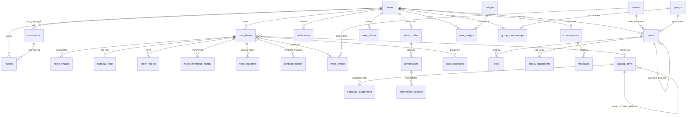

# V41 Task 2 — Create `MASTER_SUPABASE.md`

> **MANDATORY:** Read `.agents/MASTER_BLUEPRINT.md` and `.agents/docs/v41_master-doc-consolidation.md` first. All Iron Laws and guardrails apply.
> **Constraint:** This sprint touches ONLY `.md` files in `.agents/`. Do NOT modify any `.tsx`, `.ts`, `package.json`, or create new migration files.
> **Prerequisite:** `MASTER_BLUEPRINT.md` must exist and be approved (Task 1 complete).

// turbo-all

---

## Step 1: Read Source Material

Scan the migrations directory and key source files to build the schema reference:

```powershell
# Get all table definitions
cmd /c "npx rg -n 'CREATE TABLE' supabase/migrations/ --include '*.sql' 2>&1"

# Get all views and functions
cmd /c "npx rg -n 'CREATE (OR REPLACE )?(VIEW|MATERIALIZED VIEW|FUNCTION)' supabase/migrations/ --include '*.sql' 2>&1"

# Get RLS policies
cmd /c "npx rg -n 'CREATE POLICY' supabase/migrations/ --include '*.sql' 2>&1"

# Read relevant docs
View file: .agents\workflows\onboard.md                  ← Database section (lines 164-179)
View file: .agents\docs\Grand_Unification_Plan.md        ← Schema design rationale
View file: src\lib\types\database.generated.ts           ← Generated types (scan first 200 lines for table names)
```

---

## Step 2: Create `.agents/MASTER_SUPABASE.md`

Create the file at `.agents/MASTER_SUPABASE.md` (root of `.agents/`, NOT in `docs/`).

### Section 1: Header

```markdown
# 🗄️ MASTER SUPABASE — Model Horse Hub Schema Reference

> **Single Source of Truth for all database schema, RLS policies, and RPCs.**
> Update this file whenever a new migration is deployed.
> Last updated: [today's date] | Migration count: 110 (001–110) | SQL files: 106

**Environment:** Supabase Pro (PostgreSQL 15) | Extensions: `pg_trgm` (in `extensions` schema), `uuid-ossp`
```

### Section 2: Table Overview by Domain

Organize ALL tables into these logical domains. For each table, write **one short paragraph** describing its purpose, key columns, and relationships:

#### 🐴 Core Inventory
- `users` — User profiles, auth link, `alias_name` (unique slug), `tier` (free/pro), `avatar_url`, `show_badges`, `watermark_photos`
- `user_horses` — Model horse inventory. FK to `users(id)` via `owner_id`, FK to `catalog_items(id)` via `catalog_id`. Soft delete via `deleted_at`. `visibility` column is authoritative (synced to `is_public` via trigger `trg_sync_visibility`)
- `horse_images` — Photo storage references per horse. `angle_profile` enum differentiates Primary_Thumbnail vs detail angles. Private bucket, signed URLs
- `financial_vault` — Private financial data (purchase_price, estimated_current_value). FK to `user_horses(id)`. NEVER exposed on public routes
- `user_collections` — Named groupings of horses. `is_public` controls visibility on profile
- `customization_logs` — Modification history tracked per horse

#### 📖 Universal Catalog
- `catalog_items` — 10,500+ entries. Polymorphic via `item_type` enum: `plastic_mold`, `plastic_release`, `artist_resin`, `tack`. `parent_id` self-reference links releases to molds. `attributes` JSONB stores type-specific data (model_number, color_description, cast_medium). GIN index on `title || maker` for `pg_trgm` fuzzy search
- `database_suggestions` — Community-submitted catalog additions with voting

#### 💬 Social & Content
- `posts` — Universal text content. Exclusive arc FKs: `horse_id`, `group_id`, `event_id`, `studio_id`, `help_request_id`. `parent_id` for 1-level threading. Atomic counters: `likes_count`, `replies_count`
- `media_attachments` — File references for casual uploads. Links to `posts`, or `events`. Storage path to `horse-images` bucket
- `likes` — Post likes. `UNIQUE(user_id, post_id)`
- `notifications` — Push notification store. `user_id`, `type` enum, `actor_id`, `is_read`
- `activity_events` — Legacy feed events (being superseded by `posts`)
- `horse_favorites` — Saved/bookmarked horses

#### 🤝 Commerce & Trust
- `conversations` — DM threads between two users. `buyer_id` + `seller_id`
- `messages` — Chat messages within conversations. `is_read` for unread tracking
- `transactions` — Formal commerce state machine. `status` enum: `offer_made → pending_payment → funds_verified → completed` (+ `pending`, `cancelled`). `party_a_id` (seller), `party_b_id` (buyer)
- `reviews` — Post-transaction ratings. FK to `transactions(id)`. `UNIQUE(transaction_id, reviewer_id)`
- `user_blocks` — Block system. Prevents all interaction

#### 🏇 Provenance & History  
- `show_records` — Competition placings per horse. Used by `v_horse_hoofprint` view
- `horse_ownership_history` — Transfer chain. Created on claim
- `horse_transfers` — Active/expired transfer codes with cryptographic PINs
- `condition_history` — Condition grade changes over time
- `horse_pedigrees` — Dam/sire lineage data
- `horse_photo_stages` — WIP progress photos

#### 🏆 Competition Engine
- `events` — All events (shows, meetups, sales). `event_type` differentiates. `is_virtual_show` for photo shows. Contains `event_divisions` and `event_classes` via FK chains
- `event_entries` — Horse entries in show classes. Links horse → class → event
- `event_rsvps` — Attendance tracking
- `show_strings` / `show_string_entries` — Live Show Packer (physical show prep)
- `event_comments` / `event_photos` — Legacy event social (migrating to `posts`)

#### 👥 Community
- `groups` — User-created communities. `group_type` enum, `region`, `slug`
- `group_memberships` — Join tracking with `role` (member, admin, moderator)
- `user_follows` — Social graph. `follower_id` → `following_id`
- `featured_horses` — Curated spotlight

#### 🎨 Art Studio
- `artist_profiles` — Studio metadata. `studio_slug`, `studio_name`, commission settings
- `commissions` — Art commission workflow. Status tracking, pricing
- `commission_updates` — WIP progress posts on commissions

#### 💰 Monetization
- `purchased_reports` — A-la-carte PDF purchases tracking

#### 🏅 Gamification
- `badges` — Badge dictionary (achievement definitions)
- `user_badges` — Earned badges per user

#### 🔒 Infrastructure
- `rate_limits` — Rate limiting tracking per user/action
- `contact_messages` — Public contact form submissions
- `id_requests` / `id_suggestions` — Help ID community feature

### Section 3: Key RLS Policies

Document the most important RLS patterns:

```markdown
## Key RLS Patterns

### Standard User-Owns Pattern (most tables):
- SELECT: `auth.uid() = owner_id` or `auth.uid() = user_id`
- INSERT: `auth.uid() = owner_id`  
- UPDATE: `auth.uid() = owner_id`
- DELETE: `auth.uid() = owner_id`

### All policies use: `(SELECT auth.uid())` (InitPlan pattern — NOT bare `auth.uid()`)

### Special Patterns:
- `user_horses` SELECT: Owner sees all. Others see only `visibility = 'public'`
- `financial_vault`: Owner-only (all CRUD). No public access ever.
- `horse_images`: Owner sees all. Others see images for public horses only.
- `messages`: Both conversation participants can read/write.
- `notifications`: User can only see/update their own.
- `transactions`: Both parties can read. Only specific status transitions allowed.
- `catalog_items`: Public read. Insert/update restricted to admins + trusted curators.
```

### Section 4: Materialized Views & Important RPCs

Document each with its purpose and refresh strategy:

```markdown
## Views
| View | Type | Purpose | Refresh |
|------|------|---------|---------|
| `v_horse_hoofprint` | Regular VIEW | UNION ALL across 6 tables for horse timeline | Real-time (view) |
| `discover_users_view` | Regular VIEW | Public user directory with horse counts | Real-time (view) |

## Materialized Views
| View | Purpose | Refresh |
|------|---------|---------|
| `mv_market_prices` | Blue Book price aggregation from transactions + catalog | Cron: `refresh_market_prices()` |
| `mv_trusted_sellers` | Sellers with ≥3 transactions, ≥4.5 avg rating | Cron: `refresh_mv_trusted_sellers()` |

## Key RPCs (Postgres Functions)
| Function | Purpose | Security |
|----------|---------|----------|
| `search_catalog_fuzzy(term, max)` | pg_trgm trigram search on catalog_items | SECURITY INVOKER |
| `make_offer_atomic(...)` | Commerce: create offer with FOR UPDATE lock | SECURITY INVOKER |
| `respond_to_offer_atomic(...)` | Commerce: accept/reject with lock | SECURITY INVOKER |
| `toggle_post_like(post_id, user_id)` | Atomic like/unlike with counter update | SECURITY INVOKER |
| `add_post_reply(parent_id, author_id, content)` | Atomic reply with counter increment | SECURITY INVOKER |
| `vote_for_entry(entry_id, user_id)` | Show voting with duplicate prevention | SECURITY INVOKER |
| `close_virtual_show(event_id, user_id)` | End show + assign placings from votes | SECURITY INVOKER |
| `claim_transfer_atomic(code, claimant_id)` | Transfer horse ownership atomically | SECURITY INVOKER |
| `claim_parked_horse_atomic(pin, claimant_id)` | Claim parked horse with PIN verification | SECURITY INVOKER |
| `batch_import_horses(...)` | Bulk insert from CSV with FK resolution | SECURITY INVOKER |
| `count_user_horses_total(user_id)` | Accurate count bypassing RLS | SECURITY DEFINER |
| `count_user_horses_public(user_id)` | Public horse count bypassing RLS | SECURITY DEFINER |
| `get_user_tier()` | Return Pro/Free from JWT metadata | SECURITY DEFINER |
| `get_photo_limit()` | Return max photos per tier | SECURITY DEFINER |
| `is_trusted_seller(user_id)` | Check against mv_trusted_sellers | SECURITY DEFINER |
| `sync_is_public_from_visibility()` | Trigger: keeps is_public ↔ visibility in sync | TRIGGER |
```

### Section 5: Full Schema Mermaid ER Diagram

Create a Mermaid ER diagram showing the core table relationships. Group into domains. Include only the most important FKs:

```markdown
## Schema Diagram


```

### Section 6: Migration Policy

```markdown
## Migration Policy

1. **CLI-only** — Migrations are created via `supabase migration new <name>` or manually in `supabase/migrations/`
2. **Sequential numbering** — Files named `NNN_description.sql` (currently at 110)
3. **Dry-run required** — Review SQL output before pushing
4. **Human approval** — AI must NEVER run `supabase db push` or `supabase migration up` directly
5. **Rollback plan** — Destructive changes (`DROP`, `ALTER ... DROP COLUMN`) must include a rollback script or `IF EXISTS` guards
6. **SECURITY DEFINER** functions must use `SET search_path = ''` with `public.` prefix on all table references
7. **Extensions** — `pg_trgm` lives in `extensions` schema (not `public`)
8. **When >50 users** — Never run destructive SQL without human approval and a backup
```

---

## Step 3: Self-Verification

After creating the file, verify:

1. **File exists at:** `.agents/MASTER_SUPABASE.md` (root of `.agents/`)
2. **All 6 sections are present:** Header, Table Overview, RLS, RPCs, Mermaid, Migration Policy
3. **Every table from the migrations is accounted for** in the domain overview
4. **Mermaid diagram renders** — copy into a Mermaid live editor to verify no syntax errors
5. **No code was modified** — only `.md` file created

---

## 🛑 HUMAN VERIFICATION GATE 🛑

Present the completed `MASTER_SUPABASE.md` for human review. Wait for approval before proceeding to V41 Task 3.
