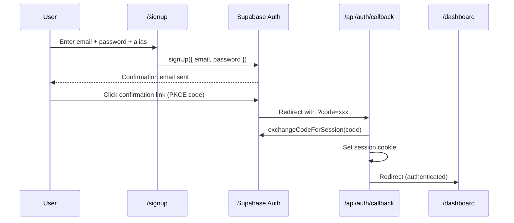
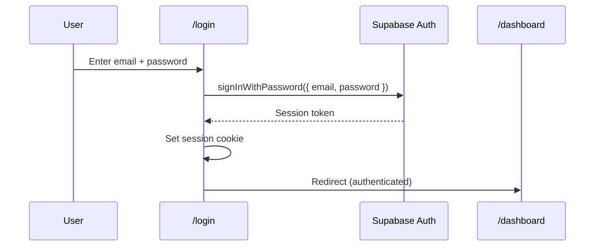
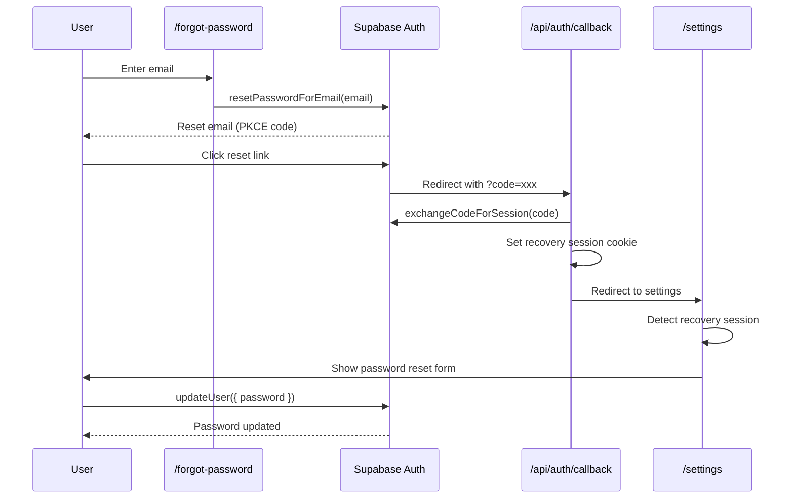

# Authentication Flow

## Overview

Model Horse Hub uses **Supabase Auth** with the **PKCE (Proof Key for Code Exchange)** flow for secure authentication. Sessions are cookie-based for SSR compatibility.

## Auth Methods

| Method | Supported | Notes |
|--------|-----------|-------|
| Email + Password | ✅ | Primary auth method |
| Password Reset | ✅ | PKCE-based recovery flow |
| Email Confirmation | ✅ | Required after signup |
| OAuth (Google, GitHub, etc.) | ❌ | Not implemented |
| Magic Link | ❌ | Not implemented |

## Flow Diagrams

### Sign Up



### Login



### Password Reset



## Auth Callback Route

`/api/auth/callback/route.ts` handles all PKCE code exchanges:

1. Reads the `code` query parameter
2. Calls `supabase.auth.exchangeCodeForSession(code)`
3. Sets the session cookie
4. Redirects to the appropriate destination

## Server-Side Auth Patterns

### In Server Components (Pages)

```typescript
// src/app/dashboard/page.tsx
import { createClient } from "@/lib/supabase/server";

export default async function DashboardPage() {
    const supabase = await createClient();
    const { data: { user } } = await supabase.auth.getUser();

    if (!user) {
        redirect("/login");
    }

    // RLS handles row-level access — user only sees their own data
    const { data: horses } = await supabase
        .from("user_horses")
        .select("*");
    // ...
}
```

### In Server Actions

```typescript
// src/app/actions/horse.ts
"use server";
import { requireAuth } from "@/lib/auth";

export async function createHorse(data: FormData) {
    const { supabase, user } = await requireAuth();
    // user is guaranteed to be authenticated
    // supabase client has the user's session
}
```

The `requireAuth()` helper (from `@/lib/auth.ts`) is the preferred pattern for server actions. It:
1. Creates a Supabase client
2. Calls `supabase.auth.getUser()`
3. Throws if no user is authenticated
4. Returns both the `supabase` client and `user` object

### In Client Components

Client components don't check auth directly. They call server actions which handle auth internally. For client-side storage uploads:

```typescript
import { createClient } from "@/lib/supabase/client";

const supabase = createClient();
// Upload to storage (auth session is in cookies)
await supabase.storage.from("horse-images").upload(path, file);
```

## Session Management

- Sessions are stored in **HTTP-only cookies** set by the Supabase SSR middleware
- The `@supabase/ssr` package handles cookie management
- Server Components read cookies via `createClient()` from `@/lib/supabase/server`
- Sessions auto-refresh when they approach expiry

## Security Layers

| Layer | Implementation |
|-------|---------------|
| **PKCE** | Code exchange prevents token interception |
| **HTTP-only cookies** | Session not accessible to client-side JS |
| **RLS** | Database enforces row-level access |
| **requireAuth()** | Server action auth guard |
| **Rate limiting** | `checkRateLimit()` on sensitive endpoints |

---

**Next:** [Data Flow](data-flow.md) · [Architecture Overview](overview.md)
