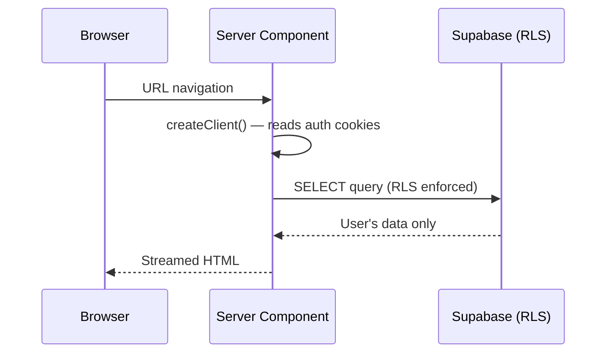
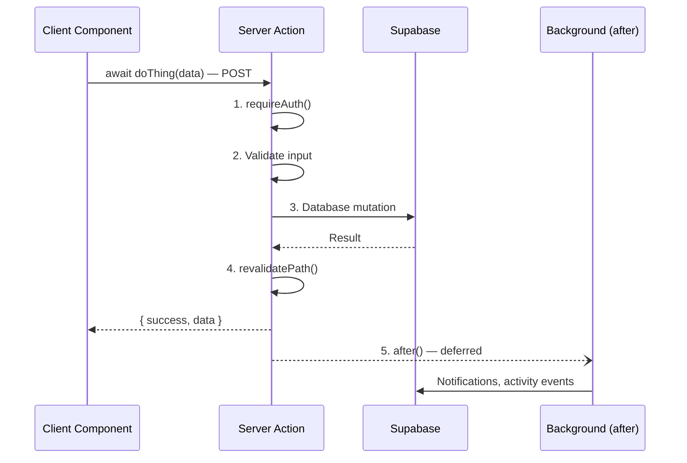
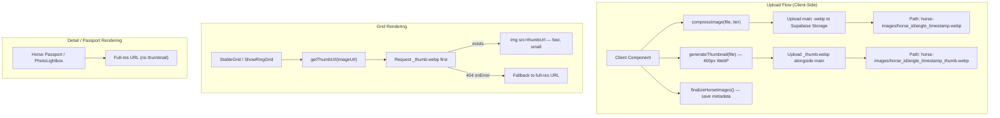

# Data Flow

## Request Lifecycle

Every user interaction follows one of two patterns:

### Pattern 1: Server Component Page Load



**Key point:** Pages are Server Components by default. They fetch data via `await createClient()` from `@/lib/supabase/server`, which reads auth cookies. RLS ensures users only see their own data.

### Pattern 2: Client Component → Server Action



## Standard Server Action Return Type

All server actions follow this consistent return pattern:

```typescript
{ success: boolean; error?: string; data?: T }
```

This enables consistent error handling in client components:

```typescript
const result = await doThing(data);
if (!result.success) {
    setError(result.error);
    return;
}
// use result.data
```

## Database Client Selection

| Need | Use | Import |
|------|-----|--------|
| Read user's own data (page load) | `createClient()` | `@/lib/supabase/server` |
| Write user's own data (server action) | `createClient()` or `requireAuth()` | `@/lib/supabase/server` or `@/lib/auth` |
| Read public data (no auth needed) | `createClient()` | `@/lib/supabase/server` |
| Upload files from browser | `createClient()` | `@/lib/supabase/client` |
| Cross-user writes (notifications) | `getAdminClient()` | `@/lib/supabase/admin` |
| Bypass RLS (admin operations) | `getAdminClient()` | `@/lib/supabase/admin` |

## Cron Jobs

| Schedule | Endpoint | Action |
|----------|----------|--------|
| Daily 6 AM UTC | `/api/cron/refresh-market` | Refreshes `mv_market_prices` materialized view |
| Monthly 1st 8 AM UTC | `/api/cron/stablemaster-agent` | AI collection analysis via Gemini |

Configured in `vercel.json`. The cron endpoints validate the `CRON_SECRET` header before executing.

## Image Flow



### Tier-Gated Compression

| Tier | Max Dimension | Quality | Max Upload Size |
|------|--------------|---------|-----------------|
| `free` | 1000px | 0.70 | 10MB |
| `pro` | 2500px | 0.92 | 10MB |
| `studio` | 2500px | 0.95 | 10MB |

User tier is read from JWT `app_metadata.tier` on the client side. Thumbnails are always 400px at 0.60 quality regardless of tier.

Horse images are in a **public** Supabase Storage bucket. Grid components use `getThumbUrl()` from `@/lib/utils/imageUrl` to derive the `_thumb.webp` path from the full-res URL. The `onError` fallback ensures horses uploaded before the thumbnail feature was added still render correctly using their full-res images.

## Cache Invalidation

After mutations, server actions call `revalidatePath()` to invalidate Next.js cached data for affected routes:

```typescript
revalidatePath("/dashboard");           // User's dashboard
revalidatePath(`/community/${horseId}`); // Public passport
revalidatePath(`/inbox/${convoId}`);     // Chat thread
```

This ensures the user sees fresh data after their action without a full page reload.

---

**Next:** [Auth Flow](auth-flow.md) · [Architecture Overview](overview.md)
