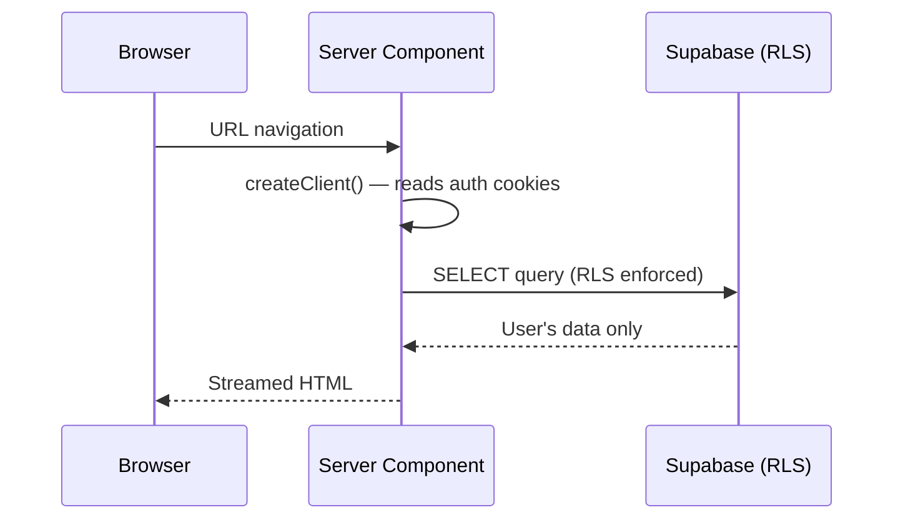
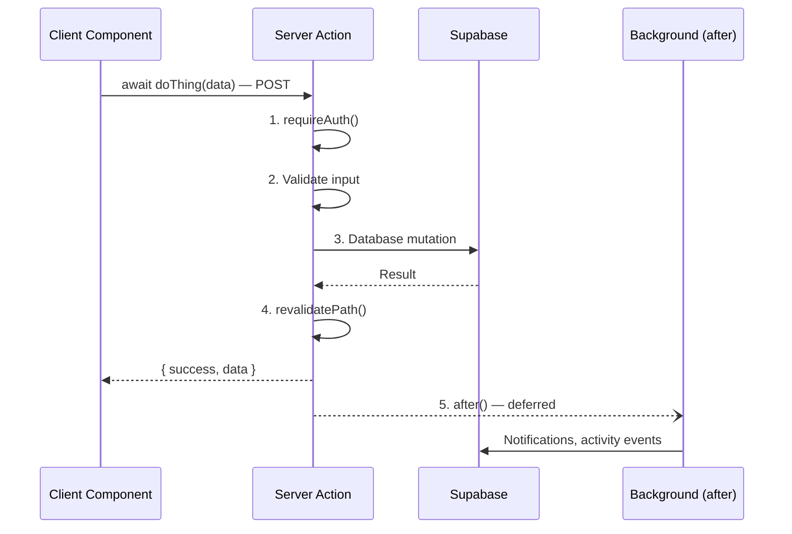
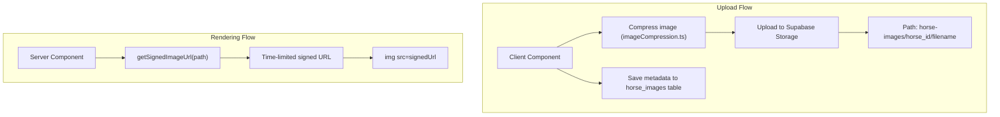

# Data Flow

## Request Lifecycle

Every user interaction follows one of two patterns:

### Pattern 1: Server Component Page Load



**Key point:** Pages are Server Components by default. They fetch data via `await createClient()` from `@/lib/supabase/server`, which reads auth cookies. RLS ensures users only see their own data.

### Pattern 2: Client Component → Server Action



## Standard Server Action Return Type

All server actions follow this consistent return pattern:

```typescript
{ success: boolean; error?: string; data?: T }
```

This enables consistent error handling in client components:

```typescript
const result = await doThing(data);
if (!result.success) {
    setError(result.error);
    return;
}
// use result.data
```

## Database Client Selection

| Need | Use | Import |
|------|-----|--------|
| Read user's own data (page load) | `createClient()` | `@/lib/supabase/server` |
| Write user's own data (server action) | `createClient()` or `requireAuth()` | `@/lib/supabase/server` or `@/lib/auth` |
| Read public data (no auth needed) | `createClient()` | `@/lib/supabase/server` |
| Upload files from browser | `createClient()` | `@/lib/supabase/client` |
| Cross-user writes (notifications) | `getAdminClient()` | `@/lib/supabase/admin` |
| Bypass RLS (admin operations) | `getAdminClient()` | `@/lib/supabase/admin` |

## Cron Jobs

| Schedule | Endpoint | Action |
|----------|----------|--------|
| Daily 6 AM UTC | `/api/cron/refresh-market` | Refreshes `mv_market_prices` materialized view |

Configured in `vercel.json`. The cron endpoint validates the request is from Vercel before executing.

## Image Flow



Horse images are in a **private** Supabase Storage bucket. The `getSignedImageUrl()` utility in `storage.ts` generates time-limited signed URLs for rendering. This prevents hotlinking and unauthorized access.

## Cache Invalidation

After mutations, server actions call `revalidatePath()` to invalidate Next.js cached data for affected routes:

```typescript
revalidatePath("/dashboard");           // User's dashboard
revalidatePath(`/community/${horseId}`); // Public passport
revalidatePath(`/inbox/${convoId}`);     // Chat thread
```

This ensures the user sees fresh data after their action without a full page reload.

---

**Next:** [Auth Flow](auth-flow.md) · [Architecture Overview](overview.md)
