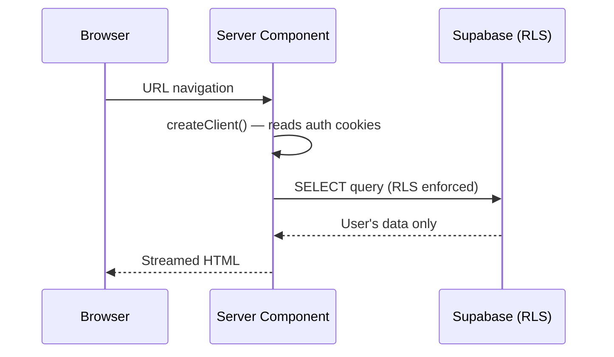
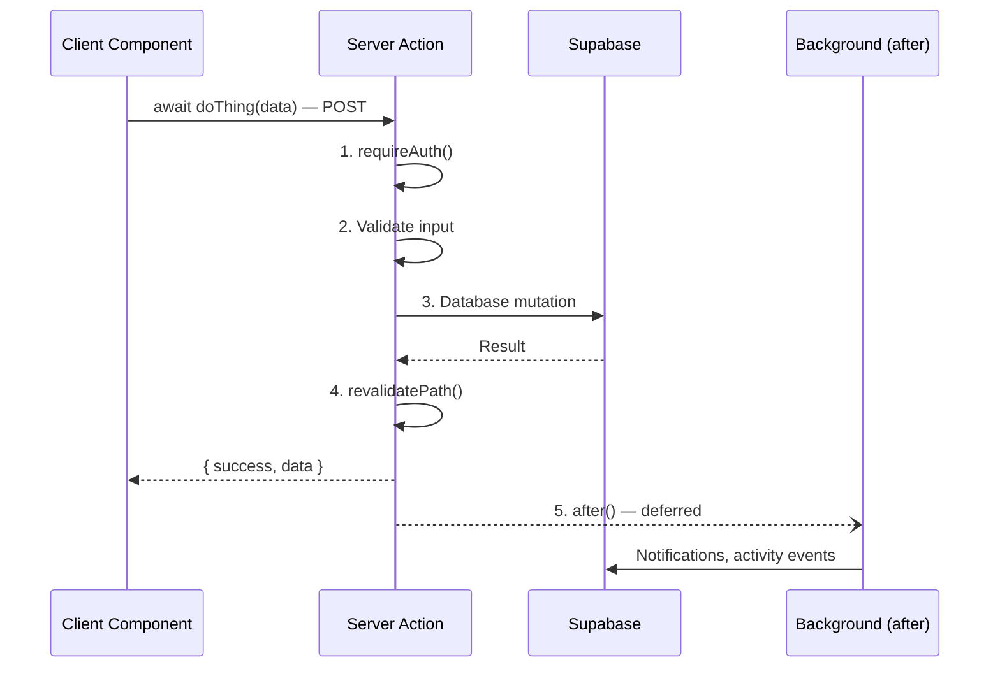
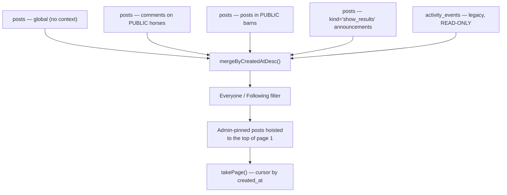
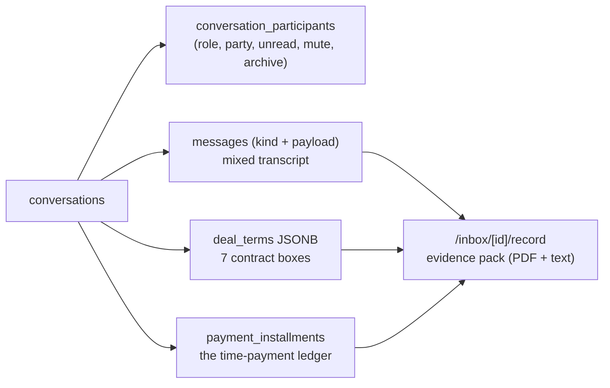
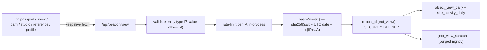
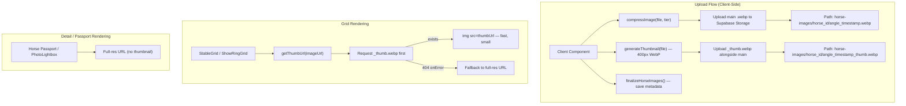

# Data Flow

## Request Lifecycle

Every user interaction follows one of two patterns:

### Pattern 1: Server Component Page Load


```mermaid
sequenceDiagram
    participant B as Browser
    participant SC as Server Component
    participant SB as Supabase (RLS)

    B->>SC: URL navigation
    SC->>SC: createClient() — reads auth cookies
    SC->>SB: SELECT query (RLS enforced)
    SB-->>SC: User's data only
    SC-->>B: Streamed HTML
```

**Key point:** Pages are Server Components by default. They fetch data via `await createClient()` from `@/lib/supabase/server`, which reads auth cookies. RLS ensures users only see their own data.

### Pattern 2: Client Component → Server Action


```mermaid
sequenceDiagram
    participant CC as Client Component
    participant SA as Server Action
    participant DB as Supabase
    participant BG as Background (after)

    CC->>SA: await doThing(data) — POST
    SA->>SA: 1. requireAuth()
    SA->>SA: 2. Validate input
    SA->>DB: 3. Database mutation
    DB-->>SA: Result
    SA->>SA: 4. revalidatePath()
    SA-->>CC: { success, data }
    SA--)BG: 5. after() — deferred
    BG->>DB: Notifications, activity events
```

## Standard Server Action Return Type

All server actions follow this consistent return pattern:

```typescript
{ success: boolean; error?: string; data?: T }
```

This enables consistent error handling in client components:

```typescript
const result = await doThing(data);
if (!result.success) {
    setError(result.error);
    return;
}
// use result.data
```

## Database Client Selection

| Need | Use | Import |
|------|-----|--------|
| Read user's own data (page load) | `createClient()` | `@/lib/supabase/server` |
| Write user's own data (server action) | `createClient()` or `requireAuth()` | `@/lib/supabase/server` or `@/lib/auth` |
| Read public data (no auth needed) | `createClient()` | `@/lib/supabase/server` |
| Upload files from browser | `createClient()` | `@/lib/supabase/client` |
| Cross-user writes (notifications) | `getAdminClient()` | `@/lib/supabase/admin` |
| Bypass RLS (admin operations) | `getAdminClient()` | `@/lib/supabase/admin` |

## Cron Jobs

| Schedule | Endpoint | Action |
|----------|----------|--------|
| Daily 06:00 UTC | `/api/cron/refresh-market` | Refreshes `mv_market_prices` and `mv_trusted_sellers`; runs `cleanup_system_garbage()` (which also purges every past-day row from `object_view_scratch`), `auto_unpark_expired_transfers()` and `cleanup_rate_limits()` |
| Hourly | `/api/cron/transition-shows` | Auto-transitions shows whose entry/judging windows have elapsed (e.g. `entries_open` → `entries_closed`) |
| Monthly, 1st, 09:00 UTC | `/api/cron/stablemaster-agent` | AI collection analysis via Gemini |

Configured in `vercel.json`. The cron endpoints validate the `CRON_SECRET` header before executing.

## The Paddock — feed stream assembly

`/feed` is one stream, assembled server-side by `getFeedStream` in `src/app/actions/posts.ts`.


```mermaid
graph TD
    P1["posts — global (no context)"] --> M["mergeByCreatedAtDesc()"]
    P2["posts — comments on PUBLIC horses"] --> M
    P3["posts — posts in PUBLIC barns"] --> M
    P4["posts — kind='show_results' announcements"] --> M
    AE["activity_events — legacy, READ-ONLY"] --> M
    M --> F["Everyone / Following filter"]
    F --> Pin["Admin-pinned posts hoisted<br/>to the top of page 1"]
    Pin --> Page["takePage() — cursor by created_at"]
```

Rules that are easy to get wrong:

- **`activity_events` is read-only.** Nothing writes to it any more; it is interleaved so the
  history before migration 166 doesn't disappear. New content is always a `posts` row.
- **Audience is enforced in RLS, not in the query.** `posts_select` ANDs a context gate with an
  audience gate (`visibility='public'` OR author OR follower). A read path that forgets the
  filter still cannot leak a followers-only post.
- **Pinning is a first-page-only hoist.** `setFeedPostPinned` marks the post; the stream lifts
  pinned rows above the cursor window on page 1 only, so pagination stays stable.
- **Mentions are structured.** `src/lib/feed/mentionMatch.ts` does longest-alias matching, and
  the same module backs both the `MentionTextarea` autocomplete and `RichText`'s `knownAliases`
  rendering — so what you saw while typing is what gets linked.

## The Deal Room — a thread that grows

A plain DM and a deal are the same `conversations` row; the difference is what has been attached
to it. **Plain DMs stay first-class** — nothing about the deal machinery is imposed on a chat.


```mermaid
graph LR
    C["conversations"] --> CP["conversation_participants<br/>(role, party, unread, mute, archive)"]
    C --> M["messages (kind + payload)<br/>mixed transcript"]
    C --> DT["deal_terms JSONB<br/>7 contract boxes"]
    C --> PI["payment_installments<br/>the time-payment ledger"]
    M --> EV["/inbox/[id]/record<br/>evidence pack (PDF + text)"]
    DT --> EV
    PI --> EV
```

- Roles come from `conversation_participants`, **not** from `conversations.buyer_id` — that
  column records who clicked first, which is not the same as who is buying.
- Non-`chat` message kinds are immutable by trigger. That immutability is the entire reason the
  evidence pack is worth anything.
- Contract boxes freeze once both parties have signed (`agreedByAAt` + `agreedByBAt`).
- Stage vocabulary is centralised in `src/lib/deals/vocabulary.ts` — see
  [State Machines](state-machines.md).

## Object view metrics — the write path


```mermaid
graph LR
    VB["<ViewBeacon> on passport / show /<br/>barn / studio / reference / profile"]
    VB -->|"keepalive fetch"| API["/api/beacon/view"]
    API --> V["validate entity type (7-value allow-list)"]
    V --> RL["rate-limit per IP, in-process"]
    RL --> H["hashViewer() — sha256(salt + UTC date + id|IP+UA)"]
    H --> RPC["record_object_view() — SECURITY DEFINER"]
    RPC --> D["object_view_daily + site_activity_daily"]
    RPC --> S["object_view_scratch (purged nightly)"]
```

The route answers **204 for success, malformed input, and an unapplied migration alike** — a
beacon must never be the reason a page misbehaves. Because it fires client-side, crawlers mostly
don't count without any user-agent sniffing.

## Image Flow


```mermaid
graph TD
    subgraph Upload["Upload Flow (Client-Side)"]
        A["Client Component"] --> B["compressImage(file, tier)"]
        B --> C["Upload main .webp to Supabase Storage"]
        C --> D["Path: horse-images/horse_id/angle_timestamp.webp"]
        A --> T["generateThumbnail(file) — 400px WebP"]
        T --> U["Upload _thumb.webp alongside main"]
        U --> V["Path: horse-images/horse_id/angle_timestamp_thumb.webp"]
        A --> E["finalizeHorseImages() — save metadata"]
    end

    subgraph Render["Grid Rendering"]
        F["StableGrid / ShowRingGrid"] --> G["getThumbUrl(imageUrl)"]
        G --> H["Request _thumb.webp first"]
        H -->|exists| I["img src=thumbUrl — fast, small"]
        H -->|404 onError| J["Fallback to full-res URL"]
    end

    subgraph Detail["Detail / Passport Rendering"]
        K["Horse Passport / PhotoLightbox"] --> L["Full-res URL (no thumbnail)"]
    end
```

### Tier-Gated Compression

| Tier | Max Dimension | Quality | Max Upload Size |
|------|--------------|---------|-----------------|
| `free` | 1000px | 0.70 | 10MB |
| `pro` | 2500px | 0.92 | 10MB |
| `studio` | 2500px | 0.95 | 10MB |

User tier is read from JWT `app_metadata.tier` on the client side. Thumbnails are always 400px at 0.60 quality regardless of tier.

Horse images are in a **public** Supabase Storage bucket. Grid components use `getThumbUrl()` from `@/lib/utils/imageUrl` to derive the `_thumb.webp` path from the full-res URL. The `onError` fallback ensures horses uploaded before the thumbnail feature was added still render correctly using their full-res images.

## Cache Invalidation

After mutations, server actions call `revalidatePath()` to invalidate Next.js cached data for affected routes:

```typescript
revalidatePath("/dashboard");           // User's dashboard
revalidatePath(`/community/${horseId}`); // Public passport
revalidatePath(`/inbox/${convoId}`);     // Chat thread
```

This ensures the user sees fresh data after their action without a full page reload.

---

**Next:** [Auth Flow](auth-flow.md) · [Architecture Overview](overview.md)
