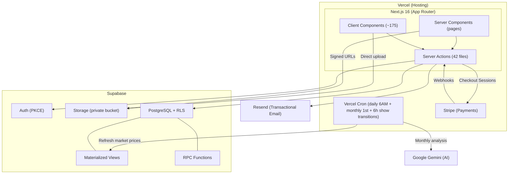

# Architecture Overview

## System Diagram



## Technology Stack

| Layer | Technology | Version | Purpose |
|-------|-----------|---------|---------|
| **Framework** | Next.js (App Router) | 16.1.6 | Server Components, server actions, Turbopack |
| **Runtime** | React | 19.2.3 | UI rendering (Server + Client Components) |
| **Language** | TypeScript | 5.x | Strict mode, auto-generated DB types via `npm run gen-types` |
| **Database** | Supabase (PostgreSQL) | — | RLS on every table, materialized views, RPC functions |
| **Auth** | Supabase Auth | — | PKCE flow, cookie-based SSR sessions |
| **Storage** | Supabase Storage | — | Private `horse-images` bucket with signed URLs |
| **Hosting** | Vercel | Serverless | Hobby tier, auto-deploy on push to `main` |
| **CSS** | Tailwind CSS v4 | — | Utility-first classes + `@theme` design tokens in globals.css |
| **UI Components** | shadcn/ui (Radix) | — | Button, Input, Select, Textarea, Badge, Card, Dialog, Popover, Skeleton, Separator, Table |
| **Animations** | Framer Motion | — | Spring physics, staggered grid reveals, tactile micro-interactions |
| **Payments** | Stripe | — | Checkout Sessions + Webhooks for Pro tier subscriptions |
| **AI** | Google Gemini | — | Stablemaster collection analysis (monthly cron) |
| **Email** | Resend | 6.9.3 | Transactional notifications (offers, comments, follows) |
| **PDF** | @react-pdf/renderer | 4.3.2 | Insurance reports, Certificate of Authenticity, Show Tags |
| **Search** | fuzzysort | 3.1.0 | Client-side fuzzy matching for reference catalog |
| **CSV** | PapaParse | 5.5.3 | Batch import parsing |
| **Testing** | Vitest + Playwright | — | Unit/integration + component (RTL) + E2E |

## Core Architectural Principles

### 1. Server Actions as the Backend

There is **no separate API layer**. All backend logic lives in 42 `"use server"` files under `src/app/actions/`. Client components import server action functions directly — Next.js handles serialization. New action files follow the **zod → `requireAuth()` → ownership/role check → RLS-first write** order (see below), with business logic factored into a pure, tested `src/lib/<domain>/` module rather than inlined in the action.

This means:
- No REST controllers, no API route boilerplate
- Backend and frontend are co-located
- Type safety is end-to-end (TypeScript on both sides)

**Exception:** 18 API routes (plus `/auth/callback`, which lives outside `/api`) exist for concerns that can't be server actions:
- `/auth/callback` — PKCE code exchange (must be a GET endpoint)
- `/api/auth/me` — Session check (GET endpoint)
- `/api/checkout` — Stripe Checkout Session creation (Pro subscription)
- `/api/checkout/promote` — Stripe: Promoted listing purchase
- `/api/checkout/boost-iso` — Stripe: ISO feed bounty purchase
- `/api/checkout/insurance-report` — Stripe: A-la-carte insurance report
- `/api/checkout/studio-pro` — Stripe: Studio Pro artist tier
- `/api/webhooks/stripe` — Stripe webhook handler
- `/api/cron/refresh-market` — Vercel cron trigger (daily)
- `/api/cron/stablemaster-agent` — Stablemaster AI cron (monthly)
- `/api/cron/transition-shows` — Auto-transition expired shows (6h)
- `/api/export` — PDF generation (CoA/parked export)
- `/api/export/show-tags` — Show tag PDF generation (Pro tier)
- `/api/export/nan-cards` — NAN card CSV export for collectors
- `/api/export/show-results/[eventId]` — Legacy photo-show results export
- `/api/export/show-results-v2/[showId]` — Shows v2 NAMHSA-format results export
- `/api/insurance-report` — Insurance PDF (streaming response)
- `/api/identify-mold` — AI image analysis
- `/api/reference-dictionary` — Reference data for search

### 2. Zod at Every Action Boundary

New Server Actions validate their input with a `zod` schema BEFORE calling `requireAuth()` or
touching the database — reject malformed input before any side effect can happen. This is fully
live in the 5 rebuilt domains (`shows-v2`, `shows-v2-ring`, `groups-forum`, `stable`,
`showring` — schemas in `src/lib/{shows,groups,stable,showring}/schemas.ts`) and is the
required pattern for new action files; it has not yet been retrofitted onto every pre-rebuild
action. See `CONTRIBUTING.md` for the full order (zod → auth → ownership → RLS-first).

### 3. Flag-Gated Dark-Ship Rebuilds

User-visible rebuilds of a live surface ship behind a `NEXT_PUBLIC_<DOMAIN>_V2` env flag rather
than a direct cutover: build dark → preview locally → owner approves → flip the flag in Vercel.
The old code path stays in the tree until the owner is confident, then a follow-up PR removes
it. All four flags shipped this way — `SHOWS_V2`, `GROUPS_FORUM`, `STABLE_V2`, `SHOWRING_V2` —
are live in prod as of July 2026.

### 4. Row Level Security (RLS) Everywhere

Every database table has RLS policies. Users can only read/write their own data through the `supabase` client. The security model is:

| Client | RLS Enforced | Used For |
|--------|-------------|----------|
| `createClient()` (server) | ✅ Yes | Page data fetching, user mutations |
| `createClient()` (client) | ✅ Yes | Direct storage uploads |
| `getAdminClient()` (admin) | ❌ Bypassed | Cross-user writes (notifications, transfers, admin) |

### 5. Privacy by Architecture

- `financial_vault` table is **never** queried on public routes — only the owner sees it via RLS
- Horse images are in a **private** Supabase bucket — rendered via signed URLs with TTL
- Block system filters blocked users at the **query level** (not UI-level)

### 6. Serverless-Safe Background Tasks

Serverless functions have cold start budgets. The `after()` API from Next.js wraps deferred tasks (notifications, activity events, achievement evaluation) so they don't block the user-facing response.

```typescript
after(async () => {
    await createNotification({ ... });  // Runs after response is sent
    await createActivityEvent({ ... });
});
```

### 7. Event-Sourced Provenance

Horse provenance is assembled from **immutable source tables** via a regular view (`v_horse_hoofprint`), not a mutable timeline table. Both views (`v_horse_hoofprint`, `discover_users_view`) use `security_invoker = true` so they respect the querying user's RLS policies. Each source of truth maintains its own data:

| Source Table | Provenance Events |
|---|---|
| `horse_transfers` | Ownership changes |
| `condition_history` | Condition grade changes |
| `show_records` | Show results |
| `customization_logs` | Customization work |
| `horse_pedigrees` | Lineage data |

The materialized view UNION ALLs these into a single chronological timeline.

## Scale (as of July 11, 2026)

| Metric | Count |
|--------|-------|
| Page routes | 73 |
| Client components | ~175 (incl. 11 shadcn/ui + 4 layouts + 3 PDF components) |
| Server action files | 42 |
| API routes | 18 (+ `/auth/callback` outside `/api`) |
| Database migrations | 119 files (001–123, some numbers skipped) |
| New domain libs | `src/lib/{shows,groups,stable,showring,commerce}/` |
| Feature flags (all live in prod) | `SHOWS_V2`, `GROUPS_FORUM`, `STABLE_V2`, `SHOWRING_V2` |
| CSS architecture | Tailwind CSS v4 + shadcn/ui + Framer Motion |
| Reference catalog entries | 10,500+ |
| Unit/integration/component tests | 1,031 (across 71 test files) |
| E2E test specs | 9 |
| CI | GitHub Actions (build + test on every push) |

---

**Next:** [Data Flow](data-flow.md) · [Auth Flow](auth-flow.md) · [State Machines](state-machines.md)
