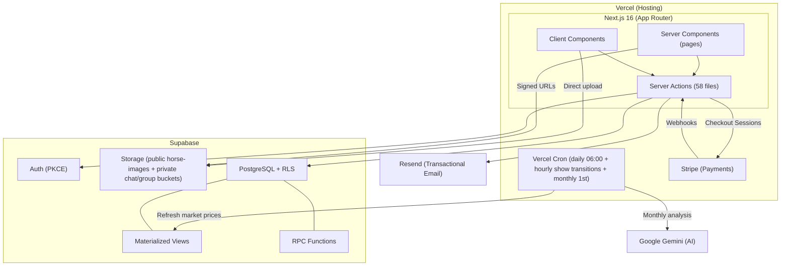

# Architecture Overview

## System Diagram


```mermaid
graph TD
    subgraph Vercel["Vercel (Hosting)"]
        subgraph Next["Next.js 16 (App Router)"]
            SC["Server Components (pages)"]
            CC["Client Components"]
            SA["Server Actions (58 files)"]
        end
        Cron["Vercel Cron (daily 06:00 + hourly show transitions + monthly 1st)"]
        Stripe["Stripe (Payments)"]
    end

    subgraph Supabase["Supabase"]
        Auth["Auth (PKCE)"]
        Storage["Storage (public horse-images + private chat/group buckets)"]
        DB["PostgreSQL + RLS"]
        MV["Materialized Views"]
        RPC["RPC Functions"]
    end

    Email["Resend (Transactional Email)"]
    Gemini["Google Gemini (AI)"]

    SA -->|"Checkout Sessions"| Stripe
    Stripe -->|"Webhooks"| SA
    Cron -->|"Monthly analysis"| Gemini

    SC --> SA
    CC --> SA
    SA --> DB
    SA --> Email
    CC -->|"Direct upload"| Storage
    SC -->|"Signed URLs"| Storage
    Cron -->|"Refresh market prices"| MV
    SA --> Auth
    DB --- MV
    DB --- RPC
```

## Technology Stack

| Layer | Technology | Version | Purpose |
|-------|-----------|---------|---------|
| **Framework** | Next.js (App Router) | 16.1.6 | Server Components, server actions, Turbopack |
| **Runtime** | React | 19.2.3 | UI rendering (Server + Client Components) |
| **Language** | TypeScript | 5.x | Strict mode, auto-generated DB types via `npm run gen-types` |
| **Database** | Supabase (PostgreSQL) | — | RLS on every table, materialized views, RPC functions |
| **Auth** | Supabase Auth | — | PKCE flow, cookie-based SSR sessions |
| **Storage** | Supabase Storage | — | **Public** `horse-images` bucket (CDN-cacheable, no signed URLs); private `chat-attachments` and `group-files` buckets served via server-generated signed URLs |
| **Hosting** | Vercel | Serverless | Auto-deploy on push to `main`. `experimental.cpus: 6` caps static-generation workers — see the build note below |
| **CSS** | Tailwind CSS v4 | — | Utility-first classes + `@theme` design tokens in globals.css |
| **UI Components** | shadcn/ui (Radix) | — | Button, Input, Select, Textarea, Badge, Card, Dialog, Popover, Skeleton, Separator, Table |
| **Animations** | Framer Motion | — | Spring physics, staggered grid reveals, tactile micro-interactions |
| **Payments** | Stripe | — | Checkout Sessions + Webhooks for Pro tier subscriptions |
| **AI** | Google Gemini | — | Stablemaster collection analysis (monthly cron) |
| **Email** | Resend | 6.9.3 | Transactional notifications (offers, comments, follows) |
| **PDF** | @react-pdf/renderer | 4.3.2 | Insurance reports, Certificate of Authenticity, Show Tags |
| **Search** | fuzzysort | 3.1.0 | Client-side fuzzy matching for reference catalog |
| **CSV** | PapaParse | 5.5.3 | Batch import parsing |
| **PWA** | Serwist | 9.5 | `src/app/sw.ts` → `public/sw.js`; offline barn mode for live shows |
| **Monitoring** | Sentry + Vercel Web Analytics | — | `withSentryConfig` wraps `next.config.ts`; Vercel Analytics (first-party, cookieless) sits in `layout.tsx` alongside GA |
| **Testing** | Vitest + Playwright | — | Unit/integration + component (RTL) + E2E |

> **Build note — do not remove `experimental.cpus: 6`.** Vercel's Turbo build machine has 30
> cores, so Next spawns 29 static-generation workers by default. Every prebuilt `/reference` page
> makes several Supabase queries; 29 concurrent workers stampede the connection pool, queue past
> the 60-second per-page cap, and fail the build. Six workers build the same pages comfortably.

## Core Architectural Principles

### 1. Server Actions as the Backend

There is **no separate API layer**. All backend logic lives in 58 `"use server"` files under `src/app/actions/`. Client components import server action functions directly — Next.js handles serialization. New action files follow the **zod → `requireAuth()` → ownership/role check → RLS-first write** order (see below), with business logic factored into a pure, tested `src/lib/<domain>/` module rather than inlined in the action.

This means:
- No REST controllers, no API route boilerplate
- Backend and frontend are co-located
- Type safety is end-to-end (TypeScript on both sides)

**Exception:** 18 API routes (plus `/auth/callback` and the Serwist handler, both outside `/api`) exist for concerns that can't be server actions — PKCE and cron need GET endpoints, Stripe and the view beacon are POSTed to from outside the React tree, and PDF/CSV generation needs a streaming `Response`. See [API Routes](../api/routes.md) for the full list.

### 2. Zod at Every Action Boundary

New Server Actions validate their input with a `zod` schema BEFORE calling `requireAuth()` or
touching the database — reject malformed input before any side effect can happen. Live in the
rebuilt domains (schemas in each `src/lib/<domain>/schemas.ts`) and required for new action
files; it has not yet been retrofitted onto every pre-rebuild action. See `CONTRIBUTING.md` for
the full order (zod → auth → ownership → RLS-first).

### 3. Ship Dark, Then Delete the Fallback

User-visible rebuilds of a live surface ship behind a `NEXT_PUBLIC_*` env flag rather than a
direct cutover: build dark → preview locally → owner approves → flip the flag in Vercel — **and
then delete the flag and the old branch.** That last step is not optional; nine v1 flags once
accumulated into nine live fallback paths nobody was testing, and the launch release's Phase 0
deleted all of them.

Four flags remain, two of them dark (`NEXT_PUBLIC_FORM_ENGINE`, `NEXT_PUBLIC_SHOW_STANDINGS`) —
see `.agents/MASTER_BLUEPRINT.md` for the table. `LegacyShowPage` is *not* a flag path: it is
the renderer chosen by data for legacy `events`-engine shows.

### 3a. Feature-Detect the Schema

Migrations are pasted into the Supabase SQL editor by hand, so deployed app code must work
against a database that does not have the new columns yet. Each affected domain probes once per
process and memoises behind a 60-second TTL, so a running instance picks up the paste within a
minute instead of needing a redeploy:

```typescript
// src/lib/deals/columnSupport.ts — one cheap select per capability
const [kinds, participants] = await Promise.all([
    supabase.from("messages").select("kind").limit(1),
    supabase.from("conversation_participants").select("conversation_id").limit(1),
]);
return { messageKinds: !kinds.error, participants: !participants.error };
```

Missing column is PostgREST `42703`; missing table is `42P01`. A probe failure degrades to
"absent", which is always the safe shape — a metrics beacon or a terms panel must never be why
a page breaks.

### 4. Row Level Security (RLS) Everywhere

Every database table has RLS policies. Users can only read/write their own data through the `supabase` client. The security model is:

| Client | RLS Enforced | Used For |
|--------|-------------|----------|
| `createClient()` (server) | ✅ Yes | Page data fetching, user mutations |
| `createClient()` (client) | ✅ Yes | Direct storage uploads |
| `getAdminClient()` (admin) | ❌ Bypassed | Cross-user writes (notifications, transfers, admin) |

### 5. Privacy by Architecture

- `financial_vault` table is **never** queried on public routes — only the owner sees it via RLS
- Horse images live in a **public**, CDN-cacheable bucket (visibility is enforced by the RLS on `horse_images`, not by URL secrecy); DM photos and barn files are in **private** buckets served through server-generated signed URLs
- Block system filters blocked users at the **query level** (not UI-level), and `are_blocked()` refuses the send outright at the database
- **Metrics track objects, never people.** `object_view_daily` has no viewer column, so "what did member X look at" is a question the schema cannot answer. The daily dedupe token is a salted hash that is purged nightly. View counts stay private to the seller

### 6. Serverless-Safe Background Tasks

Serverless functions have cold start budgets. The `after()` API from Next.js wraps deferred tasks (notifications, activity events, achievement evaluation) so they don't block the user-facing response.

```typescript
after(async () => {
    await createNotification({ ... });  // Runs after response is sent
    await createActivityEvent({ ... });
});
```

### 7. Event-Sourced Provenance

Horse provenance is assembled from **immutable source tables** via a regular view (`v_horse_hoofprint`), not a mutable timeline table. Both views (`v_horse_hoofprint`, `discover_users_view`) use `security_invoker = true` so they respect the querying user's RLS policies. Each source of truth maintains its own data:

| Source Table | Provenance Events |
|---|---|
| `horse_transfers` | Ownership changes |
| `condition_history` | Condition grade changes |
| `show_records` | Show results |
| `customization_logs` | Customization work |
| `horse_pedigrees` | Lineage data |
| `horse_titles` | Earned titles (migration 159 added this branch) |

The view UNION ALLs these into a single chronological timeline.

## Scale (as of the August 21, 2026 launch release)

| Metric | Count |
|--------|-------|
| Rooms | 5 (Stable · Shows · Market · The Paddock · Registry) |
| Page routes | 94 |
| Server action files | 58 |
| API routes | 18 (+ `/auth/callback` and the Serwist handler, both outside `/api`) |
| Database migrations | 170 files (001–175; 045/047/049/051/174 skipped) |
| Domain libs | `src/lib/{shows,groups,stable,showring,commerce,deals,studio,forms,feed,metrics,market,members,catalog,external-shows}/` |
| Feature flags | 4 remaining — 2 dark (`FORM_ENGINE`, `SHOW_STANDINGS`), 1 SEO kill-switch (`REFERENCE_PAGES`), 1 off (`WANTED_NUDGE`) |
| CSS architecture | Tailwind CSS v4 + shadcn/ui + Framer Motion, one `globals.css` (~3,980 lines) |
| Reference catalog entries | 10,900+ |
| Test files | 155 unit/integration/component + 10 Playwright E2E specs |
| CI | GitHub Actions (build + test on every push) + Husky pre-commit |

---

**Next:** [Data Flow](data-flow.md) · [Auth Flow](auth-flow.md) · [State Machines](state-machines.md)
