# Show Infrastructure — Complete Technical Report

> **Date:** March 19, 2026  
> **Scope:** Virtual Photo Shows, Expert Judging, Community Voting, Show Records, Achievements  
> **Stack:** Next.js 15 (App Router) · Supabase (PostgreSQL + RLS) · Server Actions  

---

## Table of Contents

1. [Architecture Overview](#architecture-overview)
2. [Database Schema](#database-schema)
3. [Show Lifecycle State Machine](#show-lifecycle-state-machine)
4. [Creating a Show](#creating-a-show)
5. [Entering a Show](#entering-a-show)
6. [Judging Methods](#judging-methods)
7. [Closing a Show](#closing-a-show)
8. [Show Records & Provenance](#show-records--provenance)
9. [Notifications](#notifications)
10. [Security & RLS](#security--rls)
11. [Component Architecture](#component-architecture)
12. [Route Map](#route-map)
13. [Engineering Decisions](#engineering-decisions)
14. [Show String Planner](#show-string-planner)
15. [Achievements Integration](#achievements-integration)

---

## Architecture Overview

The show system is part of the **Unified Competition Engine** — a grand unification that merged the original `photo_shows`, `show_entries`, and `show_votes` tables into the `events`, `event_entries`, and `event_votes` tables (Migration 046). This allows a single schema to support photo shows, live shows, swap meets, workshops, and more.

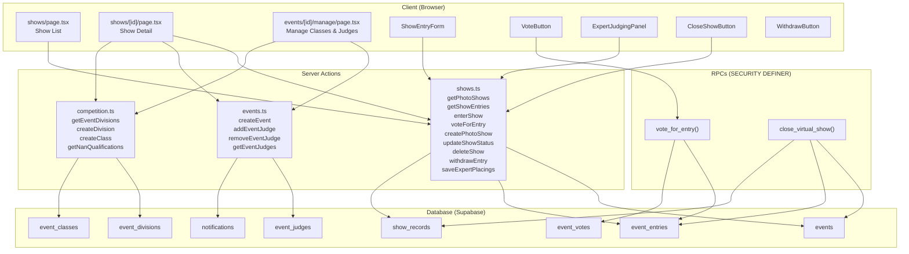

---

## Database Schema

### Core Tables

```mermaid
erDiagram
    events ||--o{ event_entries : "has entries"
    events ||--o{ event_judges : "has judges"
    events ||--o{ event_divisions : "organized by"
    event_divisions ||--o{ event_classes : "contains"
    event_entries ||--o{ event_votes : "receives votes"
    event_entries }o--|| user_horses : "entered horse"
    event_entries }o--|| users : "entered by"
    event_entries }o--o| event_classes : "in class"
    event_judges }o--|| users : "assigned to"
    event_entries ||--o| show_records : "generates record"

    events {
        uuid id PK
        text name
        text description
        text event_type "photo_show | live_show | ..."
        text show_status "open | judging | closed"
        text show_theme
        text judging_method "community_vote | expert_judge"
        timestamptz starts_at
        timestamptz ends_at
        uuid created_by FK
        boolean is_virtual
    }

    event_entries {
        uuid id PK
        uuid event_id FK
        uuid horse_id FK
        uuid user_id FK
        text entry_type "entered | planned"
        text class_id FK
        integer votes_count "default 0"
        text placing "1st 2nd 3rd HM ..."
        text entry_image_path
        text caption "max 280 chars"
        text judge_critique
        decimal judge_score
    }

    event_votes {
        uuid id PK
        uuid entry_id FK
        uuid user_id FK
        constraint "UNIQUE(entry_id, user_id)"
    }

    event_judges {
        uuid id PK
        uuid event_id FK
        uuid user_id FK
        constraint "UNIQUE(event_id, user_id)"
    }

    event_divisions {
        uuid id PK
        uuid event_id FK
        text name
        text description
        integer sort_order
    }

    event_classes {
        uuid id PK
        uuid division_id FK
        text name
        text class_number
        boolean is_nan_qualifying
        integer max_entries
        text[] allowed_scales
        integer sort_order
    }

    show_records {
        uuid id PK
        uuid horse_id FK
        uuid user_id FK
        text show_name
        date show_date
        text placing
        text division
        text show_type "photo_mhh | live | ..."
        text class_name
        integer total_entries
        text verification_tier "mhh_auto | host_verified"
        text ribbon_color
    }
```

### Constraints & Indexes

| Table | Constraint/Index | Purpose |
|-------|-----------------|---------|
| `event_entries` | `UNIQUE(event_id, horse_id)` | One entry per horse per show |
| `event_votes` | `UNIQUE(entry_id, user_id)` | One vote per user per entry |
| `event_judges` | `UNIQUE(event_id, user_id)` | One judge record per user per event |
| `event_entries` | `idx_event_entries_event` | `(event_id, votes_count DESC)` — fast leaderboard |
| `event_entries` | `idx_event_entries_user` | `(user_id)` — my entries |
| `event_entries` | `idx_event_entries_horse` | `(horse_id)` — horse show history |
| `events` | `idx_events_show_status` | `(show_status, starts_at DESC)` — filtered listing |

---

## Show Lifecycle State Machine

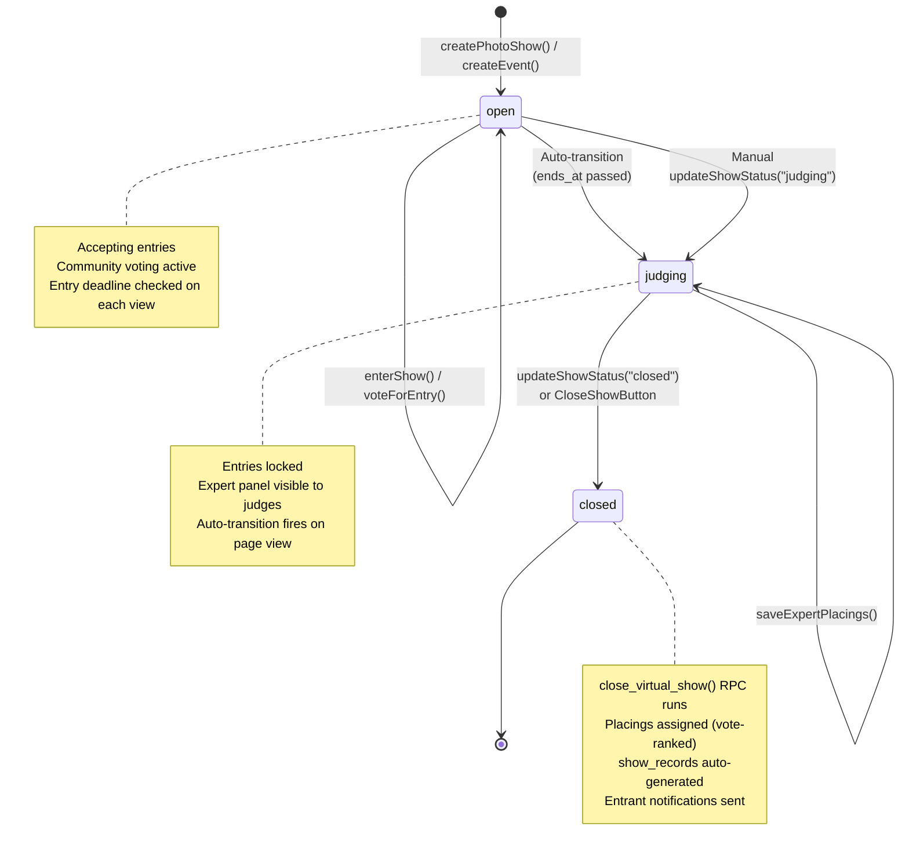

### Auto-Transition Logic

When `getShowEntries()` is called (i.e., when someone views the show detail page):

```typescript
// shows.ts — getShowEntries()
if (s.show_status === "open" && s.ends_at && new Date(s.ends_at) < new Date()) {
    const admin = getAdminClient();
    await admin.from("events")
        .update({ show_status: "judging" })
        .eq("id", showId)
        .eq("show_status", "open"); // CAS guard — only if still open
    s.show_status = "judging"; // Update in-memory for this render
}
```

**Design decision:** This is a "lazy" transition triggered on page view, not a cron job. The CAS (Compare-and-Swap) guard (`WHERE show_status = 'open'`) prevents race conditions if two users view the page simultaneously.

For the shows **list** page, the effective status is derived in-memory without writing:

```typescript
// shows.ts — getPhotoShows()
let effectiveStatus = s.show_status || "open";
if (effectiveStatus === "open" && s.ends_at && new Date(s.ends_at) < new Date()) {
    effectiveStatus = "judging"; // Display only — detail page does the DB write
}
```

---

## Creating a Show

### Flow

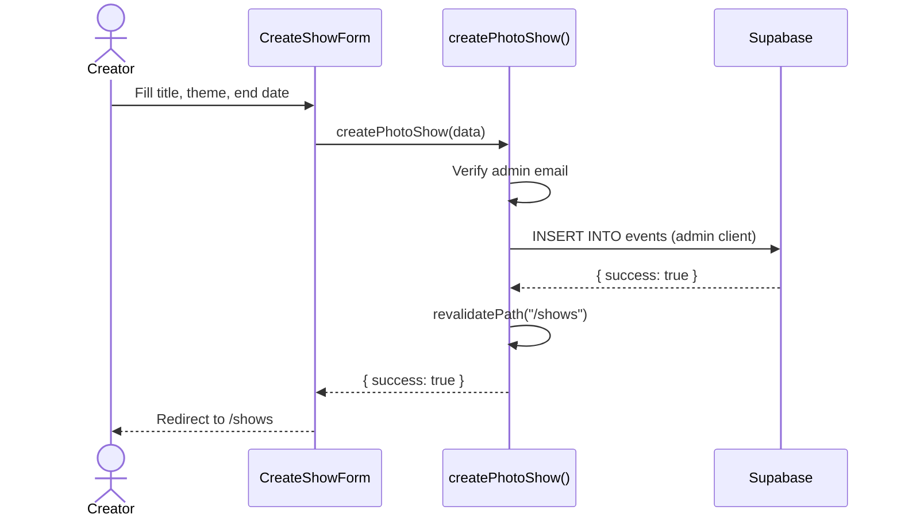

### Key Details

- **Authorization:** Currently admin-only (`user.email === ADMIN_EMAIL`). Uses `getAdminClient()` to bypass RLS.
- **Fields:** `name`, `description`, `show_theme`, `ends_at`, `event_type: "photo_show"`, `show_status: "open"`, `is_virtual: true`
- **Judging method:** Defaults to `community_vote`. Can be changed via the manage page (set to `expert_judge`).

### Division & Class Setup

After creating a show, the creator configures the competition structure via `/community/events/[id]/manage`:

```mermaid
graph TD
    A["Event (Show)"] --> B["Division: Halter"]
    A --> C["Division: Performance"]
    B --> D["Class: Stock Breed Halter"]
    B --> E["Class: Arabian Halter"]
    C --> F["Class: English Pleasure"]
    C --> G["Class: Western Trail"]

    style A fill:#1a1a2e,stroke:#8b5cf6
    style B fill:#1a1a2e,stroke:#f59e0b
    style C fill:#1a1a2e,stroke:#f59e0b
    style D fill:#1a1a2e,stroke:#22c55e
    style E fill:#1a1a2e,stroke:#22c55e
    style F fill:#1a1a2e,stroke:#22c55e
    style G fill:#1a1a2e,stroke:#22c55e
```

Classes support:
- `class_number` — Human-readable class number (e.g., "101")
- `is_nan_qualifying` — Whether placing here counts toward NAN cards
- `max_entries` — Optional cap per class
- `allowed_scales` — Scale filter (e.g., only Traditional scale horses)

Related actions: `createDivision()`, `createClass()`, `updateDivision()`, `updateClass()`, `deleteDivision()`, `deleteClass()`, `reorderDivisions()`, `reorderClasses()`, `copyDivisionsFromEvent()` (copy structure from another show).

---

## Entering a Show

### Flow

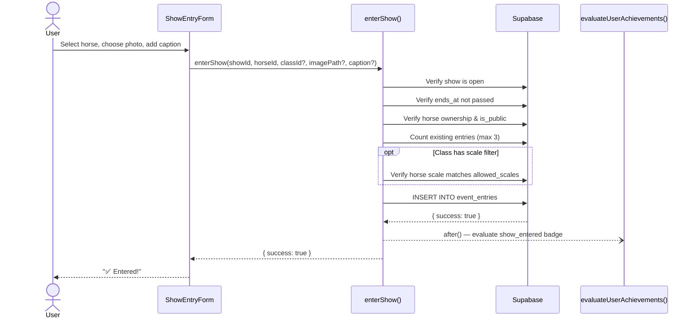

### Validation Rules

| Check | Error |
|-------|-------|
| Show must be in `open` status | "This show is not accepting entries." |
| `ends_at` must be in the future | "This show's entry deadline has passed." |
| Horse must belong to user | "Horse not found or not yours." |
| Horse must be public | "Horse must be public to enter." |
| Max 3 entries per user per show | "Maximum 3 entries per show." |
| Horse not already entered | "This horse is already entered." (23505 unique violation) |
| Scale must match class filter | "This class only accepts: Traditional. Your horse is a Classic." |

### Entry Photo Selection

The `ShowEntryForm` component fetches all photos from `horse_images` for the selected horse:

1. Auto-selects the `Primary_Thumbnail` angle
2. User can pick any angle from a visual grid
3. Photo storage path is saved in `entry_image_path`
4. Falls back to horse thumbnail if no entry photo is set
5. Optional caption (max 280 chars) displayed in italics below entry

---

## Judging Methods

Two judging methods are supported, configured per event via `judging_method`:

### 1. Community Vote (`community_vote`)

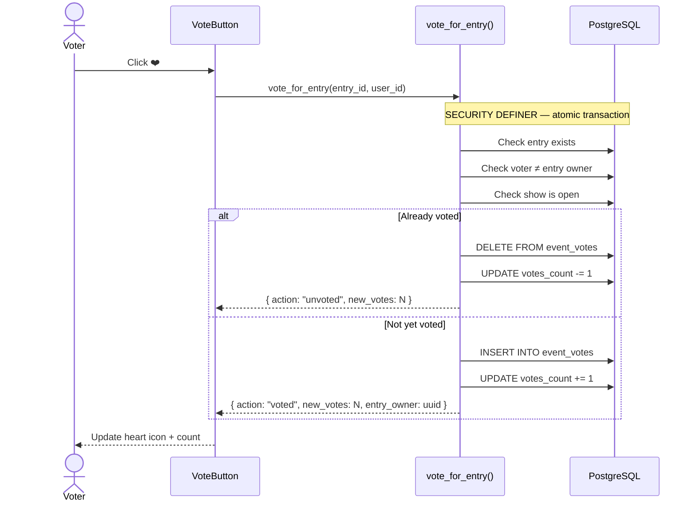

**Key design:** Voting uses an atomic `SECURITY DEFINER` RPC function (`vote_for_entry()`) to prevent race conditions. The vote toggle, count increment/decrement, and self-vote check all happen in a single PostgreSQL transaction.

The `VoteButton` component is optimistic — it updates the heart icon and count locally before the server response arrives.

### 2. Expert Judge (`expert_judge`)

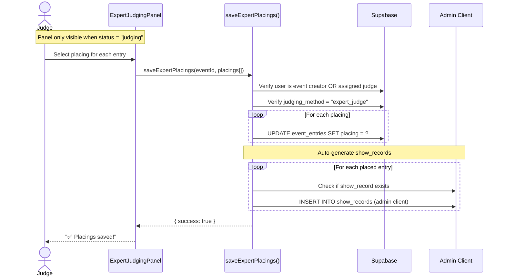

**Available placings:** 1st, 2nd, 3rd, 4th, 5th, 6th, HM, Champion, Reserve Champion, Grand Champion, Reserve Grand Champion, Top 3, Top 5, Top 10.

**Ribbon color mapping:**

| Placing | Ribbon |
|---------|--------|
| 1st | Blue |
| 2nd | Red |
| 3rd | Yellow |
| 4th | White |
| 5th | Pink |
| 6th | Green |
| HM | Green |
| Champion | Grand Champion |
| Reserve Champion | Reserve Grand Champion |

### Judge Flow & Visibility

```mermaid
graph LR
    A["Show is open"] -->|Judge visits| B["🏅 Banner:<br/>Entries still being accepted"]
    C["Show is judging"] -->|Judge visits| D["🏅 Banner + ExpertJudgingPanel<br/>with placing dropdowns"]
    E["Show is closed"] -->|Judge visits| F["🏅 Banner:<br/>Results are final"]

    style B fill:#1a1a2e,stroke:#8b5cf6
    style D fill:#1a1a2e,stroke:#22c55e
    style F fill:#1a1a2e,stroke:#6b7280
```

On the **shows list page**, judges see a purple `🏅 Judge` badge on show cards where they're assigned.

---

## Closing a Show

### Community Vote Close

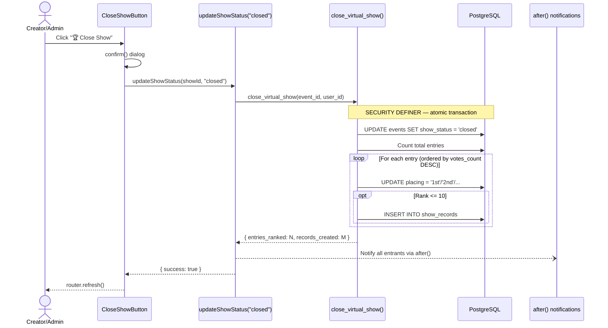

The `close_virtual_show()` RPC:
1. Verifies the caller is the event creator
2. Sets `show_status = 'closed'`
3. Ranks all entries by `votes_count DESC, created_at ASC` (tiebreaker: earlier entry wins)
4. Assigns placings: 1st, 2nd, 3rd, 4th, 5th, ... Nth
5. Auto-generates `show_records` for the top 10 entries

### Expert Judge Close

For expert-judged shows, the host/admin clicks "Close Show" **after** judges have assigned placings. The updated `close_virtual_show()` RPC (Migration 095) now **respects pre-assigned manual placings** — it branches on `judging_method`:

- `expert_judge` → Only generates `show_records` for entries with existing placings; does NOT overwrite them with vote-based rankings.
- `community_vote` → Ranks by `votes_count DESC` as before.

---

## Show Records & Provenance

Every placed entry automatically generates a `show_records` row, which flows into the horse's **Hoofprint™ timeline** and provenance:

```mermaid
graph LR
    A["Entry placed<br/>(1st, 2nd, ...)"] --> B["show_records INSERT"]
    B --> C["Horse Passport<br/>/community/[id]"]
    B --> D["Hoofprint Timeline<br/>/community/[id]/hoofprint"]
    B --> E["NAN Tracker<br/>competition.ts"]

    style A fill:#1a1a2e,stroke:#f59e0b
    style B fill:#1a1a2e,stroke:#22c55e
```

**Show record fields auto-populated:**

| Field | Source |
|-------|--------|
| `horse_id` | From entry |
| `user_id` | From entry owner |
| `show_name` | From `events.name` |
| `show_date` | From `events.starts_at` |
| `placing` | From entry placing |
| `show_type` | `"photo_mhh"` |
| `class_name` | From entry class |
| `total_entries` | Count of entries in show |
| `verification_tier` | `"mhh_auto"` |
| `ribbon_color` | Mapped from placing |
| `notes` | `"Auto-generated from expert judging"` (expert) |

---

## Notifications

| Event | Recipient | Sent From | Type |
|-------|-----------|-----------|------|
| Added as judge | Judge user | `addEventJudge()` → `after()` | `judge_assigned` |
| Vote received | Entry owner | `voteForEntry()` | `show_vote` |
| Show results announced | All entrants | `updateShowStatus("closed")` → `after()` | `show_result` |
| Comment on show | Show creator | `addEventComment()` → `after()` | `comment` |

All notifications use the **deferred `after()` pattern** — the primary action completes first, and the notification is sent in a non-blocking follow-up to avoid slowing down the response.

---

## Security & RLS

### Policy Summary

| Table | SELECT | INSERT | UPDATE | DELETE |
|-------|--------|--------|--------|--------|
| `event_entries` | All authenticated | Own `user_id` | Owner OR event creator OR assigned judge | Own `user_id` |
| `event_votes` | All authenticated | Own `user_id` | — | Own `user_id` |
| `event_judges` | All authenticated | Event creator only | — | Event creator only |
| `events` | All authenticated | Any authenticated | Creator only | Creator only |

### Critical: Migration 094 — Judge UPDATE Policy

The original `event_entries` UPDATE policy only allowed the entry owner (`user_id = auth.uid()`) to update. This silently blocked judges from assigning placings. Migration 094 replaced it with a three-role policy:

```sql
CREATE POLICY "event_entries_update" ON event_entries FOR UPDATE TO authenticated
USING (
  (SELECT auth.uid()) = user_id                    -- Entry owner
  OR EXISTS (                                       -- Event creator
    SELECT 1 FROM events
    WHERE events.id = event_entries.event_id
      AND events.created_by = (SELECT auth.uid())
  )
  OR EXISTS (                                       -- Assigned judge
    SELECT 1 FROM event_judges
    WHERE event_judges.event_id = event_entries.event_id
      AND event_judges.user_id = (SELECT auth.uid())
  )
);
```

### Admin Client Usage

| Action | Why Admin Client? |
|--------|-------------------|
| `createPhotoShow()` | Bypass INSERT policy on `events` |
| `updateShowStatus()` | Cross-user operation (admin closing any show) |
| `close_virtual_show()` RPC | `SECURITY DEFINER` — generates `show_records` for other users |
| `saveExpertPlacings()` — show_records | Judge can't INSERT rows with another user's `user_id` |
| Auto-transition (`open → judging`) | Works regardless of who triggers the page view |

---

## Component Architecture

```mermaid
graph TD
    subgraph "Server Components (RSC)"
        P1["ShowsPage<br/>shows/page.tsx"]
        P2["ShowDetailPage<br/>shows/[id]/page.tsx"]
        P3["ManagePage<br/>events/[id]/manage/page.tsx"]
    end

    subgraph "Client Components"
        C1["ShowEntryForm<br/>Horse select, photo picker,<br/>caption, class selector"]
        C2["VoteButton<br/>Optimistic toggle,<br/>vote count, heart icon"]
        C3["ExpertJudgingPanel<br/>Placing dropdowns,<br/>class filter, save button"]
        C4["CloseShowButton<br/>Confirm dialog,<br/>triggers close_virtual_show RPC"]
        C5["WithdrawButton<br/>Confirm + delete entry"]
        C6["AdminShowManager<br/>Create show form (admin)"]
        C7["CreateShowForm<br/>Title, theme, end date"]
    end

    P1 -.->|renders| C6
    P2 -.->|when open| C1
    P2 -.->|community vote entries| C2
    P2 -.->|expert + judging status| C3
    P2 -.->|creator/admin + expired| C4
    P2 -.->|own entry + open| C5
    P3 -.->|class/division CRUD| P3

    style P1 fill:#1e293b,stroke:#3b82f6
    style P2 fill:#1e293b,stroke:#3b82f6
    style P3 fill:#1e293b,stroke:#3b82f6
    style C1 fill:#1e293b,stroke:#f59e0b
    style C2 fill:#1e293b,stroke:#ef4444
    style C3 fill:#1e293b,stroke:#8b5cf6
    style C4 fill:#1e293b,stroke:#14b8a6
    style C5 fill:#1e293b,stroke:#ef4444
```

### Show Detail Page — Conditional Rendering

```mermaid
graph TD
    A["ShowDetailPage renders"] --> B{"Show status?"}
    
    B -->|open| C["📝 ShowEntryForm"]
    B -->|open or judging or closed| D["Entry Grid"]
    
    D --> E{"Judging method?"}
    E -->|community_vote| F["VoteButton on each entry"]
    E -->|expert_judge + closed| G["Placing badge on each entry"]
    E -->|expert_judge + judging| H["🏅 Expert judging label"]
    
    B -->|judging| I{"Is judge or creator?"}
    I -->|yes| J["ExpertJudgingPanel"]
    I -->|no| K["Judging in Progress banner"]
    
    B -->|closed| L["🏆 Results Podium"]
    
    A --> M{"Is judge? (any status)"}
    M -->|yes| N["🏅 Judge Assignment Banner"]
    
    A --> O{"canClose?"}
    O -->|yes| P["CloseShowButton"]

    style C fill:#1a1a2e,stroke:#22c55e
    style J fill:#1a1a2e,stroke:#8b5cf6
    style L fill:#1a1a2e,stroke:#f59e0b
    style N fill:#1a1a2e,stroke:#8b5cf6
```

---

## Route Map

| Route | Type | Purpose |
|-------|------|---------|
| `/shows` | RSC | List all shows with status badges, judge badges, entry counts |
| `/shows/[id]` | RSC | Show detail: entries grid, voting, judging panel, discussion |
| `/community/events/create` | RSC | Create a new event (show) |
| `/community/events/[id]/manage` | RSC | Manage divisions, classes, judges |
| `/shows/planner` | RSC | Show String Planner (physical show prep) |

---

## Engineering Decisions

### 1. Unified Events Table (Migration 046)

**Decision:** Merge `photo_shows` into the `events` table instead of maintaining two separate schemas.

**Rationale:** Shows are just a special type of event. By adding `show_status`, `show_theme`, and `judging_method` columns to `events`, we avoid duplicating event infrastructure (RSVP, comments, location, etc.) and enable hybrid events (e.g., a swap meet with a photo show).

**Trade-off:** The `events` table has nullable show-specific columns that are only relevant for `event_type IN ('photo_show', 'live_show')`. We accept this denormalization for simpler queries.

### 2. Atomic RPCs over Multi-Statement Mutations

**Decision:** Use `SECURITY DEFINER` PostgreSQL functions for voting and show closing.

**Rationale:** 
- `vote_for_entry()` — The toggle (insert/delete vote + increment/decrement counter) must be atomic to prevent double-votes or count drift.
- `close_virtual_show()` — Ranking entries, assigning placings, and generating show records must happen in a single transaction to prevent partial state.

**Trade-off:** These RPCs bypass RLS, so they must include their own authorization checks internally.

### 3. Lazy Auto-Transition vs. Cron

**Decision:** Auto-transition `open → judging` on page view instead of using a cron job.

**Rationale:**
- No infrastructure cost (no cron scheduler needed)
- Zero latency for active shows (transitions the moment someone looks)
- CAS guard prevents race conditions
- Admin client used so it works regardless of who triggers the view

**Trade-off:** A show with no viewers after the deadline won't transition until someone visits. This is acceptable for a small platform where shows are actively watched.

### 4. Entry Photo vs. Horse Thumbnail

**Decision:** Entry photos take display priority over horse thumbnails.

**Rationale:** The same horse might be entered in multiple shows with different photos. The `entry_image_path` allows contestants to select their best angle for each show, separate from the horse's primary thumbnail.

**Fallback chain:** `entry_image_path` → `Primary_Thumbnail` → any horse image → `null`.

### 5. Admin Client for Show Records

**Decision:** `saveExpertPlacings()` uses `getAdminClient()` when inserting `show_records`.

**Rationale:** When a judge assigns placings, the auto-generated show records have `user_id` set to the **entry owner** (the contestant), not the judge. Standard RLS INSERT policies require `user_id = auth.uid()`, which would block the judge from creating records for other users. The admin client bypasses this.

### 6. Max 3 Entries per User per Show

**Decision:** Hard cap of 3 entries per user per show, enforced at the application level.

**Rationale:** Prevents a single collector from dominating shows with their entire stable. Three entries allows variety without flooding.

### 7. Scale Enforcement at Entry Time

**Decision:** If a class has `allowed_scales` set (e.g., `["Traditional"]`), the horse's scale (from `catalog_items.scale`) is checked at entry time.

**Rationale:** Prevents scale-inappropriate entries (e.g., entering a Stablemate in a Traditional class). The check is a cascading join: `user_horses.catalog_id → catalog_items.scale`.

---

## Show String Planner

The Show String Planner is a **physical show preparation tool** (separate from virtual photo shows):

```mermaid
graph TD
    A["Create Show String<br/>(name, date, notes)"] --> B["Add Entries<br/>(horse + class + time slot)"]
    B --> C["Detect Conflicts<br/>(same horse, same time slot)"]
    C --> D["After Show: Convert to Results<br/>(placement, NAN cards)"]
    D --> E["show_records created"]

    style A fill:#1a1a2e,stroke:#3b82f6
    style D fill:#1a1a2e,stroke:#22c55e
    style E fill:#1a1a2e,stroke:#f59e0b
```

**Conflict detection** catches:
- Same horse in two classes at the same time slot
- Same horse entered twice in the same class
- Handler time conflict (two different horses in the same time slot — handler can only be in one ring)

Related actions: `createShowString()`, `addShowStringEntry()`, `removeShowStringEntry()`, `getShowStringEntries()`, `detectConflicts()`, `convertShowStringToResults()`, `deleteShowString()`.

---

## Achievements Integration

Show entries trigger the gamification engine:

```typescript
// shows.ts — enterShow()
after(async () => {
    try {
        const { evaluateUserAchievements } = await import("@/lib/utils/achievements");
        await evaluateUserAchievements(showUserId, "show_entered");
    } catch { /* non-blocking */ }
});
```

Potential badges: "First Show Entry", "Show Regular" (5 entries), "Show Addict" (20 entries), etc. The achievement evaluation is deferred via `after()` to keep the entry action fast.

---

## V34 Sprint Additions

### Entry Photo Preview Modal

The `ShowEntryForm` component now includes a **"👁 Preview"** button that opens a portal-rendered modal showing the entry exactly as judges/voters will see it:

- Photo rendered at 4:3 aspect ratio matching the entries grid
- Caption, horse name, and class displayed
- Two CTAs: "✅ Looks Good — Submit Entry" and "← Choose Different Photo"
- Uses `createPortal(overlay, document.body)` per project convention

### Smart Class Browser

The flat class `<select>` was replaced with a **searchable, scrollable class list** that includes:

- 🔍 Live search/filter
- ✅/⚠️ **Scale match indicators** comparing the selected horse's scale against class `allowed_scales`
- 🏅 **NAN badge** on qualifying classes
- Entry count per class
- Division grouping headers

### Results Podium Layout

Closed shows now display a **premium podium layout** instead of the basic list:

- Top 3 get large photo cards with ribbon color sidebar bars
- Champion/Reserve entries get a hero banner
- Horse and owner names are clickable links
- Caption displayed below entry photo
- Graceful fallback for entry-only photos

### Personalized Show Notifications

When a show closes, entrants now receive **personalized notifications**:

- **Placed entries:** "🥇 Your horse [name] placed 1st in [show]!"
- **Unplaced entries:** "Thanks for entering [show]! See the results."
- Horse names are batch-fetched for efficiency

### Show History Widget

The dashboard sidebar now includes a **Show History Widget** (`ShowHistoryWidget.tsx`):

- Collapsible `<details>` element matching the NAN widget pattern
- Groups results by year with expandable sections
- Shows ribbon emoji summaries per year (🥇×2 🥈×1 etc.)
- Individual records link to horse passports
- "Current" badge on the current year
- Server-side data fetch via `getShowHistory()` action

### Cron Auto-Transition (`/api/cron/transition-shows`)

In addition to the lazy page-view auto-transition, a **server-side cron job** now runs every 6 hours:

- Finds all shows past their `ends_at` still in `open` status
- Transitions them to `judging` with CAS guard
- Authenticated via `CRON_SECRET` header
- Configured in `vercel.json` alongside the existing `refresh-market` cron

### Host Override Placings

Show creators can now **adjust placings after a show is closed** via the `overrideFinalPlacings()` server action:

- Available as a red-tinted override panel on the show detail page for the creator
- Updates both `event_entries.placing` and corresponding `show_records`
- Adds audit trail notes: `[Override by host on YYYY-MM-DD]`
- Supports inserting new show records for previously unplaced entries

### Enriched Show Records (Migration 095)

New columns on `show_records`:

| Column | Type | Purpose |
|--------|------|---------|
| `judge_notes` | `TEXT` | Private judge notes/critique |
| `total_class_entries` | `INT` | Entries in the specific class |
| `judge_user_id` | `UUID` | The judge who placed this entry |

### Expert Judging Panel Enhancements

`ExpertJudgingPanel.tsx` now supports:

- **Collapsible judge notes** per entry (📝 toggle button)
- **Override mode** (`overrideMode` prop) that routes to `overrideFinalPlacings()` instead of `saveExpertPlacings()`
- Red-tinted UI in override mode for visual distinction
- Class filter dropdown grouped by division

### Judge Notes Persistence

Judge notes entered in the `ExpertJudgingPanel` are now persisted to `show_records.judge_notes`:

- `ExpertJudgingPanel` includes `notes` in the save payload alongside `entryId` and `placing`
- `saveExpertPlacings()` writes `judge_notes` when inserting new show records, and updates them on existing records
- `overrideFinalPlacings()` passes `judge_notes` through on both insert and update paths
- Notes are stored per show record, associated with the judge who placed the entry

### Notification Deep-Links (Migration 096)

All show-related notifications now deep-link to the relevant page:

- Added `link_url` TEXT column to `notifications` table
- `createNotification()` accepts optional `linkUrl` parameter
- `NotificationList.tsx` uses `linkUrl` as primary link with smart type-based fallbacks:
  1. `linkUrl` (explicit deep-link) → highest priority
  2. `horseId` → horse passport
  3. `conversationId` → inbox thread
  4. Type-specific defaults (`show_result` → `/shows`, `follow` → actor profile)
  5. Actor profile → last resort
- Show result notifications link to `/shows/{showId}`
- Judge assignment notifications link to `/shows/{eventId}`

### Playwright E2E Tests

16 end-to-end tests in `e2e/show-entry.spec.ts` covering:

| Test | Validates |
|------|-----------|
| Shows listing loads | Hero section, heading, grid or empty state |
| Show cards display badges | Status badge, title, footer on each card |
| Click card → detail | Navigation to show detail page |
| Detail hero/status/entries | Hero, stats section, breadcrumb |
| Entry form with selector | `.show-entry-section`, `.form-select` or empty state |
| Preview modal lifecycle | Horse select → Preview button → modal → close |
| Closed show results | Results heading, podium cards with medals |
| Podium links to passport | `/community/` href on horse name |
| Entries grid | Entry cards with rank, name, owner |
| Show history widget | Dashboard sidebar widget |
| Expert judging panel | Judge/creator viewing panel on judging show |
| Host override panel | Override panel on closed show for creator |
| Mobile entry targets | 375×812 viewport, adequate touch target sizes |
| Mobile scroll | No horizontal overflow on mobile |
| Show record in passport | Timeline entry for show participation |
| Auth redirect | Unauthenticated → /login |

Tests gracefully skip when required data state isn't present (no open shows, no closed shows, etc.).

Playwright config loads `.env.local` for test user credentials (`TEST_USER_A_EMAIL`/`TEST_USER_A_PASSWORD`).

---

## File Index

| File | LOC | Purpose |
|------|-----|---------|
| [shows.ts](file:///c:/Project%20Equispace/model-horse-hub/src/app/actions/shows.ts) | ~960 | All show server actions (entries, votes, create, close, expert judging, override, history) |
| [events.ts](file:///c:/Project%20Equispace/model-horse-hub/src/app/actions/events.ts) | 853 | Event CRUD, judge management, comments |
| [competition.ts](file:///c:/Project%20Equispace/model-horse-hub/src/app/actions/competition.ts) | 898 | Divisions, classes, NAN tracking, show strings |
| [notifications.ts](file:///c:/Project%20Equispace/model-horse-hub/src/app/actions/notifications.ts) | ~165 | Notification CRUD with linkUrl deep-link support |
| [shows/page.tsx](file:///c:/Project%20Equispace/model-horse-hub/src/app/shows/page.tsx) | 128 | Show list page with judge badges |
| [shows/[id]/page.tsx](file:///c:/Project%20Equispace/model-horse-hub/src/app/shows/%5Bid%5D/page.tsx) | ~500 | Show detail with all conditional panels |
| [ExpertJudgingPanel.tsx](file:///c:/Project%20Equispace/model-horse-hub/src/components/ExpertJudgingPanel.tsx) | ~290 | Placing UI with judge notes + override mode |
| [ShowEntryForm.tsx](file:///c:/Project%20Equispace/model-horse-hub/src/components/ShowEntryForm.tsx) | ~470 | Smart class browser + entry preview modal |
| [ShowHistoryWidget.tsx](file:///c:/Project%20Equispace/model-horse-hub/src/components/ShowHistoryWidget.tsx) | ~120 | Dashboard ribbon summary widget |
| [NotificationList.tsx](file:///c:/Project%20Equispace/model-horse-hub/src/components/NotificationList.tsx) | ~155 | Notification list with deep-link routing |
| [VoteButton.tsx](file:///c:/Project%20Equispace/model-horse-hub/src/components/VoteButton.tsx) | 65 | Optimistic vote toggle |
| [CloseShowButton.tsx](file:///c:/Project%20Equispace/model-horse-hub/src/components/CloseShowButton.tsx) | 57 | Close show with confirm dialog |
| [WithdrawButton.tsx](file:///c:/Project%20Equispace/model-horse-hub/src/components/WithdrawButton.tsx) | 30 | Withdraw entry |
| [transition-shows/route.ts](file:///c:/Project%20Equispace/model-horse-hub/src/app/api/cron/transition-shows/route.ts) | ~55 | Cron: auto-transition expired shows |
| [046_unified_competition_engine.sql](file:///c:/Project%20Equispace/model-horse-hub/supabase/migrations/046_unified_competition_engine.sql) | 334 | Schema, RPCs, data migration |
| [094_judge_entry_update_policy.sql](file:///c:/Project%20Equispace/model-horse-hub/supabase/migrations/094_judge_entry_update_policy.sql) | 40 | Judge RLS fix |
| [095_show_polish.sql](file:///c:/Project%20Equispace/model-horse-hub/supabase/migrations/095_show_polish.sql) | 129 | V34: Expert judging precedence fix + enriched show_records |
| [096_notification_deep_links.sql](file:///c:/Project%20Equispace/model-horse-hub/supabase/migrations/096_notification_deep_links.sql) | 11 | Add link_url column to notifications |
| [shows.test.ts](file:///c:/Project%20Equispace/model-horse-hub/src/app/actions/__tests__/shows.test.ts) | ~200 | Vitest: entry validation, auth, overrides, history |
| [show-entry.spec.ts](file:///c:/Project%20Equispace/model-horse-hub/e2e/show-entry.spec.ts) | ~460 | Playwright E2E: 16 show system tests |
| [playwright.config.ts](file:///c:/Project%20Equispace/model-horse-hub/playwright.config.ts) | 36 | Playwright config with .env.local loading |
