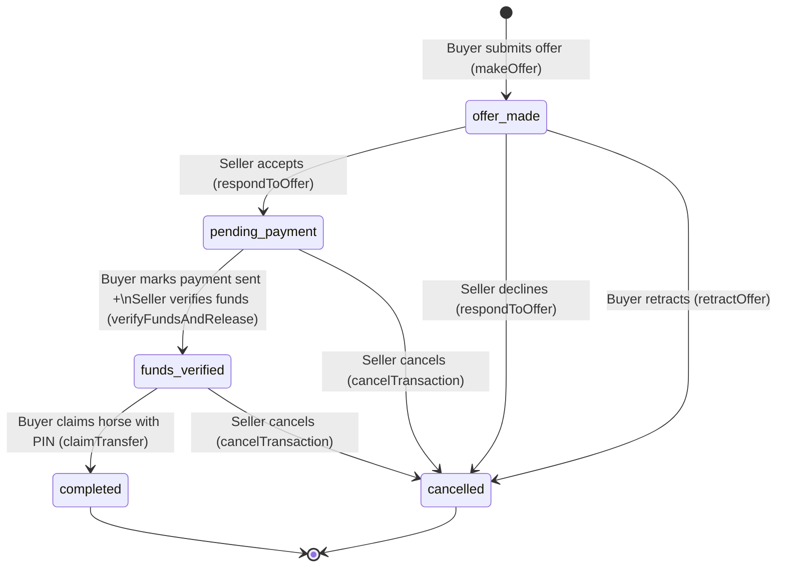
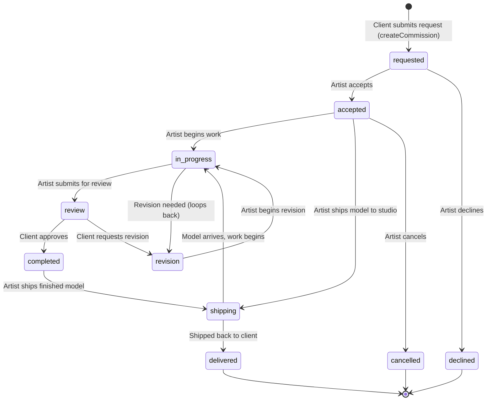
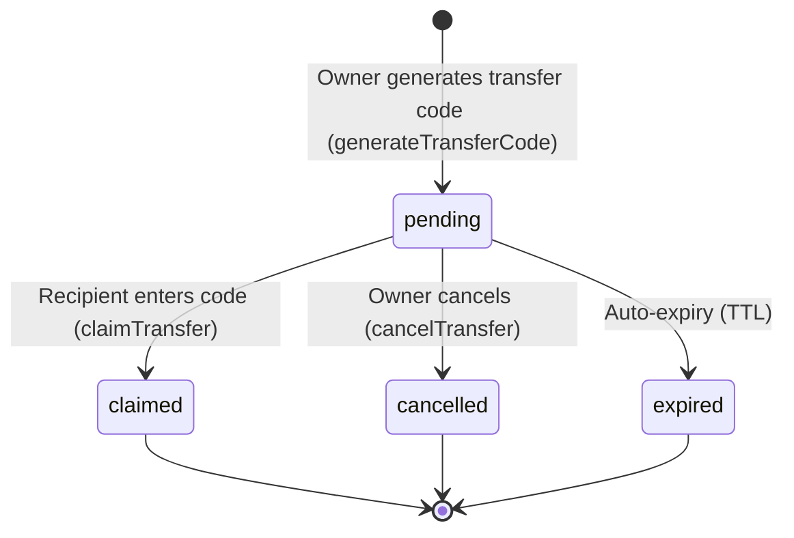

# State Machines

Three core workflows in Model Horse Hub use formal state machines with explicit transition rules.

---

## 1. Commerce State Machine (Safe-Trade)

The marketplace commerce flow is a 5-state machine defined in `transactions.ts`. It ensures safe, structured buy/sell transactions between users.

**Source:** [transactions.ts](../../src/app/actions/transactions.ts) (lines 395–717)

### State Details

| State | Who Acts | What Happens |
|-------|----------|--------------|
| `offer_made` | Buyer creates | Horse must be "For Sale" or "Open to Offers". A DM conversation is created. |
| `pending_payment` | Seller accepts | Horse trade_status locked to "Pending Sale". Other offers auto-cancelled. |
| `funds_verified` | Seller verifies | Horse is "parked" (life_stage → parked). A 6-char claim PIN is generated. |
| `completed` | Buyer claims PIN | Ownership transfers atomically via `claim_transfer_atomic` RPC. Transaction record created. |
| `cancelled` | Either party | Horse reverts to "Open to Offers". If parked, horse is unparked. Pending transfer PINs cancelled. |

### Side Effects

- **On accept:** Auto-cancels all other active offers on the same horse
- **On verify:** Triggers `parkHorse()` → generates transfer PIN
- **On complete:** Triggers `refresh_market_prices` RPC, evaluates commerce achievements via `after()`
- **On cancel from funds_verified:** Unparks horse and cancels pending transfer PINs

---

## 2. Commission Lifecycle

The art studio commission workflow is a 10-state machine defined in `art-studio.ts`. It supports bidirectional movement (revision loops) and physical shipping.

**Source:** [art-studio.ts](../../src/app/actions/art-studio.ts) (lines 12–33)

### Transition Rules (from `VALID_TRANSITIONS`)

| From | Allowed Targets |
|------|----------------|
| `requested` | `accepted`, `declined` |
| `accepted` | `in_progress`, `shipping`, `cancelled` |
| `in_progress` | `review`, `revision` |
| `review` | `completed`, `revision` |
| `revision` | `in_progress` |
| `completed` | `shipping` |
| `shipping` | `in_progress`, `delivered` |

### Key Behaviors

- **Client exception:** Only the artist can change status, *except* the client can move `review → completed` (client approval)
- **On delivery:** Creates a completed transaction (enables reviews), stamps `finishing_artist` on the horse, injects WIP photos into the Hoofprint™ timeline via `customization_logs`
- **Revision loop:** `in_progress → review → revision → in_progress` can repeat indefinitely
- **Shipping:** Bidirectional — used when physical models must travel between client and artist

---

## 3. Transfer Flow (Hoofprint™)

The ownership transfer flow uses a claim code mechanism. This is not a traditional state machine but a 3-state lifecycle.

**Source:** [hoofprint.ts](../../src/app/actions/hoofprint.ts) (lines 244–434)

### Flow Details

1. **Owner generates code:** `generateTransferCode()` creates a 6-character alphanumeric code (no ambiguous chars: 0/O, 1/I excluded). Any existing pending transfer for that horse is auto-cancelled.
2. **Recipient claims:** `claimTransfer()` calls the atomic RPC `claim_transfer_atomic` which handles locking, validation, ownership swap, and financial vault clearing in a single database transaction.
3. **Rate limited:** 5 claim attempts per 15 minutes per IP address.
4. **On claim:** Creates a completed `transfer` transaction, sends notification to sender, revalidates dashboard and passport pages.

### Acquisition Types

| Type | Description |
|------|-------------|
| `purchase` | Bought from another collector |
| `trade` | Exchanged for another model |
| `gift` | Received as a gift |
| `transfer` | Generic ownership transfer |

---

## Summary

| Machine | States | Terminal States | Revision Loop | Source File |
|---------|--------|-----------------|---------------|-------------|
| Commerce (Safe-Trade) | 5 | `completed`, `cancelled` | No | `transactions.ts` |
| Commission | 10 | `delivered`, `declined`, `cancelled` | Yes (`in_progress ↔ review ↔ revision`) | `art-studio.ts` |
| Transfer | 3 | `claimed`, `cancelled`, `expired` | No | `hoofprint.ts` |

---

**Next:** [Architecture Overview](overview.md) · [Data Flow](data-flow.md)
