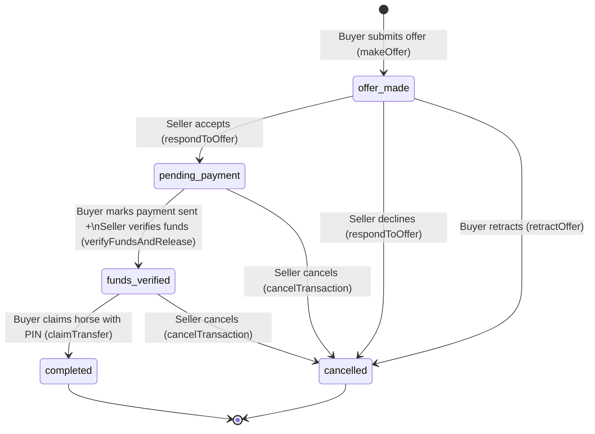
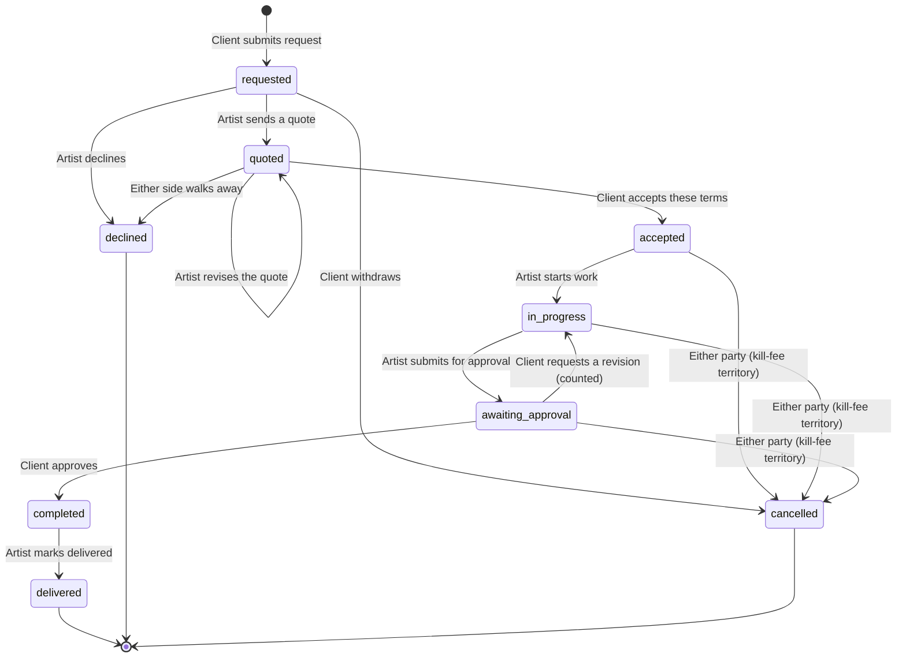
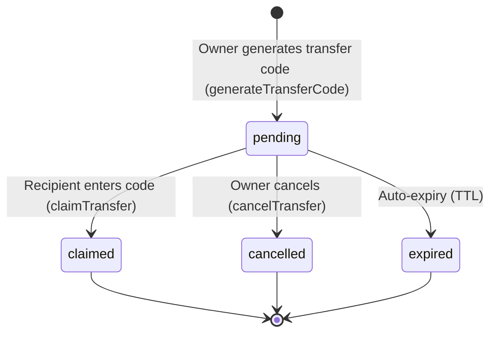

# State Machines

Four core workflows use formal state machines with explicit transition rules, plus a deal
vocabulary that reads across two of them.

| Machine | Source of truth |
|---|---|
| Commerce (offers) | `src/app/actions/transactions.ts` + `src/lib/commerce/stateMachine.ts` |
| Deal stages | `src/lib/deals/vocabulary.ts` |
| Commission pipeline | `src/lib/studio/pipeline.ts` |
| Transfer | `src/app/actions/hoofprint.ts` |
| Show status | `src/lib/shows/stateMachine.ts` |

The pure-lib machines are imported by **both** the server action (to enforce) and the UI (to
render the available moves), so the two can never drift.

---

## 1. Commerce State Machine (Safe-Trade)

The marketplace commerce flow is a 5-state machine defined in `transactions.ts`. It ensures safe, structured buy/sell transactions between users.

**Source:** [transactions.ts](../../src/app/actions/transactions.ts) (lines 395–717)

```mermaid
stateDiagram-v2
    [*] --> offer_made : Buyer submits offer (makeOffer)
    
    offer_made --> pending_payment : Seller accepts (respondToOffer)
    offer_made --> cancelled : Seller declines (respondToOffer)
    offer_made --> cancelled : Buyer retracts (retractOffer)
    
    pending_payment --> funds_verified : Buyer marks payment sent +\nSeller verifies funds (verifyFundsAndRelease)
    pending_payment --> cancelled : Seller cancels (cancelTransaction)
    
    funds_verified --> completed : Buyer claims horse with PIN (claimTransfer)
    funds_verified --> cancelled : Seller cancels (cancelTransaction)
    
    completed --> [*]
    cancelled --> [*]
```

### State Details

| State | Who Acts | What Happens |
|-------|----------|--------------|
| `offer_made` | Buyer creates | Horse must be "For Sale" or "Open to Offers". A DM conversation is created. |
| `pending_payment` | Seller accepts | Horse trade_status locked to "Pending Sale". Other offers auto-cancelled. |
| `funds_verified` | Seller verifies | Horse is "parked" (life_stage → parked). A 6-char claim PIN is generated. |
| `completed` | Buyer claims PIN | Ownership transfers atomically via `claim_transfer_atomic` RPC. Transaction record created. |
| `cancelled` | Either party | Horse reverts to "Open to Offers". If parked, horse is unparked. Pending transfer PINs cancelled. |

### Side Effects

- **On accept:** Auto-cancels all other active offers on the same horse
- **On verify:** Triggers `parkHorse()` → generates transfer PIN
- **On complete:** Triggers `refresh_market_prices` RPC, evaluates commerce achievements via `after()`
- **On cancel from funds_verified:** Unparks horse and cancels pending transfer PINs

### Counter-offers (migration 173)

`deal_offer_move_atomic(transaction, actor, move, amount?, message?)` adds a **counter** move
alongside accept/decline while a transaction is in `offer_made`. It row-locks the transaction,
derives the actor's side from `party_a_id`/`party_b_id`, and refuses to let you accept or decline
your own standing offer. `respond_to_offer_atomic` was deliberately left untouched.

> **Two constraint bugs fixed in migration 172.** `chk_trade_status` had never allowed
> `'Pending Sale'` (which `acceptOffer` writes) or `'Stolen/Missing'` (shipped in 079 with a
> "no schema change needed" comment that was wrong). And `respond_to_offer_atomic` set a phantom
> `transactions.updated_at` on its decline branch, so **every decline errored from migration 099
> until 172**.

---

## 2. Commission Pipeline

The art studio pipeline is a 7-state ladder plus two early exits, defined in
[`src/lib/studio/pipeline.ts`](../../src/lib/studio/pipeline.ts). Its shape comes from
researched commission practice (`docs/studio/COMMISSION_RESEARCH.md`): every real flow is
inquiry → quote → agreement → work → approval → delivery, and **the ball is always in exactly
one court**.

```mermaid
stateDiagram-v2
    [*] --> requested : Client submits request

    requested --> quoted : Artist sends a quote
    requested --> declined : Artist declines
    requested --> cancelled : Client withdraws

    quoted --> quoted : Artist revises the quote
    quoted --> accepted : Client accepts these terms
    quoted --> declined : Either side walks away

    accepted --> in_progress : Artist starts work
    in_progress --> awaiting_approval : Artist submits for approval

    awaiting_approval --> completed : Client approves
    awaiting_approval --> in_progress : Client requests a revision (counted)

    completed --> delivered : Artist marks delivered

    accepted --> cancelled : Either party (kill-fee territory)
    in_progress --> cancelled : Either party (kill-fee territory)
    awaiting_approval --> cancelled : Either party (kill-fee territory)

    delivered --> [*]
    declined --> [*]
    cancelled --> [*]
```

### Who holds the ball (`ballIsWith`)

| Status | Waiting on | Their move |
|---|---|---|
| `requested` | Artist | Quote it or decline it |
| `quoted` | Client | Accept the terms, or walk |
| `accepted` · `in_progress` | Artist | Start / finish the work |
| `awaiting_approval` | Client | Approve, or spend a revision |
| `completed` | Artist | Hand it over |
| `delivered` · `declined` · `cancelled` | — | Terminal |

### Key behaviours

- **The quote stage is new.** v1 had none — the *client* set the artist's price — and v1's only
  client-side action was blocked by RLS. Both are fixed.
- **Revisions are a counted loop, not a state.** `awaiting_approval → in_progress` is owned by
  the client and increments `revisions_used` (which a trigger forbids from ever decreasing).
  v1 had a separate `revision` status that nothing tallied — the commonest source of commission
  disputes.
- **The agreement freezes at acceptance.** `trg_commissions_freeze_agreement` pins
  `agreed_price`, `terms_snapshot` and `accepted_at` once `accepted_at` is set.
- **Cancelling after acceptance is different from declining before it.** Transitions carry an
  `afterAgreement` flag so the UI can surface the agreed cancellation terms at that moment.
- **Legacy rows still render.** `LEGACY_STATUS_MAP` normalises v1's `review → awaiting_approval`,
  `revision → in_progress`, `shipping → completed` on read. Those values are never written.
- **Slot accounting:** `ACTIVE_STATUSES` = `accepted`, `in_progress`, `awaiting_approval` — the
  set that counts against the free tier's 3-commission bench. `EARNED_STATUSES` = `completed`,
  `delivered` — the set income rollups use.
- **On delivery:** stamps `finishing_artist` on the horse via `stamp_finishing_artist()`, and the
  `customization_logs` row carries `commission_id` + `artist_user_id`, which is what puts the
  horse on the artist's receipts wall (`v_artist_finished_horses`) with the ribbons it went on
  to win.

---

## 3. Deal Stages

A **deal stage** is not a fourth state machine — it is one vocabulary that reads across a
transaction *or* a commission so the inbox, the market and the studio can all say the same word
for the same situation. Defined in
[`src/lib/deals/vocabulary.ts`](../../src/lib/deals/vocabulary.ts).

| Stage | Label | Means |
|---|---|---|
| `talking` | Talking | A thread exists; nothing is on the table |
| `proposed` | Offer on the table | An offer or a quote is awaiting a response |
| `agreed` | Agreed | Terms accepted — contract boxes signed by both, or the quote accepted |
| `paying` | Payment | Money is moving between the parties (never through the platform) |
| `fulfilling` | On its way | Work, shipping, or handover |
| `settled` | Settled | Done and closed cleanly — **terminal** |
| `closed` | Closed | Ended without settling — **terminal** |
| `disputed` | Disputed | One party raised a dispute |

Parties are **A/B**, derived from `transactions.party_a_id`/`party_b_id` — never from
`conversations.buyer_id`, which only records who clicked first. `stageForTransaction` and
`stageForCommission` map the two underlying machines onto this vocabulary; `waitingOn` answers
whose move it is; `dealKind` is `sale` | `commission` | `trade`.

> **A disputed deal is not adjudicated.** The platform produces the evidence pack at
> `/inbox/[id]/record` — the immutable transcript, the signed terms, the installment ledger —
> and stops there. We are the record, not the referee.

---

## 4. Transfer Flow (Hoofprint)

The ownership transfer flow uses a claim code mechanism. This is not a traditional state machine but a 3-state lifecycle.

**Source:** [hoofprint.ts](../../src/app/actions/hoofprint.ts) (lines 244–434)

```mermaid
stateDiagram-v2
    [*] --> pending : Owner generates transfer code (generateTransferCode)
    
    pending --> claimed : Recipient enters code (claimTransfer)
    pending --> cancelled : Owner cancels (cancelTransfer)
    pending --> expired : Auto-expiry (TTL)
    
    claimed --> [*]
    cancelled --> [*]
    expired --> [*]
```

### Flow Details

1. **Owner generates code:** `generateTransferCode()` creates a 6-character alphanumeric code (no ambiguous chars: 0/O, 1/I excluded). Any existing pending transfer for that horse is auto-cancelled.
2. **Recipient claims:** `claimTransfer()` calls the atomic RPC `claim_transfer_atomic` which handles locking, validation, ownership swap, and financial vault clearing in a single database transaction.
3. **Rate limited:** 5 claim attempts per 15 minutes per IP address.
4. **On claim:** Creates a completed `transfer` transaction, sends notification to sender, revalidates dashboard and passport pages.

### Acquisition Types

| Type | Description |
|------|-------------|
| `purchase` | Bought from another collector |
| `trade` | Exchanged for another model |
| `gift` | Received as a gift |
| `transfer` | Generic ownership transfer |

---

## Summary

| Machine | States | Terminal States | Loop | Source |
|---------|--------|-----------------|------|--------|
| Commerce (Safe-Trade) | 5 | `completed`, `cancelled` | Counter-offers within `offer_made` | `transactions.ts`, `deal_offer_move_atomic` |
| Commission pipeline | 7 + 2 exits | `delivered`, `declined`, `cancelled` | Yes — `awaiting_approval → in_progress`, counted | `src/lib/studio/pipeline.ts` |
| Deal stages (vocabulary) | 8 | `settled`, `closed` | — | `src/lib/deals/vocabulary.ts` |
| Transfer | 3 | `claimed`, `cancelled`, `expired` | No | `hoofprint.ts` |
| Show status | — | `archived` | — | `src/lib/shows/stateMachine.ts` |

---

**Next:** [Architecture Overview](overview.md) · [Data Flow](data-flow.md)
