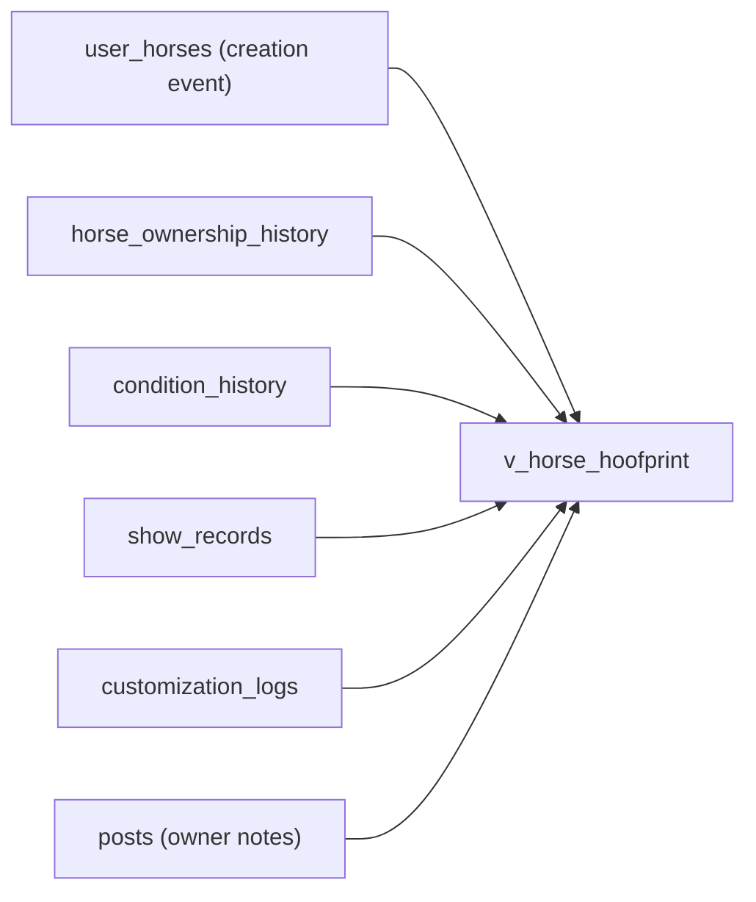
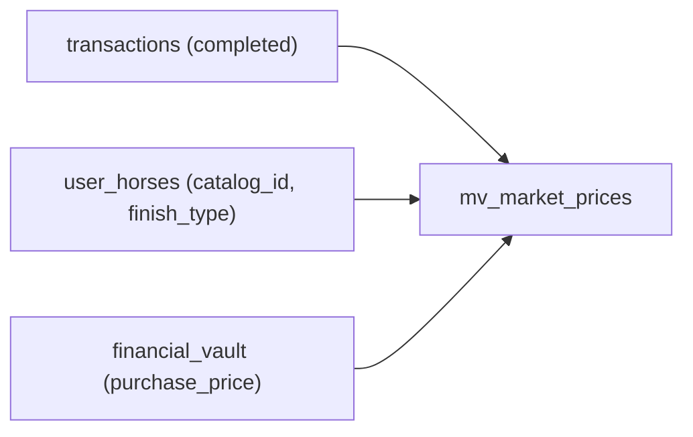

# Materialized Views

Two computed views power read-heavy features by pre-aggregating data from source tables.

---

## v_horse_hoofprint (Regular VIEW)

**Type:** Regular VIEW (computed at query time)  
**Purpose:** Unified provenance timeline for each horse  
**Latest definition:** Migration `089_commission_wip_photos.sql`

### Source Tables

The view UNION ALLs 6 source tables into a single chronological timeline:



### Output Columns

| Column | Type | Source |
|--------|------|--------|
| `source_id` | UUID | PK from source table |
| `horse_id` | UUID | The horse this event belongs to |
| `user_id` | UUID | Who performed the action |
| `event_type` | TEXT | `acquired`, `transferred`, `condition_change`, `show_result`, `customization`, `note` |
| `title` | TEXT | Human-readable event title |
| `description` | TEXT | Detailed description |
| `event_date` | DATE | When the event occurred |
| `metadata` | JSONB | Type-specific data (condition grades, show placings, WIP image URLs) |
| `is_public` | BOOLEAN | Always `true` (provenance is public) |
| `created_at` | TIMESTAMPTZ | Record creation timestamp |
| `source_table` | TEXT | Origin table name |

### Key Design Decisions

- **Owner notes only:** Posts are filtered to `author_id = owner_id` (no visitor comments appear in the timeline)
- **WIP photos:** Customization logs include `image_urls` in metadata (injected from commission WIP photos on delivery)
- **No direct writes:** The timeline is never written to directly — events are derived from reality
- **Real-time:** As a regular VIEW, it always shows current data (no refresh needed)

### Usage

```typescript
const { data } = await supabase
    .from("v_horse_hoofprint")
    .select("*")
    .eq("horse_id", horseId)
    .order("event_date", { ascending: false });
```

---

## mv_market_prices (MATERIALIZED VIEW)

**Type:** MATERIALIZED VIEW (pre-computed, refreshed on schedule)  
**Purpose:** Blue Book market price guide  
**Latest definition:** Migration `055_market_price_guide.sql`

### Aggregation Logic

Computes sale statistics from completed transactions grouped by catalog item, finish type, and life stage:



### Output Columns

| Column | Type | Description |
|--------|------|-------------|
| `catalog_id` | UUID | Reference to `catalog_items` |
| `finish_type` | TEXT | "OF", "Custom", "Artist Resin" |
| `life_stage` | TEXT | Horse life stage at time of sale |
| `lowest_price` | NUMERIC | Minimum sale price |
| `highest_price` | NUMERIC | Maximum sale price |
| `average_price` | NUMERIC | Mean sale price |
| `median_price` | NUMERIC | Median sale price |
| `transaction_volume` | INTEGER | Number of completed sales |
| `last_sold_at` | TIMESTAMPTZ | Most recent sale date |

### Refresh Schedule

| Trigger | Mechanism | Frequency |
|---------|-----------|-----------|
| **Cron** | `vercel.json` → `/api/cron/refresh-market` → `REFRESH MATERIALIZED VIEW mv_market_prices` | Daily 6 AM UTC |
| **On sale** | `completeTransaction()` → `admin.rpc("refresh_market_prices")` | On each completed sale (best-effort, non-blocking) |

### Usage

```typescript
const { data } = await supabase
    .from("mv_market_prices")
    .select("*")
    .eq("catalog_id", catalogId);
```

---

## discover_users_view (Regular VIEW)

**Type:** Regular VIEW  
**Purpose:** User profiles for the Discover page  
**Latest definition:** Migration `086_hide_test_accounts.sql`

### Purpose

Aggregates user profile data with horse counts and badge counts for the user discovery page. Filters out test accounts (`is_test_account = true`).

### Key Columns

| Column | Source |
|--------|--------|
| `id`, `alias_name`, `bio`, `avatar_url` | `users` table |
| `horse_count` | COUNT from `user_horses` |
| `badge_count` | COUNT from `user_badges` |
| `created_at` | `users.created_at` |

---

**Next:** [Schema Overview](schema-overview.md) · [Migrations](migrations.md)
