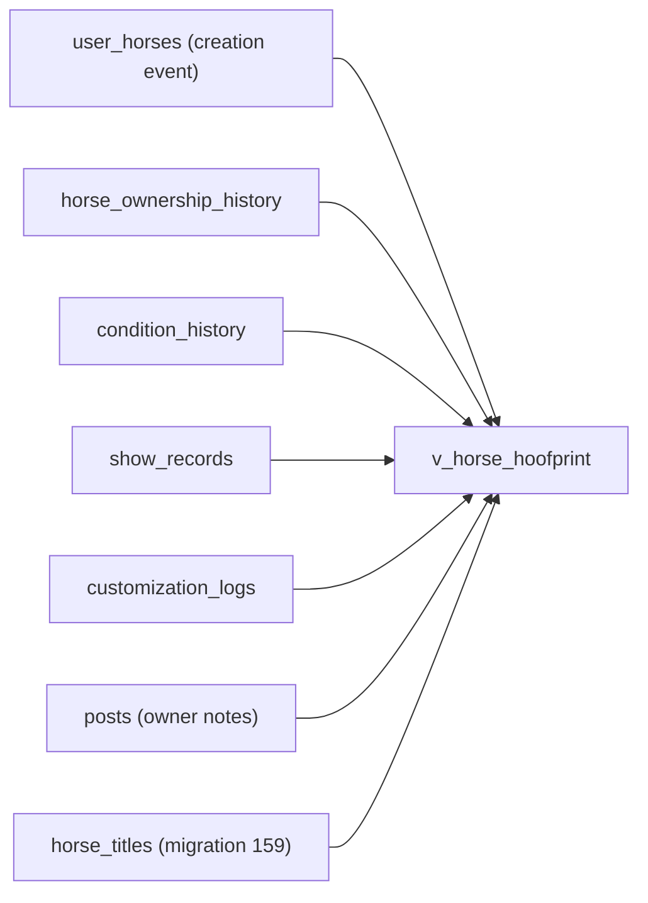
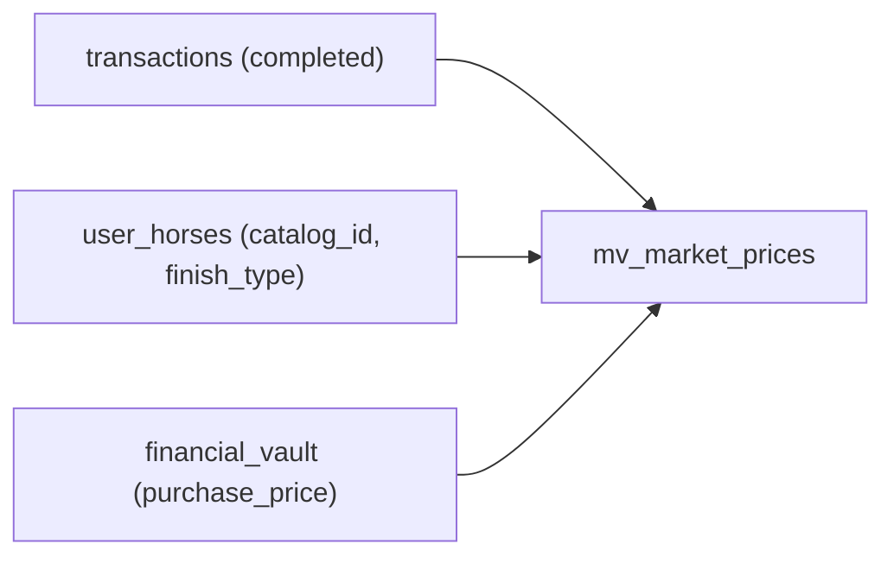
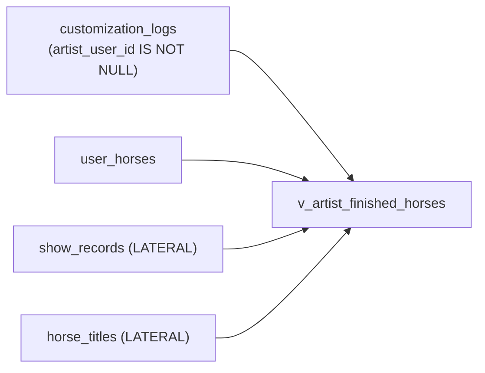

# Views & Materialized Views

Computed views power read-heavy features by pre-aggregating data from source tables. Two are
materialized (refreshed on the daily cron); the rest are regular views evaluated at query time
with `security_invoker = true`.

---

## v_horse_hoofprint (Regular VIEW)

**Type:** Regular VIEW (computed at query time)  
**Purpose:** Unified provenance timeline for each horse  
**Latest definition:** Migration `092_supabase_linter_fixes.sql`  
**Security:** `security_invoker = true` (respects the querying user's RLS policies)

### Source Tables

The view UNION ALLs its source tables into a single chronological timeline. Migration 159 added
a seventh branch for earned titles:


```mermaid
graph LR
    UH["user_horses (creation event)"] --> V["v_horse_hoofprint"]
    OH["horse_ownership_history"] --> V
    CH["condition_history"] --> V
    SR["show_records"] --> V
    CL["customization_logs"] --> V
    P["posts (owner notes)"] --> V
    HT["horse_titles (migration 159)"] --> V
```

### Output Columns

| Column | Type | Source |
|--------|------|--------|
| `source_id` | UUID | PK from source table |
| `horse_id` | UUID | The horse this event belongs to |
| `user_id` | UUID | Who performed the action |
| `event_type` | TEXT | `acquired`, `transferred`, `condition_change`, `show_result`, `customization`, `note` |
| `title` | TEXT | Human-readable event title |
| `description` | TEXT | Detailed description |
| `event_date` | DATE | When the event occurred |
| `metadata` | JSONB | Type-specific data (condition grades, show placings, WIP image URLs) |
| `is_public` | BOOLEAN | Always `true` (provenance is public) |
| `created_at` | TIMESTAMPTZ | Record creation timestamp |
| `source_table` | TEXT | Origin table name |

### Key Design Decisions

- **Owner notes only:** Posts are filtered to `author_id = owner_id` (no visitor comments appear in the timeline)
- **WIP photos:** Customization logs include `image_urls` in metadata (injected from commission WIP photos on delivery)
- **No direct writes:** The timeline is never written to directly — events are derived from reality
- **Real-time:** As a regular VIEW, it always shows current data (no refresh needed)

### Usage

```typescript
const { data } = await supabase
    .from("v_horse_hoofprint")
    .select("*")
    .eq("horse_id", horseId)
    .order("event_date", { ascending: false });
```

---

## mv_market_prices (MATERIALIZED VIEW)

**Type:** MATERIALIZED VIEW (pre-computed, refreshed on schedule)  
**Purpose:** Blue Book market price guide  
**Latest definition:** Migration `055_market_price_guide.sql`  
**Access:** `authenticated` role only (`anon` access revoked in migration 092)

### Aggregation Logic

Computes sale statistics from completed transactions grouped by catalog item, finish type, and life stage:


```mermaid
graph LR
    T["transactions (completed)"] --> MV["mv_market_prices"]
    UH["user_horses (catalog_id, finish_type)"] --> MV
    FV["financial_vault (purchase_price)"] --> MV
```

### Output Columns

| Column | Type | Description |
|--------|------|-------------|
| `catalog_id` | UUID | Reference to `catalog_items` |
| `finish_type` | TEXT | "OF", "Custom", "Artist Resin" |
| `life_stage` | TEXT | Horse life stage at time of sale |
| `lowest_price` | NUMERIC | Minimum sale price |
| `highest_price` | NUMERIC | Maximum sale price |
| `average_price` | NUMERIC | Mean sale price |
| `median_price` | NUMERIC | Median sale price |
| `transaction_volume` | INTEGER | Number of completed sales |
| `last_sold_at` | TIMESTAMPTZ | Most recent sale date |

### Refresh Schedule

| Trigger | Mechanism | Frequency |
|---------|-----------|-----------|
| **Cron** | `vercel.json` → `/api/cron/refresh-market` → `REFRESH MATERIALIZED VIEW mv_market_prices` | Daily 6 AM UTC |
| **On sale** | `completeTransaction()` → `admin.rpc("refresh_market_prices")` | On each completed sale (best-effort, non-blocking) |

### Usage

```typescript
const { data } = await supabase
    .from("mv_market_prices")
    .select("*")
    .eq("catalog_id", catalogId);
```

---

## discover_users_view (Regular VIEW)

**Type:** Regular VIEW  
**Purpose:** User profiles for the Discover page  
**Latest definition:** Migration `092_supabase_linter_fixes.sql`  
**Security:** `security_invoker = true` (respects the querying user's RLS policies)

### Purpose

Backs the **Members** directory at `/discover`. Aggregates profile data with horse counts and
ratings, batched so the page is one round-trip rather than N.

**Excluded:** test accounts (`is_test_account`), non-active accounts (`account_status`), and —
since migration 169 — **suspended members** (`is_suspended IS NOT TRUE`). The 169 rewrite is
wrapped in a guard that checks the column exists first.

### Key Columns

| Column | Source |
|--------|--------|
| `id`, `alias_name`, `bio`, `avatar_url`, `created_at` | `users` table |
| `public_horse_count`, `total_horse_count` | COUNT from `user_horses` |
| `avg_rating`, `rating_count` | `reviews` |
| `has_studio` | EXISTS on `artist_profiles` |

---

## v_artist_finished_horses (Regular VIEW)

**Type:** Regular VIEW
**Purpose:** The Art Studio **receipts wall**
**Latest definition:** Migration `170_art_studio.sql`
**Security:** `security_invoker = true`, GRANT SELECT to `authenticated`

The point of this view is that it shows finished horses **with their ribbons** — an artist's
portfolio is more persuasive when the work is shown next to what it went on to win.


```mermaid
graph LR
    CL["customization_logs<br/>(artist_user_id IS NOT NULL)"] --> V["v_artist_finished_horses"]
    UH["user_horses"] --> V
    SR["show_records (LATERAL)"] --> V
    HT["horse_titles (LATERAL)"] --> V
```

| Column group | Contents |
|---|---|
| Horse | the `user_horses` row the log points at |
| Show record LATERAL | `show_count`, `nan_qualifying_count`, `best_placing`, `latest_show_date` |
| Titles LATERAL | `titles` |

The join is possible at all because migration 170 added `artist_user_id` and `commission_id` to
`customization_logs`.

---

## mv_trusted_sellers (MATERIALIZED VIEW)

**Type:** MATERIALIZED VIEW
**Purpose:** The trusted-seller badge
**Latest definition:** Migration `169_market_completion.sql` (rebuilt)
**Access:** `authenticated, anon`

### Thresholds

Account older than 60 days, not a test account, **≥5 distinct buyers**, **≥3 reviews**, average
rating **≥4.8**.

| Column | Meaning |
|---|---|
| `user_id`, `alias_name`, `account_created` | Identity |
| `distinct_buyers` | COUNT(DISTINCT `horse_transfers.claimed_by`) where status = `'claimed'`, excluding self-dealing |
| `avg_rating`, `review_count` | From `reviews` |

### ⚠️ Why it was empty from migration 101 until 169

The original definition counted buyers from `horse_transfers` where **`status = 'completed'`** —
a value the table's own CHECK constraint (migration 018) has never permitted; the allowed set is
`pending` / `claimed` / `expired` / `cancelled`. The join therefore matched nothing. The view
refreshed cleanly, reported no error, and produced **zero rows for 68 migrations**. Nobody was
ever a trusted seller and nothing ever said so.

Migration 169 corrects the status to `'claimed'`, replaces the old INNER/LEFT-join cartesian with
two independent `CROSS JOIN LATERAL`s, and excludes self-dealing (`claimed_by <> u.id`).

> **The lesson, worth generalising:** a materialized view that refreshes without error is not a
> view that is working. When adding one, assert on its row count — not just on the refresh.

### Refresh

`refresh_mv_trusted_sellers()` on the daily 06:00 cron. Note the migration itself cannot refresh
it, because `REFRESH ... CONCURRENTLY` may not run inside a transaction block.

---

**Next:** [Schema Overview](schema-overview.md) · [Migrations](migrations.md)
