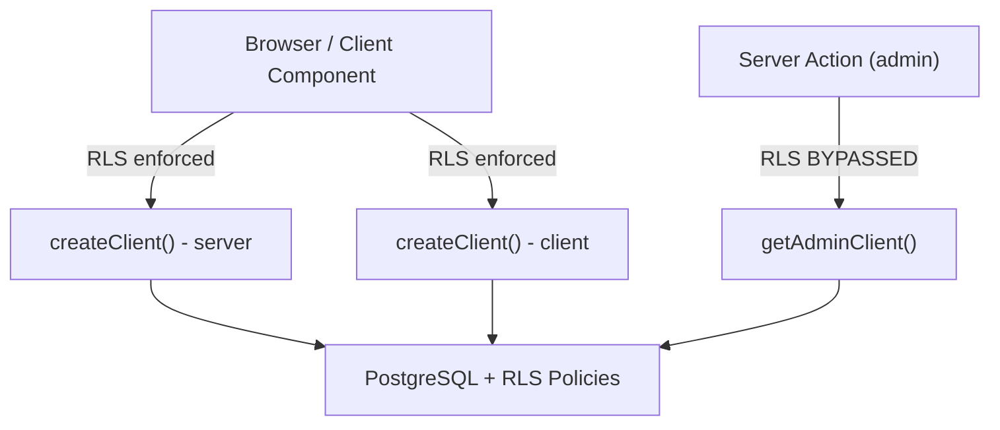

# RLS Policies

Every table in the Model Horse Hub database has **Row Level Security (RLS)** enabled. This document summarizes the security model.

## Security Model



| Client | RLS | Use Case |
|--------|-----|----------|
| `createClient()` from `@/lib/supabase/server` | ✅ **Enforced** | Page data fetching, user mutations |
| `createClient()` from `@/lib/supabase/client` | ✅ **Enforced** | Direct storage uploads from browser |
| `getAdminClient()` from `@/lib/supabase/admin` | ❌ **Bypassed** | Cross-user writes (notifications, transfers, admin) |

## Common Policy Patterns

### Pattern 1: Owner-Only Access

Most tables allow users to see and modify only their own rows.

> [!TIP]
> Always wrap `auth.uid()` in `(SELECT auth.uid())` to force PostgreSQL to evaluate it once per query (InitPlan) instead of once per row.

```sql
-- SELECT: users can read their own data
CREATE POLICY "select_own" ON table_name FOR SELECT
  USING (user_id = (SELECT auth.uid()));

-- INSERT: users can insert their own data
CREATE POLICY "insert_own" ON table_name FOR INSERT
  WITH CHECK (user_id = (SELECT auth.uid()));

-- UPDATE: users can update their own data
CREATE POLICY "update_own" ON table_name FOR UPDATE
  USING (user_id = (SELECT auth.uid()));

-- DELETE: users can delete their own data
CREATE POLICY "delete_own" ON table_name FOR DELETE
  USING (user_id = (SELECT auth.uid()));
```

**Used by:** `user_collections`, `user_wishlists`, `financial_vault`, `user_settings`

### Pattern 2: Public Read, Owner Write

Tables where data is publicly visible but only the owner can modify:

```sql
-- SELECT: anyone can read public data
CREATE POLICY "select_public" ON table_name FOR SELECT
  USING (true);

-- INSERT/UPDATE/DELETE: owner only
CREATE POLICY "modify_own" ON table_name FOR ALL
  USING (owner_id = (SELECT auth.uid()));
```

**Used by:** `catalog_items`, `badges`, `user_badges`, `show_records`

### Pattern 3: Visibility Toggle

Tables where the owner controls public visibility:

```sql
-- SELECT: owner always sees all; others see only public
CREATE POLICY "select_visibility" ON user_horses FOR SELECT
  USING (
    owner_id = (SELECT auth.uid())
    OR is_public = true
  );
```

**Used by:** `user_horses`, `user_collections`

### Pattern 4: Participant Access

Tables where both parties in a relationship can access:

```sql
-- SELECT: either party can read
CREATE POLICY "participant_select" ON conversations FOR SELECT
  USING ((SELECT auth.uid()) = ANY(participants));
```

**Used by:** `conversations`, `messages`, `transactions`, `commissions`

### Pattern 5: Block-Aware Filtering

Social tables filter out blocked users at the query level:

```sql
-- SELECT: exclude posts from blocked users
CREATE POLICY "select_unblocked" ON posts FOR SELECT
  USING (
    NOT EXISTS (
      SELECT 1 FROM user_blocks
      WHERE blocker_id = (SELECT auth.uid())
      AND blocked_id = posts.author_id
    )
  );
```

**Used by:** `posts`, `likes`, `activity_events`

## Table-by-Table Summary

### Core Tables

| Table | SELECT | INSERT | UPDATE | DELETE |
|-------|--------|--------|--------|--------|
| `users` | Own row | On signup | Own row | — |
| `user_horses` | Own + public | Own | Own | Own (tombstone) |
| `horse_images` | Via horse visibility | Own horse's images | Own | Own |
| `financial_vault` | **Own only (NEVER public)** | Own | Own | Own |
| `catalog_items` | All (public reference) | Admin | Admin | — |

### Social Tables

| Table | SELECT | INSERT | UPDATE | DELETE |
|-------|--------|--------|--------|--------|
| `posts` | All (block-filtered) | Authenticated | Own | Own |
| `likes` | All | Authenticated | — | Own |
| `user_follows` | All | Authenticated | — | Own |
| `notifications` | Own | System (admin) | Own (mark read) | — |
| `activity_events` | Followed users | System (admin) | — | — |

### Commerce Tables

| Table | SELECT | INSERT | UPDATE | DELETE |
|-------|--------|--------|--------|--------|
| `transactions` | Participant | System (admin) | Participant | — |
| `reviews` | All | Authenticated (once per txn) | — | Own |
| `horse_transfers` | Sender | Sender | Sender | — |

### Art Studio Tables

| Table | SELECT | INSERT | UPDATE | DELETE |
|-------|--------|--------|--------|--------|
| `artist_profiles` | All (if visible) | Own | Own | Own |
| `commissions` | Participant | Authenticated | Artist (+ client approval) | — |
| `commission_updates` | Participant | Participant | — | — |
| `customization_logs` | Via horse visibility | Horse owner + commission artist | — | — |

### Competition Tables

| Table | SELECT | INSERT | UPDATE | DELETE |
|-------|--------|--------|--------|--------|
| `events` | All | Authenticated | Creator | Creator |
| `event_entries` | All | Authenticated | Own | Own |
| `event_divisions` | All | Event creator | Event creator | Event creator |
| `event_classes` | All | Event creator | Event creator | Event creator |

### Catalog Curation Tables (V32)

| Table | SELECT | INSERT | UPDATE | DELETE |
|-------|--------|--------|--------|--------|
| `catalog_suggestions` | All (public) | Authenticated | Admin (status change) | — |
| `catalog_suggestion_votes` | All | Authenticated (one per suggestion) | — | Own |
| `catalog_suggestion_comments` | All | Authenticated | — | Own |
| `catalog_changelog` | All (public) | System (admin) | — | — |

## Storage Policies

The `horse-images` bucket is **private** with read policies based on content type:

| Content | Path Pattern | Read Access |
|---------|-------------|-------------|
| Horse photos | `horses/{horseId}/*` | Public if `user_horses.is_public`, owner always |
| Social images | `social/*` | All authenticated + anon |
| Event images | `events/*` | All authenticated + anon |
| Commission WIP | `{userId}/commissions/*` | All authenticated + anon |
| Avatars | `avatars/*` | Public |

## Critical Security Rules

1. **`financial_vault` is NEVER publicly readable** — RLS enforces owner-only SELECT
2. **The admin client (`getAdminClient()`) bypasses ALL RLS** — use only for cross-user operations
3. **Block filtering is at the DB level** — blocked users' content is invisible, not just hidden in UI
4. **Rate limiting is application-level** — `checkRateLimit()` supplements RLS for sensitive operations
5. **All views use `security_invoker = true`** — views respect the querying user's RLS policies, not the view creator's
6. **All `SECURITY DEFINER` functions use `SET search_path = ''`** — prevents search path injection attacks; table references must be fully qualified (`public.table_name`)
7. **`pg_trgm` lives in the `extensions` schema** — not exposed via the public API
8. **`mv_market_prices` is not accessible to `anon`** — only `authenticated` users can query the Blue Book
9. **Avoid multiple permissive policies per table/role/action** — merge with `OR` for better performance

---

**Next:** [Schema Overview](schema-overview.md) · [Tables](tables.md)
