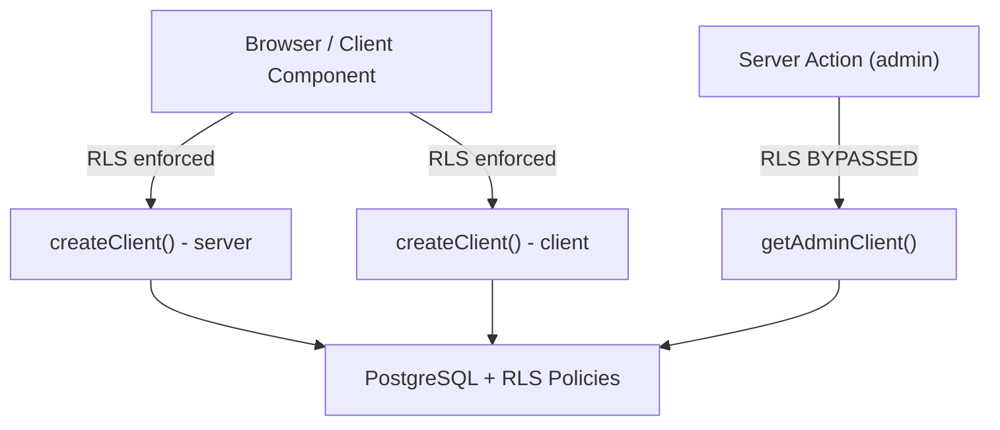

# RLS Policies

Every table in the Model Horse Hub database has **Row Level Security (RLS)** enabled. This document summarizes the security model.

## Security Model


```mermaid
graph TD
    A["Browser / Client Component"] -->|"RLS enforced"| B["createClient() - server"]
    A -->|"RLS enforced"| C["createClient() - client"]
    D["Server Action (admin)"] -->|"RLS BYPASSED"| E["getAdminClient()"]
    
    B --> F["PostgreSQL + RLS Policies"]
    C --> F
    E --> F
```

| Client | RLS | Use Case |
|--------|-----|----------|
| `createClient()` from `@/lib/supabase/server` | ✅ **Enforced** | Page data fetching, user mutations |
| `createClient()` from `@/lib/supabase/client` | ✅ **Enforced** | Direct storage uploads from browser |
| `getAdminClient()` from `@/lib/supabase/admin` | ❌ **Bypassed** | Cross-user writes (notifications, transfers, admin) |

## Common Policy Patterns

### Pattern 1: Owner-Only Access

Most tables allow users to see and modify only their own rows.

> [!TIP]
> Always wrap `auth.uid()` in `(SELECT auth.uid())` to force PostgreSQL to evaluate it once per query (InitPlan) instead of once per row.

```sql
-- SELECT: users can read their own data
CREATE POLICY "select_own" ON table_name FOR SELECT
  USING (user_id = (SELECT auth.uid()));

-- INSERT: users can insert their own data
CREATE POLICY "insert_own" ON table_name FOR INSERT
  WITH CHECK (user_id = (SELECT auth.uid()));

-- UPDATE: users can update their own data
CREATE POLICY "update_own" ON table_name FOR UPDATE
  USING (user_id = (SELECT auth.uid()));

-- DELETE: users can delete their own data
CREATE POLICY "delete_own" ON table_name FOR DELETE
  USING (user_id = (SELECT auth.uid()));
```

**Used by:** `user_collections`, `user_wishlists`, `financial_vault`, `user_settings`

### Pattern 2: Public Read, Owner Write

Tables where data is publicly visible but only the owner can modify:

```sql
-- SELECT: anyone can read public data
CREATE POLICY "select_public" ON table_name FOR SELECT
  USING (true);

-- INSERT/UPDATE/DELETE: owner only
CREATE POLICY "modify_own" ON table_name FOR ALL
  USING (owner_id = (SELECT auth.uid()));
```

**Used by:** `catalog_items`, `badges`, `user_badges`, `show_records`

### Pattern 3: Visibility Toggle

Tables where the owner controls public visibility:

```sql
-- SELECT: owner always sees all; others see only public
CREATE POLICY "select_visibility" ON user_horses FOR SELECT
  USING (
    owner_id = (SELECT auth.uid())
    OR is_public = true
  );
```

**Used by:** `user_horses`, `user_collections`

### Pattern 4: Participant Access

Tables where both parties in a relationship can access:

```sql
-- SELECT: either party can read
CREATE POLICY "participant_select" ON conversations FOR SELECT
  USING ((SELECT auth.uid()) = ANY(participants));
```

**Used by:** `conversations`, `messages`, `transactions`, `commissions`

### Pattern 5: Audience Gate (migration 166)

`posts` carries a per-row audience. The policy ANDs the existing **context** gate (no context, or
a public horse, or a barn you belong to) with an **audience** gate, so a read path that forgets
to filter still cannot leak a followers-only post:

```sql
-- ... AND (
  visibility = 'public'
  OR author_id = (SELECT auth.uid())
  OR EXISTS (
    SELECT 1 FROM user_follows
    WHERE following_id = posts.author_id
      AND follower_id = (SELECT auth.uid())
  )
-- )
```

**Used by:** `posts` (values are lowercase `public` / `followers`).

### Pattern 6: No Policies At All

Some tables are reachable **only** through `SECURITY DEFINER` RPCs. They have RLS enabled, zero
policies, and their grants revoked — which is stronger than a restrictive policy, because there
is no policy to get wrong:

```sql
ALTER TABLE object_view_daily ENABLE ROW LEVEL SECURITY;
REVOKE ALL ON object_view_daily FROM anon, authenticated;
```

**Used by:** `object_view_daily`, `site_activity_daily`, `object_view_scratch` (175), and
`rate_limits`. `announcements` is a partial case — live rows are world-readable, but there are no
write policies, so writes go through the service role after an `ADMIN_EMAIL` check.

> **Why:** no role holds INSERT on the counter tables, and a public INSERT policy would let
> anyone type any number into a seller's view count.

### Pattern 7: Column-Level Grants (migration 133)

`users` has **no table-level SELECT grant**. Public columns are granted individually:

```sql
GRANT SELECT (profile_customization) ON public.users TO anon, authenticated;
```

If an anon page renders "Unknown" where a name should be, a missing column grant is the first
thing to check.

### Pattern 8: Block-Aware Filtering

Social tables filter out blocked users at the query level:

```sql
-- SELECT: exclude posts from blocked users
CREATE POLICY "select_unblocked" ON posts FOR SELECT
  USING (
    NOT EXISTS (
      SELECT 1 FROM user_blocks
      WHERE blocker_id = (SELECT auth.uid())
      AND blocked_id = posts.author_id
    )
  );
```

**Used by:** `posts`, `likes`, `activity_events`

## Table-by-Table Summary

### Core Tables

| Table | SELECT | INSERT | UPDATE | DELETE |
|-------|--------|--------|--------|--------|
| `users` | Own row | On signup | Own row | — |
| `user_horses` | Own + public | Own | Own | Own (tombstone) |
| `horse_images` | Via horse visibility | Own horse's images | Own | Own |
| `financial_vault` | **Own only (NEVER public)** | Own | Own | Own |
| `catalog_items` | All (public reference) | Admin | Admin | — |

### Social Tables

| Table | SELECT | INSERT | UPDATE | DELETE |
|-------|--------|--------|--------|--------|
| `posts` | Context gate **AND** audience gate (166) | Authenticated | Own | Own |
| `likes` | All | Authenticated | — | Own |
| `user_follows` | All | Authenticated | — | Own |
| `notifications` | Own | System (admin) | Own (mark read) | — |
| `activity_events` | Followed users | **Nothing writes here any more** — legacy, read-only | — | — |
| `announcements` | Live rows, incl. `anon` | Service role only | Service role only | Service role only |

### Commerce & Deal Room Tables

| Table | SELECT | INSERT | UPDATE | DELETE |
|-------|--------|--------|--------|--------|
| `transactions` | Participant | System (admin) | Participant | — |
| `reviews` | All | Authenticated (once per txn) | — | Own |
| `horse_transfers` | Sender | Sender | Sender | — |
| `conversations` | Participant | Participant | Participant (**`WITH CHECK` added in 173** — 022 shipped without one) | — |
| `messages` | Participant | Participant, unless `are_blocked()` | Participant (**`WITH CHECK` added in 173**); triggers pin identity and freeze non-`chat` kinds | — |
| `conversation_participants` | Own row, or a thread you are in | Participant | Own row; `role`/`party` trigger-pinned, `last_read_at` monotonic | — |
| `payment_installments` | Thread participants | Participant | Participant; a confirmed row is final | Only while neither sent nor confirmed |
| `media_attachments` | **Narrowed in 173** from `USING (true)` to: no `message_id`, or you are in that thread | Uploader | — | Uploader |

### Barn Tables (migration 167)

| Table | SELECT | INSERT | UPDATE | DELETE |
|-------|--------|--------|--------|--------|
| `groups` | All — a private barn is *listed* so people can ask to join | Authenticated | Owner/admin | Owner |
| `group_memberships` | Own, public barns, or members of your private barn | Self-join for public barns or the founder; staff may add anyone | Owner (031 had **no** UPDATE policy) | Owner/admin |
| `barn_join_requests` | Requester's own, or barn staff | Requester, `status='pending'`, non-member only | Barn staff (decide) | Requester (withdraw), staff (clear) |

### Metrics Tables (migration 175)

| Table | SELECT | INSERT | UPDATE | DELETE |
|-------|--------|--------|--------|--------|
| `object_view_daily`, `site_activity_daily`, `object_view_scratch` | **None** | **None** | **None** | **None** |

RLS on, zero policies, `REVOKE ALL FROM anon, authenticated`. Reached only via
`record_object_view()`, `get_horse_view_stats()` (owner-gated), and two `service_role`-only
aggregate RPCs.

### Help ID Tables (V33 — fixed)

| Table | SELECT | INSERT | UPDATE | DELETE |
|-------|--------|--------|--------|--------|
| `id_requests` | All (authenticated) | Own | Own | Own (V33 fix) |
| `id_suggestions` | All (authenticated) | Authenticated | Own | Own (V33 fix) |

### Art Studio Tables

| Table | SELECT | INSERT | UPDATE | DELETE |
|-------|--------|--------|--------|--------|
| `artist_profiles` | All (if visible) | Own | Own | Own |
| `commissions` | Participant | Authenticated | Artist (+ client approval) | — |
| `commission_updates` | Participant | Participant | — | — |
| `customization_logs` | Via horse visibility | Horse owner + commission artist | — | — |

### Competition Tables

| Table | SELECT | INSERT | UPDATE | DELETE |
|-------|--------|--------|--------|--------|
| `events` | All | Authenticated | Creator | Creator |
| `event_entries` | All | Authenticated | Own | Own |
| `event_divisions` | All | Event creator | Event creator | Event creator |
| `event_classes` | All | Event creator | Event creator | Event creator |

### Catalog Curation Tables (V32)

| Table | SELECT | INSERT | UPDATE | DELETE |
|-------|--------|--------|--------|--------|
| `catalog_suggestions` | All (public) | Authenticated | Admin (status change) | — |
| `catalog_suggestion_votes` | All | Authenticated (one per suggestion) | — | Own |
| `catalog_suggestion_comments` | All | Authenticated | — | Own |
| `catalog_changelog` | All (public) | System (admin) | — | — |

## Storage Policies

The `horse-images` bucket is **public** and CDN-cacheable — visibility is enforced by RLS on the
`horse_images` table, not by URL secrecy. `chat-attachments` (DM photos) and `group-files` (barn
files) are **private**, read through server-generated signed URLs gated by their own tables' RLS.
Migration 149 added size and MIME caps across the buckets.

Read access by content type:

| Content | Path Pattern | Read Access |
|---------|-------------|-------------|
| Horse photos | `horses/{horseId}/*` | Public if `user_horses.is_public`, owner always |
| Social images | `social/*` | All authenticated + anon |
| Event images | `events/*` | All authenticated + anon |
| Commission WIP | `{userId}/commissions/*` | All authenticated + anon |
| Avatars | `avatars/*` | Public |

## Critical Security Rules

1. **`financial_vault` is NEVER publicly readable** — RLS enforces owner-only SELECT
2. **The admin client (`getAdminClient()`) bypasses ALL RLS** — use only for cross-user operations
3. **Block filtering is at the DB level** — blocked users' content is invisible, not just hidden in UI
4. **Rate limiting is application-level** — `checkRateLimit()` supplements RLS for sensitive operations
5. **All views use `security_invoker = true`** — views respect the querying user's RLS policies, not the view creator's
6. **All `SECURITY DEFINER` functions use `SET search_path = ''`** — prevents search path injection attacks; table references must be fully qualified (`public.table_name`)
7. **`pg_trgm` lives in the `extensions` schema** — not exposed via the public API
8. **`mv_market_prices` is not accessible to `anon`** — only `authenticated` users can query the Blue Book
9. **Avoid multiple permissive policies per table/role/action** — merge with `OR` for better performance
10. **`event_entries` UPDATE allows three roles** — entry owner, event creator, AND assigned judges (migration 094). This enables expert judging where judges assign placings on entries they don't own.
11. **An UPDATE policy without `WITH CHECK` only guards which rows you may touch, not what you may write them to.** Migration 022's `messages` and `conversations` UPDATE policies shipped without one; 173 recreated both. Audit any `FOR UPDATE` policy for a matching `WITH CHECK`.
12. **A policy that reads a column of `users` will break for anon** now that 133 revoked table-level SELECT. Use a `SECURITY DEFINER` helper instead — migration 151 had to replace a direct `users.is_suspended` read in the entry INSERT policy with `is_caller_suspended()` for exactly this reason.
13. **Blocking is enforced at the write, not just the read.** `are_blocked()` is bidirectional, and `trg_messages_block_guard` refuses the INSERT outright.

---

**Next:** [Schema Overview](schema-overview.md) · [Full schema reference](../../.agents/MASTER_SUPABASE.md)
