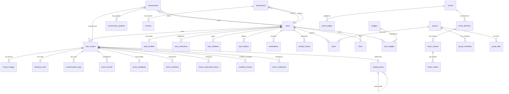

# Database Schema Overview

The Model Horse Hub database runs on **Supabase (PostgreSQL)** with Row Level Security on every table. The schema is organized into 6 logical domains.

## Entity Relationship Diagram

## Table Groups

### Core (Inventory & Identity)

| Table | Purpose | Key Columns |
|-------|---------|-------------|
| `users` | User accounts (synced from Supabase Auth) | `alias_name`, `bio`, `avatar_url`, `pref_simple_mode`, `currency_symbol`, `show_badges` |
| `user_horses` | The central model — every horse in every stable | `owner_id`, `catalog_id`, `custom_name`, `finish_type`, `condition_grade`, `trade_status`, `life_stage`, `is_public` |
| `horse_images` | Photos attached to horses (5 LSQ angles + extras) | `horse_id`, `image_url`, `angle_profile` |
| `financial_vault` | Private financial data (purchase price, value) | `horse_id`, `purchase_price`, `estimated_current_value` — **never queried on public routes** |
| `catalog_items` | Universal reference catalog (10,500+ entries) | `item_type` (polymorphic: mold, release, resin, tack), `parent_id`, `maker`, `scale`, `attributes` (JSONB) |
| `user_collections` | Named collections for organizing horses | `user_id`, `name`, `is_public` |
| `horse_collections` | Many-to-many junction: horses ↔ collections | `horse_id`, `collection_id` |

### Provenance (Hoofprint™)

| Table | Purpose | Key Columns |
|-------|---------|-------------|
| `horse_ownership_history` | Chain of ownership (immutable) | `horse_id`, `owner_id`, `owner_alias`, `acquisition_type`, `sale_price`, `is_price_public` |
| `condition_history` | Condition grade change log | `horse_id`, `old_condition`, `new_condition`, `changed_by` |
| `customization_logs` | Artist work records | `horse_id`, `work_type`, `artist_alias`, `materials_used`, `image_urls` |
| `horse_pedigrees` | Sire/dam lineage | `horse_id`, `sire_name`, `dam_name`, `sire_id`, `dam_id` |
| `show_records` | Competition results | `horse_id`, `show_name`, `placing`, `is_nan_qualifying` |
| `horse_transfers` | Transfer codes and claims | `horse_id`, `sender_id`, `transfer_code`, `status` |

### Social

| Table | Purpose | Key Columns |
|-------|---------|-------------|
| `posts` | Universal posts (social, timeline notes, group posts) | `author_id`, `parent_id` (reply), `horse_id`, `group_id`, `event_id` |
| `likes` | Likes on posts and horses | `user_id`, `post_id`, `horse_id` |
| `user_follows` | Follow relationships | `follower_id`, `following_id` |
| `activity_events` | Activity feed events | `actor_id`, `event_type`, `metadata` (JSONB) |
| `notifications` | User notifications | `user_id`, `type`, `actor_id`, `content`, `is_read` |
| `conversations` | DM conversation headers | `participants` (array) |
| `messages` | DM messages | `conversation_id`, `sender_id`, `content` |
| `user_blocks` | Block relationships | `blocker_id`, `blocked_id` |

### Commerce

| Table | Purpose | Key Columns |
|-------|---------|-------------|
| `transactions` | Safe-Trade state machine | `party_a_id`, `party_b_id`, `status`, `offer_amount`, `paid_at`, `verified_at` |
| `reviews` | Post-transaction reviews | `transaction_id`, `reviewer_id`, `target_id`, `stars` |
| `user_wishlists` | Wishlist items | `user_id`, `catalog_id`, `notes` |
| `horse_favorites` | Favorited horses | `user_id`, `horse_id` |

### Art Studio

| Table | Purpose | Key Columns |
|-------|---------|-------------|
| `artist_profiles` | Studio pages | `user_id`, `studio_name`, `studio_slug`, `status`, `specialties`, `mediums` |
| `commissions` | Commission requests and tracking | `artist_id`, `client_id`, `status`, `commission_type`, `horse_id`, `guest_token` |
| `commission_updates` | WIP photos, messages, milestones | `commission_id`, `update_type`, `image_urls`, `old_status`, `new_status` |

### Competition

| Table | Purpose | Key Columns |
|-------|---------|-------------|
| `events` | Shows and competitions | `title`, `event_type`, `status`, `created_by` |
| `event_divisions` | Division hierarchy | `event_id`, `name`, `sort_order` |
| `event_classes` | Class hierarchy | `division_id`, `name`, `is_nan_qualifying`, `allowed_scales` |
| `event_entries` | Horse entries in classes | `event_id`, `horse_id`, `class_id`, `votes` |
| `event_judges` | Judge assignments | `event_id`, `user_id` |

### Community

| Table | Purpose | Key Columns |
|-------|---------|-------------|
| `groups` | Community groups | `name`, `description`, `created_by` |
| `group_members` | Group membership | `group_id`, `user_id`, `role` |
| `group_files` | Shared files in groups | `group_id`, `uploaded_by`, `file_url` |

### Platform

| Table | Purpose | Key Columns |
|-------|---------|-------------|
| `contact_messages` | Contact form submissions | `email`, `subject`, `message` |
| `beta_feedback` | Beta user feedback | `user_id`, `content` |
| `rate_limits` | Rate limiting state | `identifier`, `endpoint`, `attempts` |
| `featured_horses` | Admin-featured horses | `horse_id`, `title` |
| `badges` | Achievement definitions | `slug`, `name`, `description`, `category`, `tier` |
| `user_badges` | Earned achievements | `user_id`, `badge_id`, `awarded_at` |
| `user_reports` | Content moderation reports | `reporter_id`, `reported_id`, `reason` |

### Catalog Curation (V32)

| Table | Purpose | Key Columns |
|-------|---------|-------------|
| `catalog_suggestions` | Community-submitted catalog edits, additions, removals, photos | `user_id`, `catalog_item_id`, `suggestion_type`, `field_changes` (JSONB), `reason`, `status`, `upvotes`, `downvotes` |
| `catalog_suggestion_votes` | Votes on suggestions (unique per user per suggestion) | `suggestion_id`, `user_id`, `vote_type` (up/down) |
| `catalog_suggestion_comments` | Discussion threads on suggestions | `suggestion_id`, `user_id`, `user_alias`, `body` |
| `catalog_changelog` | Public log of approved catalog changes | `suggestion_id`, `catalog_item_id`, `change_type`, `change_summary`, `contributed_by`, `contributor_alias` |

**Curator columns on `users`:** `approved_suggestions_count` (int), `is_trusted_curator` (bool, set at 50+ approvals).

**Auto-approve tiers:**
- **Silver (50+ approved):** Auto-approves corrections to `color`, `year`, `production_run`, `release_date`
- **Gold (200+ approved):** Auto-approves all correction suggestions
- Additions and removals always require admin review

## Views

| View | Type | Purpose | Refresh |
|------|------|---------|---------|
| `v_horse_hoofprint` | Regular VIEW | Union of 6 provenance source tables into chronological timeline | Real-time |
| `mv_market_prices` | MATERIALIZED VIEW | Aggregated sale prices by catalog item, finish type, and life stage | Daily cron (6 AM UTC) |
| `discover_users_view` | Regular VIEW | User profiles with horse counts, badges — excludes test accounts | Real-time |

## Key Patterns

- **Polymorphic catalog:** `catalog_items.item_type` distinguishes molds, releases, resins, tack, etc. `parent_id` links releases to molds.
- **Event-sourced provenance:** The Hoofprint™ timeline is never written directly — it's assembled from immutable source tables via `v_horse_hoofprint`.
- **Soft delete:** Records referenced by other tables use tombstone deletion (set `is_tombstone = true`) rather than hard DELETE.
- **RLS everywhere:** Every table has Row Level Security policies. See [RLS Policies](rls-policies.md) for the full inventory.

---

**Next:** [Tables Reference](tables.md) · [RLS Policies](rls-policies.md) · [Migrations](migrations.md)
