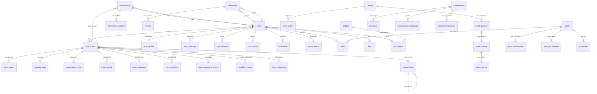

# Database Schema Overview

The Model Horse Hub database runs on **Supabase (PostgreSQL)** with Row Level Security on every table, across migrations 001–175.

For the exhaustive reference — every column, policy, RPC and trigger — see
[`.agents/MASTER_SUPABASE.md`](../../.agents/MASTER_SUPABASE.md). This page is the map.

## Entity Relationship Diagram

```mermaid
erDiagram
    users ||--o{ user_horses : "owns"
    users ||--o| artist_profiles : "has studio"
    users ||--o{ user_collections : "organizes"
    users ||--o{ user_wishlists : "wants"
    users ||--o{ user_follows : "follows"
    users ||--o{ notifications : "receives"
    users ||--o{ activity_events : "generates"
    users ||--o{ posts : "authors"
    users ||--o{ likes : "likes"
    users ||--o{ user_badges : "earns"

    user_horses ||--o{ horse_images : "has photos"
    user_horses ||--o| financial_vault : "has vault"
    user_horses ||--o{ customization_logs : "has work"
    user_horses ||--o{ show_records : "competed in"
    user_horses ||--o| horse_pedigrees : "has lineage"
    user_horses ||--o{ horse_transfers : "transferred"
    user_horses ||--o{ horse_ownership_history : "owned by"
    user_horses ||--o{ condition_history : "condition changed"
    user_horses }o--o{ horse_collections : "belongs to"
    user_horses }o--o| catalog_items : "references"

    catalog_items ||--o{ catalog_items : "parent/child"

    commissions }o--|| users : "artist"
    commissions }o--o| users : "client"
    commissions ||--o{ commission_updates : "has updates"
    commissions }o--o| user_horses : "linked horse"

    transactions }o--|| users : "party A"
    transactions }o--o| users : "party B"
    transactions ||--o{ reviews : "has reviews"

    events ||--o{ event_divisions : "has divisions"
    event_divisions ||--o{ event_classes : "has classes"
    event_classes ||--o{ event_entries : "has entries"
    events ||--o{ event_judges : "judged by"

    groups ||--o{ group_memberships : "has members"
    groups ||--o{ barn_join_requests : "at the gate"
    groups ||--o{ group_files : "has files"
    groups ||--o{ posts : "has posts"

    conversations ||--o{ messages : "transcript"
    conversations ||--o{ conversation_participants : "parties"
    conversations ||--o{ payment_installments : "time payments"

    badges ||--o{ user_badges : "awarded as"
```

## Table Groups

### Core (Inventory & Identity)

| Table | Purpose | Key Columns |
|-------|---------|-------------|
| `users` | User accounts (synced from Supabase Auth) | `alias_name`, `bio`, `avatar_url`, `pref_simple_mode`, `currency_symbol`, `show_badges`, `watermark_photos` (on by default), `watermark_text`, `is_suspended` (148), `is_supporter` (142), `profile_customization` JSONB (171). **No table-level SELECT grant since migration 133** — public columns are granted one at a time |
| `user_horses` | The central model — every horse in every stable | `owner_id`, `catalog_id`, `custom_name`, `finish_type`, `condition_grade`, `trade_status`, `life_stage`, `is_public` |
| `horse_images` | Photos attached to horses (5 LSQ angles + extras) | `horse_id`, `image_url`, `angle_profile` |
| `financial_vault` | Private financial data (purchase price, value) | `horse_id`, `purchase_price`, `estimated_current_value` — **never queried on public routes** |
| `catalog_items` | Universal reference catalog (~10,900+ entries) | `item_type` (polymorphic: mold, release, resin, tack, micro_mini, medallion, prop, diorama), `parent_id`, `maker`, `scale`, `attributes` (JSONB: `model_number`, `color_description`, `cast_medium`, `release_year_start`, `material`) |
| `user_collections` | Named collections for organizing horses | `user_id`, `name`, `is_public` |
| `horse_collections` | Many-to-many junction: horses ↔ collections | `horse_id`, `collection_id` |

### Provenance (Hoofprint)

| Table | Purpose | Key Columns |
|-------|---------|-------------|
| `horse_ownership_history` | Chain of ownership (immutable) | `horse_id`, `owner_id`, `owner_alias`, `acquisition_type`, `sale_price`, `is_price_public` |
| `condition_history` | Condition grade change log | `horse_id`, `old_condition`, `new_condition`, `changed_by` |
| `customization_logs` | Artist work records | `horse_id`, `work_type`, `artist_alias`, `materials_used`, `image_urls` |
| `horse_pedigrees` | Sire/dam lineage | `horse_id`, `sire_name`, `dam_name`, `sire_id`, `dam_id` |
| `show_records` | Competition results | `horse_id`, `show_name`, `placing`, `is_nan_qualifying` |
| `horse_transfers` | Transfer codes and claims | `horse_id`, `sender_id`, `transfer_code`, `status` |

### Social

| Table | Purpose | Key Columns |
|-------|---------|-------------|
| `posts` | Universal posts, and **the spine of The Paddock** | `author_id`, `parent_id` (reply), `horse_id`, `group_id`, `event_id`, `title`/`bumped_at` (122), `kind` (`user`/`show_results`/`audit`) + `visibility` (`public`/`followers`) — both 166 |
| `likes` | Likes on posts and horses | `user_id`, `post_id`, `horse_id` |
| `user_follows` | Follow relationships | `follower_id`, `following_id` |
| `activity_events` | Legacy activity feed — **read-only**, interleaved into the stream so pre-166 history survives | `actor_id`, `event_type`, `metadata` (JSONB) |
| `notifications` | User notifications | `user_id`, `type`, `actor_id`, `content`, `is_read`, `link_url` (same-origin-guarded before use) |
| `announcements` | Site-wide banner (165) | `message`, `link_url`, `placement`, `starts_at`/`ends_at`. Live rows are world-readable; **no write policies at all** — service role only |
| `user_blocks` | Block relationships. `are_blocked()` (173) checks **both** directions | `blocker_id`, `blocked_id` |

### Messaging & the Deal Room

| Table | Purpose | Key Columns |
|-------|---------|-------------|
| `conversations` | Thread header — a plain DM and a deal are the same row | `buyer_id`/`seller_id` (historical names: the two parties), `horse_id`, `last_message_*` (173), `deal_terms` JSONB (the signed contract boxes), `deal_kind`, `disputed_at`/`dispute_reason`/`disputed_by` |
| `messages` | The mixed transcript | `conversation_id`, `sender_id`, `content`, `kind` (14 values), `payload` JSONB, `edited_at`, `deleted_at`. Non-`chat` kinds are **immutable by trigger** — that is what makes the evidence pack worth anything |
| `conversation_participants` | One row per person per thread (173) | PK `(conversation_id, user_id)`, `role`, `party` (a/b), `last_read_at` (monotonic), `muted`, `archived` |
| `payment_installments` | The time-payment ledger (173) | `conversation_id`, `seq` (unique per thread), `amount`, `due_date`, `marked_sent_at`/`_by`, `confirmed_at`/`_by`. A confirmed row is final |

### Object Metrics (175)

| Table | Purpose | Key Columns |
|-------|---------|-------------|
| `object_view_daily` | Permanent per-object rollup — **no viewer column, by design** | PK `(entity_type, entity_id, day)`, `views`, `unique_viewers` |
| `site_activity_daily` | Per-day site totals | PK `day`, `member_dau`, `anon_dau`, `views` |
| `object_view_scratch` | Daily dedupe only. `viewer_hash` = sha256(salt + UTC date + id/IP+UA); **purged nightly** by `cleanup_system_garbage()` | PK `(viewer_hash, entity_type, entity_id, day)` |

All three have RLS enabled with **zero policies** and `REVOKE ALL FROM anon, authenticated` —
reachable only through `record_object_view()` and the admin RPCs.

### Commerce

| Table | Purpose | Key Columns |
|-------|---------|-------------|
| `transactions` | Safe-Trade state machine | `party_a_id`, `party_b_id`, `status`, `offer_amount`, `paid_at`, `verified_at` |
| `reviews` | Post-transaction reviews | `transaction_id`, `reviewer_id`, `target_id`, `stars` |
| `user_wishlists` | Wishlist items | `user_id`, `catalog_id`, `notes` |
| `horse_favorites` | Favorited horses | `user_id`, `horse_id` |

### Art Studio

| Table | Purpose | Key Columns |
|-------|---------|-------------|
| `artist_profiles` | Studio pages | `user_id`, `studio_name`, `studio_slug`, `status`, `specialties`, `mediums`, plus the 8 structured terms fields and `services` JSONB (170) |
| `commissions` | The commission pipeline | `artist_id`, `client_id`, `status` (`requested→quoted→accepted→in_progress→awaiting_approval→completed→delivered`), `agreed_price`, `terms_snapshot` JSONB (frozen at acceptance), `revisions_used`/`revisions_included`, stage timestamps, payment marks (170) |
| `commission_updates` | WIP photos, messages, milestones | `commission_id`, `update_type`, `image_urls`, `old_status`, `new_status` |
| `customization_logs` | Artist work records — and the join back to the artist | `horse_id`, `commission_id` (unique where set), `artist_user_id`, `work_type`, `image_urls` (170) |

### Competition

| Table | Purpose | Key Columns |
|-------|---------|-------------|
| `shows` → `show_divisions` → `show_sections` → `show_classes` → `show_class_entries` | The first-class competition domain (117+) | See `.agents/MASTER_SUPABASE.md` |
| `show_placings`, `show_callbacks`, `qualification_cards` | Results, champion ladder, bearer-token cards | |
| `horse_titles`, `exhibitor_distinctions` (159) · `horse_career`, `exhibitor_career` (163) | The titles engine and the point-total ledgers | |
| `show_barred_entrants`, `horse_documents` (148) · `show_fee_payments` (139) · `external_shows` (143) | Shows v4 moderation, entry paperwork, the host fee checklist, and the community-submitted `/calendar` | |
| `events` | **Now listing pages for happenings outside MHH.** Creating `live_show`/`photo_show` is removed and server-guarded; 168 widened the type CHECK to add `external_show` and `club` | `title`, `event_type`, `status`, `created_by`, `starts_at` |
| `event_divisions` · `event_classes` · `event_entries` · `event_judges` | The legacy photo-show engine. **Still live** — it serves real entrants and `LegacyShowPage` renders it. Deletable only after a data migration | |

### Community — "Barns"

> Groups are called **Barns** in user-facing copy. The tables kept their names.

| Table | Purpose | Key Columns |
|-------|---------|-------------|
| `groups` | Barns | `name`, `description`, `created_by`, `slug`, `is_private` (canonical since 167, trigger-synced to legacy `visibility`) |
| `group_memberships` | Barn membership | `group_id`, `user_id`, `role` |
| `barn_join_requests` | The "At the Gate" queue for private barns (167) | PK `(group_id, user_id)`, `message`, `status`, `decided_at`, `decided_by` |
| `group_files` | Shared files (private `group-files` bucket) | `group_id`, `uploaded_by`, `file_url` |
| `group_channels` · `group_last_read` | Notice Board channels and per-user unread state | |

### Platform

| Table | Purpose | Key Columns |
|-------|---------|-------------|
| `contact_messages` | Contact form submissions | `email`, `subject`, `message` |
| `beta_feedback` | Beta user feedback | `user_id`, `content` |
| `rate_limits` | Rate limiting state (RLS enabled, no user policies — accessed via SECURITY DEFINER RPCs only) | `identifier`, `endpoint`, `attempts` |
| `featured_horses` | Admin-featured horses | `horse_id`, `title` |
| `badges` | Achievement definitions | `slug`, `name`, `description`, `category`, `tier` |
| `user_badges` | Earned achievements | `user_id`, `badge_id`, `awarded_at` |
| `user_reports` | Content moderation reports | `reporter_id`, `reported_id`, `reason` |

### Catalog Curation (V32)

| Table | Purpose | Key Columns |
|-------|---------|-------------|
| `catalog_suggestions` | Community-submitted catalog edits, additions, removals, photos | `user_id`, `catalog_item_id`, `suggestion_type`, `field_changes` (JSONB), `reason`, `status`, `upvotes`, `downvotes` |
| `catalog_suggestion_votes` | Votes on suggestions (unique per user per suggestion) | `suggestion_id`, `user_id`, `vote_type` (up/down) |
| `catalog_suggestion_comments` | Discussion threads on suggestions | `suggestion_id`, `user_id`, `user_alias`, `body` |
| `catalog_changelog` | Public log of approved catalog changes | `suggestion_id`, `catalog_item_id`, `change_type`, `change_summary`, `contributed_by`, `contributor_alias` |

**Curator columns on `users`:** `approved_suggestions_count` (int), `is_trusted_curator` (bool, set at 50+ approvals).

**Auto-approve tiers:**
- **Silver (50+ approved):** Auto-approves corrections to the `attributes` keys `color_description`, `release_year_start`, `production_run`, `release_date` (these are the raw attribute keys `SuggestEditModal` emits — see `src/lib/catalog/corrections.ts`)
- **Gold (200+ approved):** Auto-approves all correction suggestions
- Additions and removals always require admin review

**Applying corrections:** approved attribute corrections merge into the `catalog_items.attributes` JSONB (never top-level columns) via `src/lib/catalog/corrections.ts`. Recognized attribute keys: `color_description`, `model_number`, `cast_medium`, `release_year_start`, `production_run`, `release_date`, `material`. Real columns handled separately: `title`, `maker`, `scale`, `item_type`, `parent_id`.

## Views

| View | Type | Purpose | Refresh | Security |
|------|------|---------|---------|---------|
| `v_horse_hoofprint` | Regular VIEW | Union of the provenance source tables into a chronological timeline; migration 159 added a titles branch | Real-time | `security_invoker = true` |
| `mv_market_prices` | MATERIALIZED VIEW | Aggregated sale prices by catalog item, finish type, and life stage | Daily cron (06:00 UTC) | `authenticated` only; anon reads via `get_market_rows()` RPC (migration 126) |
| `mv_trusted_sellers` | MATERIALIZED VIEW | Sellers past 60 days with ≥5 distinct buyers and ≥3 reviews averaging ≥4.8. **Rebuilt in 169** — see [Materialized Views](materialized-views.md) for why it was empty for 68 migrations | Daily cron | `authenticated, anon` |
| `discover_users_view` | Regular VIEW | Backs **Members** (`/discover`). Profiles with horse counts and ratings; excludes test, non-active and (since 169) suspended accounts | Real-time | `security_invoker = true` |
| `v_artist_finished_horses` | Regular VIEW | The Art Studio receipts wall — finished horses joined to their show records and titles (170) | Real-time | `security_invoker = true` |

## Key Patterns

- **Polymorphic catalog:** `catalog_items.item_type` distinguishes molds, releases, resins, tack, etc. `parent_id` links releases to molds. Filter dropdowns (maker / scale / material) are served in one round-trip by the `get_catalog_facets()` RPC (migration 125; `materials` added 128).
- **Event-sourced provenance:** The Hoofprint timeline is never written directly — it's assembled from immutable source tables via `v_horse_hoofprint`.
- **Soft delete:** Records referenced by other tables use tombstone deletion (set `is_tombstone = true`) rather than hard DELETE.
- **RLS everywhere:** Every table has Row Level Security policies. See [RLS Policies](rls-policies.md) for the full inventory.
- **Security invoker views:** All views use `security_invoker = true` so they respect the calling user's RLS policies.
- **Hardened SECURITY DEFINER functions:** Every SECURITY DEFINER RPC pins its `search_path` and fully qualifies table references (`public.table_name`). Migration 149 swept the stragglers.
- **Column grants on `users`:** migration 133 revoked table-level SELECT. A new publicly-readable column needs its own `GRANT SELECT (col) ... TO anon, authenticated` — otherwise anon pages render "Unknown" for it.
- **Anon read paths are RPCs, not policies:** the logged-out market, passport, cards and record surfaces go through `SECURITY DEFINER` functions (`get_market_listings`, `get_public_passport`, `get_public_horse_cards`, `get_public_horse_records`, `get_public_aliases`) so the exposed shape is written down in one place instead of inferred from a policy.
- **Objects, not people:** the metrics tables have no viewer column. The per-viewer marker needed to count uniques is a salted daily hash in a scratch table that is purged every night.
- **Guard triggers bypass service context:** any `BEFORE UPDATE` guard enforcing per-user rules must return early when `auth.uid()` IS NULL, or the migration's own backfill will trip it.
- **Extensions schema:** `pg_trgm` lives in the `extensions` schema, not `public`, to avoid API exposure.
- **InitPlan optimization:** All RLS policies wrap `auth.uid()` in `(SELECT auth.uid())` for per-query evaluation.

---

**Next:** [RLS Policies](rls-policies.md) · [Migrations](migrations.md) · [Full schema reference](../../.agents/MASTER_SUPABASE.md)
