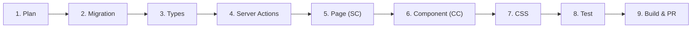

# Adding a Feature (End-to-End)

This guide walks through adding a complete feature to Model Horse Hub, from database to UI.

## Feature Workflow



## Step-by-Step

### 1. Plan the Feature

Before writing code:
- Define the data model (what tables/columns are needed?)
- Identify the user flows (who does what, when?)
- Check existing patterns for similar features (see [Component Patterns](../components/patterns.md))

### 2. Create a Database Migration

If the feature needs schema changes:

```bash
# Create a new migration file
# Use the next sequential number (check docs/database/migrations.md for current count)
```

Create `supabase/migrations/NNN_feature_name.sql`:

```sql
-- Migration NNN: Feature Name
-- Brief description of what this migration does

CREATE TABLE IF NOT EXISTS my_feature (
    id UUID PRIMARY KEY DEFAULT gen_random_uuid(),
    user_id UUID NOT NULL REFERENCES auth.users(id) ON DELETE CASCADE,
    -- columns...
    created_at TIMESTAMPTZ NOT NULL DEFAULT now()
);

-- ALWAYS add RLS
ALTER TABLE my_feature ENABLE ROW LEVEL SECURITY;

-- Standard owner-access policies
CREATE POLICY "select_own" ON my_feature FOR SELECT
  USING (user_id = (SELECT auth.uid()));

CREATE POLICY "insert_own" ON my_feature FOR INSERT
  WITH CHECK (user_id = (SELECT auth.uid()));

CREATE POLICY "update_own" ON my_feature FOR UPDATE
  USING (user_id = (SELECT auth.uid()));

CREATE POLICY "delete_own" ON my_feature FOR DELETE
  USING (user_id = (SELECT auth.uid()));

-- Add indexes for FK columns
CREATE INDEX IF NOT EXISTS idx_my_feature_user_id ON my_feature(user_id);
```

See [Adding a Migration](adding-a-migration.md) for the full guide.

### 3. Update TypeScript Types

Add or update interfaces in `src/lib/types/database.ts`:

```typescript
export interface MyFeature {
    id: string;
    userId: string;
    // fields...
    createdAt: string;
}
```

If adding to the `Database` interface for typed Supabase queries:

```typescript
my_feature: {
    Row: MyFeature;
    Insert: Omit<MyFeature, "id" | "createdAt"> & {
        id?: string;
        createdAt?: string;
    };
    Update: Partial<Omit<MyFeature, "id">>;
    Relationships: [];
};
```

### 4. Create Server Actions

Create `src/app/actions/my-feature.ts`:

```typescript
"use server";

import { requireAuth } from "@/lib/auth";
import { createClient } from "@/lib/supabase/server";
import { revalidatePath } from "next/cache";
import { after } from "next/server";

export async function createMyFeature(data: {
    field: string;
}): Promise<{ success: boolean; error?: string; data?: { id: string } }> {
    const { supabase, user } = await requireAuth();

    const { data: result, error } = await supabase
        .from("my_feature")
        .insert({
            user_id: user.id,
            field: data.field,
        })
        .select("id")
        .single();

    if (error) return { success: false, error: error.message };

    // Revalidate affected pages
    revalidatePath("/my-feature");

    // Deferred: non-blocking side effects
    after(async () => {
        // Notifications, activity events, achievement evaluation
    });

    return { success: true, data: { id: (result as { id: string }).id } };
}

export async function getMyFeatures(): Promise<MyFeature[]> {
    const { supabase, user } = await requireAuth();

    const { data } = await supabase
        .from("my_feature")
        .select("*")
        .eq("user_id", user.id)
        .order("created_at", { ascending: false });

    return (data ?? []) as MyFeature[];
}
```

**Key rules:**
- Always use `requireAuth()` for mutations
- Always return `{ success, error?, data? }`
- Use `revalidatePath()` after mutations
- Put notifications/events in `after()` blocks

### 5. Create the Page (Server Component)

Create `src/app/my-feature/page.tsx`:

```tsx
import { getMyFeatures } from "@/app/actions/my-feature";
import MyFeatureClient from "@/components/MyFeatureClient";

export default async function MyFeaturePage() {
    const features = await getMyFeatures();

    return (
        <main className="page-container" style={{ padding: "var(--space-2xl) 0" }}>
            <h1>My Feature</h1>
            <MyFeatureClient features={features} />
        </main>
    );
}
```

### 6. Create the Client Component

Create `src/components/MyFeatureClient.tsx`:

```tsx
"use client";

import { useState } from "react";
import { createMyFeature } from "@/app/actions/my-feature";
import styles from "./MyFeatureClient.module.css";

interface Props {
    features: MyFeature[];
}

export default function MyFeatureClient({ features }: Props) {
    const [loading, setLoading] = useState(false);
    const [error, setError] = useState("");

    async function handleCreate() {
        setLoading(true);
        setError("");
        const result = await createMyFeature({ field: "value" });
        if (!result.success) {
            setError(result.error || "Something went wrong.");
        }
        setLoading(false);
    }

    return (
        <div className={styles.container}>
            {error && <p className="form-error">{error}</p>}
            <button className="btn btn-primary" onClick={handleCreate} disabled={loading}>
                {loading ? "Creating..." : "Create"}
            </button>
            {features.map(f => (
                <div key={f.id} className="card">
                    {/* Feature content */}
                </div>
            ))}
        </div>
    );
}
```

### 7. Add CSS Module

Create `src/components/MyFeatureClient.module.css`:

```css
.container {
    display: flex;
    flex-direction: column;
    gap: var(--space-lg);
}

/* Use design tokens, never hard-code colors */
.featureCard {
    background: var(--color-bg-card);
    border: 1px solid var(--color-border);
    border-radius: var(--radius-lg);
    padding: var(--space-xl);
}
```

See [CSS Conventions](css-conventions.md) for the rules.

### 8. Write Tests

**Unit test** (`__tests__/my-feature.test.ts`):

```typescript
import { describe, it, expect, vi } from "vitest";

describe("MyFeature", () => {
    it("should create a feature", async () => {
        // Mock supabase, test business logic
    });
});
```

**E2E test** (`e2e/my-feature.spec.ts`):

```typescript
import { test, expect } from "@playwright/test";

test("user can create a feature", async ({ page }) => {
    // Login, navigate, interact, assert
});
```

See [Testing](testing.md) for the full guide.

### 9. Build & Verify

```bash
# Build to check for errors
npm run build

# Run unit tests
npm run test

# Run E2E tests
npm run test:e2e
```

## Checklist

- [ ] Migration has RLS policies on all new tables
- [ ] Migration has indexes on FK columns
- [ ] TypeScript types updated in `database.ts`
- [ ] Server actions use `requireAuth()` for mutations
- [ ] Server actions return `{ success, error?, data? }`
- [ ] `revalidatePath()` called after mutations
- [ ] Side effects in `after()` blocks
- [ ] Client component uses CSS Module (not inline styles)
- [ ] CSS uses design tokens (not hard-coded colors)
- [ ] Build passes (`npm run build`)
- [ ] No sensitive data exposed in public-facing pages

---

**Next:** [Adding a Migration](adding-a-migration.md) · [CSS Conventions](css-conventions.md)
