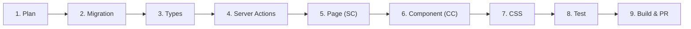

# Adding a Feature (End-to-End)

This guide walks through adding a complete feature to Model Horse Hub, from database to UI.

## Feature Workflow


```mermaid
graph LR
    A["1. Plan"] --> B["2. Migration"]
    B --> C["3. Types"]
    C --> D["4. Server Actions"]
    D --> E["5. Page (SC)"]
    E --> F["6. Component (CC)"]
    F --> G["7. CSS"]
    G --> H["8. Test"]
    H --> I["9. Build & PR"]
```

## Step-by-Step

### 1. Plan the Feature

Before writing code:
- Define the data model (what tables/columns are needed?)
- Identify the user flows (who does what, when?)
- Check existing patterns for similar features (see [Component Patterns](../components/patterns.md))

### 2. Create a Database Migration

If the feature needs schema changes:

```bash
# Create a new migration file
# Use the next sequential number (check docs/database/migrations.md for current count)
```

Create `supabase/migrations/NNN_feature_name.sql`:

```sql
-- Migration NNN: Feature Name
-- Brief description of what this migration does

CREATE TABLE IF NOT EXISTS my_feature (
    id UUID PRIMARY KEY DEFAULT gen_random_uuid(),
    user_id UUID NOT NULL REFERENCES auth.users(id) ON DELETE CASCADE,
    -- columns...
    created_at TIMESTAMPTZ NOT NULL DEFAULT now()
);

-- ALWAYS add RLS
ALTER TABLE my_feature ENABLE ROW LEVEL SECURITY;

-- Standard owner-access policies
CREATE POLICY "select_own" ON my_feature FOR SELECT
  USING (user_id = (SELECT auth.uid()));

CREATE POLICY "insert_own" ON my_feature FOR INSERT
  WITH CHECK (user_id = (SELECT auth.uid()));

CREATE POLICY "update_own" ON my_feature FOR UPDATE
  USING (user_id = (SELECT auth.uid()));

CREATE POLICY "delete_own" ON my_feature FOR DELETE
  USING (user_id = (SELECT auth.uid()));

-- Add indexes for FK columns
CREATE INDEX IF NOT EXISTS idx_my_feature_user_id ON my_feature(user_id);
```

See [Adding a Migration](adding-a-migration.md) for the full guide.

### 2a. Feature-detect the schema

Migrations are **pasted by hand** by the owner, which means your app code will be deployed and
running against a database that does not have the new columns yet. Every read and write path for
a new migration must work on **both** shapes of the schema — the old one behaving exactly as it
does today, the new one lighting up the feature.

Probe once per process, memoise behind a short TTL, and degrade rather than throw:

```typescript
// src/lib/<domain>/columnSupport.ts
const TTL_MS = 60_000;   // after the paste, a running instance picks it up
                         // within a minute rather than needing a redeploy

export async function getColumnSupport(supabase: SupabaseClient) {
    if (cached && Date.now() - cachedAt < TTL_MS) return cached;
    try {
        const [kinds, participants] = await Promise.all([
            supabase.from("messages").select("kind").limit(1),
            supabase.from("conversation_participants").select("conversation_id").limit(1),
        ]);
        cached = { messageKinds: !kinds.error, participants: !participants.error };
    } catch {
        // Never let a probe failure take the surface down —
        // "columns absent" is the always-safe shape.
        cached = NONE;
    }
    cachedAt = Date.now();
    return cached;
}
```

| Symptom | PostgREST code |
|---|---|
| Column does not exist | `42703` |
| Relation/table does not exist | `42P01` |
| Function does not exist | `42883` |

Rules:

- **Absent is the safe shape.** A missing panel is fine; a thrown error on the inbox is not.
- **Hide, don't half-render.** Pre-migration, the terms panel and the payment ledger are absent
  rather than broken, and the metrics cards read "—".
- **TypeScript doesn't know yet either.** The generated types are regenerated only *after* the
  paste, so call sites use a narrow untyped escape hatch (`dealDb(client)`, `barnDb`,
  `metricsDb`) and every one of them handles the missing-schema codes above.
- Reference implementations: `src/lib/deals/columnSupport.ts`, `src/lib/studio/columnSupport.ts`,
  `src/lib/feed/columnSupport.ts`, `src/lib/metrics/db.ts`.

### 3. Update TypeScript Types

After creating a migration, regenerate the TypeScript types:

```bash
npm run gen-types
```

This updates `src/lib/types/database.generated.ts` with types matching the live database schema. All three Supabase clients (`createClient`, `getAdminClient`) are typed with the generated `Database` generic, so TypeScript will automatically infer correct types from your queries.

> **Do NOT** manually define database row interfaces. The generated types are the single source of truth.

### 4. Create Server Actions

Create `src/app/actions/my-feature.ts`:

```typescript
"use server";

import { requireAuth } from "@/lib/auth";
import { createClient } from "@/lib/supabase/server";
import { revalidatePath } from "next/cache";
import { after } from "next/server";

export async function createMyFeature(data: {
    field: string;
}): Promise<{ success: boolean; error?: string; data?: { id: string } }> {
    const { supabase, user } = await requireAuth();

    const { data: result, error } = await supabase
        .from("my_feature")
        .insert({
            user_id: user.id,
            field: data.field,
        })
        .select("id")
        .single();

    if (error) return { success: false, error: error.message };

    // Revalidate affected pages
    revalidatePath("/my-feature");

    // Deferred: non-blocking side effects
    after(async () => {
        // Notifications, activity events, achievement evaluation
    });

    return { success: true, data: { id: result.id } };
}

export async function getMyFeatures() {
    const { supabase, user } = await requireAuth();

    const { data } = await supabase
        .from("my_feature")
        .select("*")
        .eq("user_id", user.id)
        .order("created_at", { ascending: false });

    return data ?? [];
}
```

**Key rules:**
- Validate with **zod first**, before `requireAuth()` and before any side effect (Iron Law 7)
- Always use `requireAuth()` for mutations
- Always return `{ success, error?, data? }`
- Use `revalidatePath()` after mutations
- Put notifications/events in `after()` blocks
- Keep the action thin — business logic belongs in a pure, tested `src/lib/<domain>/` module that
  both the action (to enforce) and the UI (to render available moves) import, so they cannot drift
- **Never** use `as unknown as` casts on query results — let TypeScript infer types from the typed Supabase client
- For nullable fields, coerce with `?? "default"` when passing to components

### 5. Create the Page (Server Component)

Create `src/app/my-feature/page.tsx`:

```tsx
import { getMyFeatures } from "@/app/actions/my-feature";
import MyFeatureClient from "@/components/MyFeatureClient";
import { ExplorerLayout } from "@/components/layouts/ExplorerLayout";

export default async function MyFeaturePage() {
    const features = await getMyFeatures();

    return (
        <ExplorerLayout title="My Feature">
            <MyFeatureClient features={features} />
        </ExplorerLayout>
    );
}
```

> **Page containers:** Every page must use one of the 4 layout archetypes: `ExplorerLayout`, `ScrapbookLayout`, `CommandCenterLayout`, or `FocusLayout`. Custom container `<div>`s are forbidden.

### 6. Create the Client Component

Create `src/components/MyFeatureClient.tsx`:

```tsx
"use client";

import { useState } from "react";
import { createMyFeature } from "@/app/actions/my-feature";

interface Props {
    features: MyFeature[];
}

export default function MyFeatureClient({ features }: Props) {
    const [loading, setLoading] = useState(false);
    const [error, setError] = useState("");

    async function handleCreate() {
        setLoading(true);
        setError("");
        const result = await createMyFeature({ field: "value" });
        if (!result.success) {
            setError(result.error || "Something went wrong.");
        }
        setLoading(false);
    }

    return (
        <div className="space-y-4">
            {error && <p className="form-error">{error}</p>}
            <Button onClick={handleCreate} disabled={loading}>
                {loading ? "Creating..." : "Create"}
            </Button>
            {features.map(f => (
                <div key={f.id} className="rounded-lg border border-edge bg-card p-6 shadow-md">
                    {/* Feature content */}
                </div>
            ))}
        </div>
    );
}
```

### 7. Add Styles

Use Tailwind CSS v4 utility classes directly in JSX:

```tsx
export default function MyComponent() {
    return <div className="rounded-lg border border-edge bg-card p-6 shadow-md">
        <h2 className="text-lg font-bold text-ink">Hello</h2>
    </div>;
}
```

> **Convention:** CSS Modules have been fully eliminated. All styling uses Tailwind utility classes. See [Design System Guide](../guides/design-system.md).

### 8. Write Tests

**Unit test** (`__tests__/my-feature.test.ts`):

```typescript
import { describe, it, expect, vi } from "vitest";

describe("MyFeature", () => {
    it("should create a feature", async () => {
        // Mock supabase, test business logic
    });
});
```

**E2E test** (`e2e/my-feature.spec.ts`):

```typescript
import { test, expect } from "@playwright/test";

test("user can create a feature", async ({ page }) => {
    // Login, navigate, interact, assert
});
```

See [Testing](testing.md) for the full guide.

### 9. Build & Verify

```bash
# Build to check for errors
npm run build

# Run unit tests
npm run test

# Run E2E tests
npm run test:e2e
```

## Checklist

- [ ] Migration has RLS policies on all new tables
- [ ] Migration has indexes on FK columns
- [ ] Migration is re-runnable, and any guard trigger bypasses the service context
- [ ] **Every path feature-detects** — the feature is absent, not broken, before the paste
- [ ] Ran `npm run gen-types` to regenerate TypeScript types
- [ ] Server actions validate with zod before `requireAuth()`
- [ ] Server actions return `{ success, error?, data? }`
- [ ] Business logic lives in `src/lib/<domain>/` with unit tests, not inline in the action
- [ ] No `as unknown as` casts on Supabase query results
- [ ] Nullable fields coerced with `?? default` when needed
- [ ] `revalidatePath()` called after mutations
- [ ] Side effects in `after()` blocks
- [ ] Semantic tokens only — no raw hex, no `bg-white`, no `stone-*`
- [ ] **Lamplight and Simple Mode both work** (and night paper carries no ruling)
- [ ] Copy uses the room names — Registry, The Paddock, Show Ring, Barns, Members
- [ ] Build passes (`npm run build`)
- [ ] No sensitive data exposed in public-facing pages

---

**Next:** [Adding a Migration](adding-a-migration.md) · [CSS Conventions](css-conventions.md)
