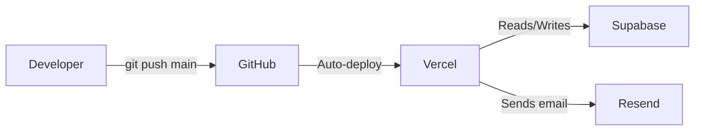

# Deployment Guide

Model Horse Hub is deployed on **Vercel** (frontend/backend) with **Supabase** (database, auth, storage).

## Architecture



## Vercel

### Hosting Tier

Currently on **Vercel Hobby tier** (free). Key limits:
- Serverless function execution: 10 seconds
- Bandwidth: 100 GB/month
- Builds: 6000 minutes/month

### Auto-Deploy

Every push to the `main` branch triggers an automatic deployment:

1. Vercel detects the push
2. Runs `npm run build` (Next.js production build)
3. Deploys static assets to CDN
4. Deploys serverless functions
5. Updates the production URL

### Environment Variables

Configure in **Vercel Dashboard → Settings → Environment Variables**:

| Variable | Purpose | Where to Get |
|----------|---------|--------------|
| `NEXT_PUBLIC_SUPABASE_URL` | Supabase project URL | Supabase Dashboard → Settings → API |
| `NEXT_PUBLIC_SUPABASE_ANON_KEY` | Supabase anon key (public) | Same location |
| `SUPABASE_SERVICE_ROLE_KEY` | Admin access (server-only) | Same location |
| `RESEND_API_KEY` | Email sending | Resend Dashboard |
| `CRON_SECRET` | Validates cron requests | Generate a random secret |

> ⚠️ **Never expose `SUPABASE_SERVICE_ROLE_KEY` client-side.** It bypasses all RLS.

### Cron Jobs

Configured in `vercel.json`:

```json
{
    "crons": [{
        "path": "/api/cron/refresh-market",
        "schedule": "0 6 * * *"
    }]
}
```

This refreshes the `mv_market_prices` materialized view daily at 6 AM UTC.

### Preview Deployments

Each pull request gets a unique preview URL. These use the same environment variables as production (configure per-environment in Vercel if needed).

## Supabase

### Database

- **PostgreSQL** with RLS on every table
- Migrations are applied manually via the Supabase Dashboard SQL Editor (no remote CLI yet)

### Applying Migrations to Production

1. Open **Supabase Dashboard → SQL Editor**
2. Paste the SQL content of the new migration file
3. Click **Run**
4. Verify the changes in the Table Editor

> **Important:** Always test migrations in the SQL Editor's preview mode first. There's no automatic rollback.

### Auth Configuration

Configured in **Supabase Dashboard → Authentication → Settings**:

| Setting | Value |
|---------|-------|
| Site URL | `https://your-production-url.vercel.app` |
| Redirect URLs | `https://your-production-url.vercel.app/api/auth/callback` |
| Email confirmations | Enabled |
| Password recovery | PKCE flow |

### Storage

- **`horse-images` bucket** → Private (signed URLs for access)
- Storage policies are set via migrations (not Dashboard)
- Max file size: configured in Supabase Dashboard → Storage → Settings

## Deployment Checklist

### Before Deploying

- [ ] `npm run build` passes locally
- [ ] `npm run test` passes
- [ ] No TypeScript errors
- [ ] New migrations applied to Supabase production
- [ ] Environment variables set in Vercel for any new secrets
- [ ] No secrets in committed code (check with `git diff`)

### After Deploying

- [ ] Verify the production site loads
- [ ] Spot-check key flows (login, add horse, navigate)
- [ ] Check Vercel Function Logs for errors
- [ ] Verify cron job runs (check next day)

## Rollback

Vercel keeps all previous deployments. To roll back:

1. Go to **Vercel Dashboard → Deployments**
2. Find the last working deployment
3. Click **•••** → **Promote to Production**

Database rollbacks require writing a compensating migration (see [Adding a Migration](adding-a-migration.md)).

## Monitoring

| What | Where |
|------|-------|
| Build logs | Vercel Dashboard → Deployments → [deployment] → Build Logs |
| Runtime errors | Vercel Dashboard → Logs (filter by "Error") |
| Database performance | Supabase Dashboard → Reports → Database |
| Auth issues | Supabase Dashboard → Authentication → Users |
| Storage usage | Supabase Dashboard → Storage |

---

**Next:** [Adding a Feature](adding-a-feature.md) · [Testing](testing.md)
