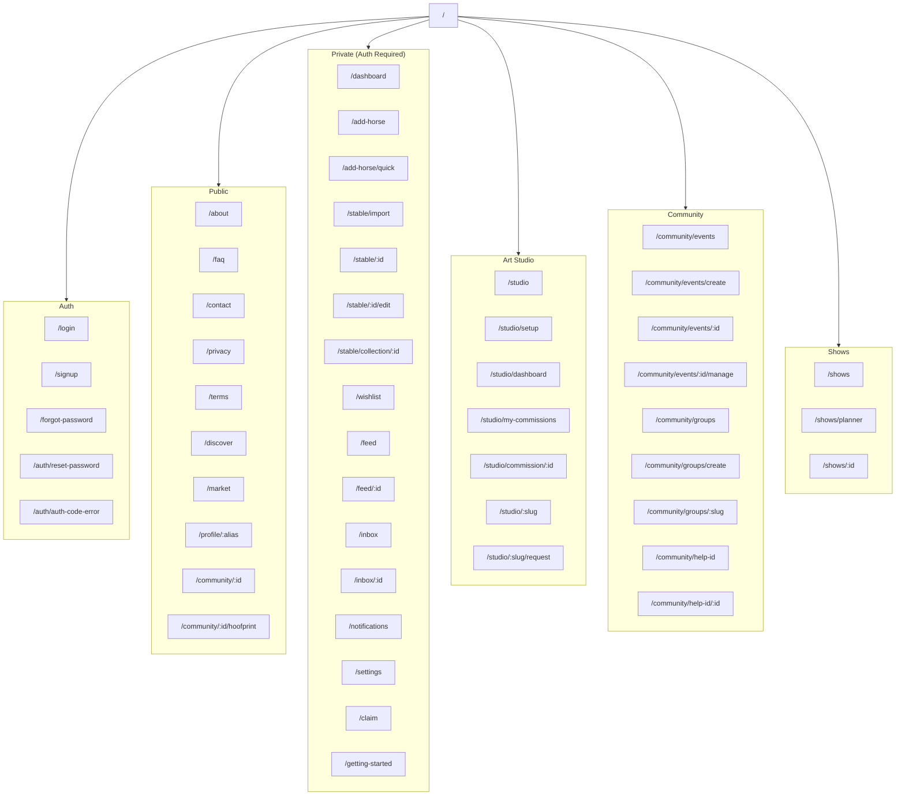

# Route Map

All 58 page routes in the Model Horse Hub application, organized by section.

## Route Diagram

## Route Reference

### Auth (5 routes)

| Path | Page | Auth | Notes |
|------|------|------|-------|
| `/login` | Login form | Public | Redirects to `/dashboard` if already logged in |
| `/signup` | Registration | Public | Requires email confirmation |
| `/forgot-password` | Password reset request | Public | Sends PKCE recovery email |
| `/auth/reset-password` | Password reset form | Recovery session | Redirected from email link |
| `/auth/auth-code-error` | Auth error display | Public | Shown when PKCE code exchange fails |

### Home & Public Pages (10 routes)

| Path | Page | Auth | Notes |
|------|------|------|-------|
| `/` | Dashboard (logged in) or Landing (logged out) | Both | Dual-purpose root route |
| `/about` | About page | Public | |
| `/faq` | FAQ | Public | |
| `/contact` | Contact form | Public | |
| `/privacy` | Privacy policy | Public | |
| `/terms` | Terms of service | Public | |
| `/discover` | User discovery grid | Public | Filterable by location, specialty |
| `/market` | Market price guide (Blue Book) | Public | Uses `mv_market_prices` materialized view |
| `/profile/[alias_name]` | Public user profile | Public | Shows stable (public horses only), badges, reviews |
| `/getting-started` | Getting started guide | Auth | Interactive onboarding |

### Stable & Inventory (7 routes)

| Path | Page | Auth | Notes |
|------|------|------|-------|
| `/dashboard` | Private dashboard | Auth | Stable overview widget, recent activity |
| `/add-horse` | Full add horse form | Auth | 5 LSQ photo slots + reference search |
| `/add-horse/quick` | Quick add form | Auth | Minimal fields for fast entry |
| `/stable/import` | CSV batch import | Auth | Parses CSV, previews, imports |
| `/stable/[id]` | Horse detail (private view) | Auth + Owner | Full detail with vault, editing |
| `/stable/[id]/edit` | Edit horse form | Auth + Owner | All fields editable |
| `/stable/collection/[id]` | Collection detail | Auth + Owner | Grid of horses in collection |

### Community & Social (11 routes)

| Path | Page | Auth | Notes |
|------|------|------|-------|
| `/community/[id]` | Public horse passport | Public | Public view of a horse |
| `/community/[id]/hoofprint` | Hoofprint™ timeline | Public | Provenance history from view |
| `/feed` | Activity feed | Auth | Posts from followed users |
| `/feed/[id]` | Single post + thread | Auth | Post detail with replies |
| `/inbox` | DM conversations | Auth | List of conversations |
| `/inbox/[id]` | Chat thread | Auth | Messages in a conversation |
| `/notifications` | Notifications | Auth | All notifications with mark-read |
| `/community/help-id` | Help ID requests | Public | Community model identification |
| `/community/help-id/[id]` | Help ID detail | Public | Single request with replies |
| `/community/groups` | Group browser | Auth | List of groups |
| `/community/groups/create` | Create group | Auth | |
| `/community/groups/[slug]` | Group detail | Auth | Posts, files, members |

### Art Studio (7 routes)

| Path | Page | Auth | Notes |
|------|------|------|-------|
| `/studio` | Artist browser | Public | Browse all artists |
| `/studio/setup` | Create/edit artist profile | Auth | |
| `/studio/dashboard` | Artist commission dashboard | Auth + Artist | Manage incoming commissions |
| `/studio/my-commissions` | Client commissions | Auth | View your sent commissions |
| `/studio/commission/[id]` | Commission detail | Auth + Participant | Timeline, status changes, WIP photos |
| `/studio/[slug]` | Public artist page | Public | Portfolio, queue, commission info |
| `/studio/[slug]/request` | Commission request form | Auth | Submit a new commission |

### Shows & Competition (3 routes)

| Path | Page | Auth | Notes |
|------|------|------|-------|
| `/shows` | Show browser | Auth | Browse photo shows |
| `/shows/planner` | Show planner | Auth | NAN dashboard widget |
| `/shows/[id]` | Show detail | Auth | Entries, voting, results |

### Events (4 routes)

| Path | Page | Auth | Notes |
|------|------|------|-------|
| `/community/events` | Event browser | Auth | Community events |
| `/community/events/create` | Create event | Auth | |
| `/community/events/[id]` | Event detail | Auth | RSVP, divisions, entries |
| `/community/events/[id]/manage` | Manage event | Auth + Creator | Judge assignment, results |

### Utility (3 routes)

| Path | Page | Auth | Notes |
|------|------|------|-------|
| `/wishlist` | Wishlist | Auth | Saved catalog items |
| `/settings` | Account settings | Auth | Profile, password, notifications, avatar, delete |
| `/claim` | Transfer claim | Auth | Enter 6-char transfer code |
| `/admin` | Admin dashboard | Auth + Admin | Stats, users, reports |

### Catalog (6 routes)

| Path | Page | Auth | Notes |
|------|------|------|-------|
| `/catalog` | Catalog browser | Public | Search, filter, sort, paginate 10,500+ entries |
| `/catalog/[id]` | Catalog item detail | Public | View all fields, suggest edit (auth required) |
| `/catalog/suggestions` | Suggestions list | Public | Filter by status, browse community proposals |
| `/catalog/suggestions/new` | Suggest new entry | Auth | Form to propose a missing model for the catalog (V33) |
| `/catalog/suggestions/[id]` | Suggestion detail | Public | Vote (auth), discuss (auth), admin review |
| `/catalog/changelog` | Public changelog | Public | Chronological feed of approved catalog changes |

## Route Totals

| Section | Routes |
|---------|--------|
| Auth | 5 |
| Public | 10 |
| Stable & Inventory | 7 |
| Community & Social | 12 |
| Art Studio | 7 |
| Shows & Competition | 3 |
| Events | 4 |
| Utility | 4 |
| Catalog | 6 |
| **Total** | **58** |

---

**Next:** [Server Actions](../api/server-actions.md) · [Component Catalog](../components/catalog.md)
