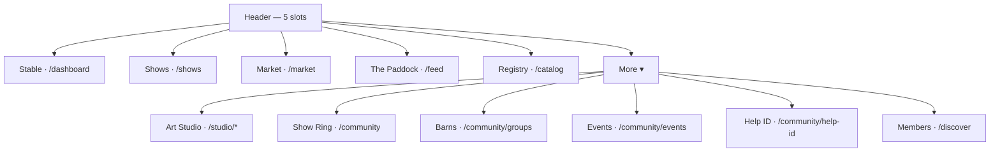

# Route Map

All **94 page routes**, organized by room. For the 18 API routes see [API Routes](../api/routes.md).

## The Five Rooms

`src/components/Header.tsx` caps the primary nav at five items with a hard `Math.min(…, 5)` —
the bar shows exactly these at any width, and only shrinks below five on narrow viewports.

```mermaid
graph TD
    Nav["Header — 5 slots"] --> Stable["Stable · /dashboard"]
    Nav --> Shows["Shows · /shows"]
    Nav --> Market["Market · /market"]
    Nav --> Paddock["The Paddock · /feed"]
    Nav --> Registry["Registry · /catalog"]
    Nav --> More["More ▾"]

    More --> Studio["Art Studio · /studio/*"]
    More --> Ring["Show Ring · /community"]
    More --> Barns["Barns · /community/groups"]
    More --> Events["Events · /community/events"]
    More --> HelpId["Help ID · /community/help-id"]
    More --> Members["Members · /discover"]
```

> **The copy and the routes disagree on purpose.** `/catalog` is called "Registry", `/feed` is
> "The Paddock", `/community` is the "Show Ring", `groups` are "Barns", `/discover` is
> "Members". Routes were never renamed — only the words the reader sees.

## Route Reference

### Auth (5 routes)

| Path | Page | Auth | Notes |
|------|------|------|-------|
| `/login` | Login form | Public | Redirects to `/dashboard` if already logged in |
| `/signup` | Registration | Public | Requires email confirmation |
| `/forgot-password` | Password reset request | Public | Sends PKCE recovery email |
| `/auth/reset-password` | Password reset form | Recovery session | Redirected from email link |
| `/auth/auth-code-error` | Auth error display | Public | Shown when PKCE code exchange fails |

### Home & Public Pages (12 routes)

| Path | Page | Auth | Notes |
|------|------|------|-------|
| `/` | Dashboard (logged in) or Landing (logged out) | Both | Dual-purpose root route |
| `/about` | About page | Public | |
| `/faq` | FAQ | Public | Describes only what a member can see today — no dark features |
| `/contact` | Contact form | Public | |
| `/privacy` | Privacy policy | Public | States plainly what object metrics count and that the dedupe token is deleted nightly |
| `/terms` | Terms of service | Public | |
| `/learn` | Learn index | Public | |
| `/learn/glossary` | Hobby glossary | Public | |
| `/learn/enter-your-first-photo-show` | Walkthrough | Public | |
| `/getting-started` | Getting started guide | Auth | Interactive onboarding |
| `/profile/[alias_name]` | Public profile | Public | Championship line, barns, for-sale strip. Tombstoned and suspended profiles are withheld |
| `/profile/customize` | Profile customization | Auth | Curated themes, banner, featured horses (migration 171) |

### 1. Stable (9 routes)

| Path | Page | Auth | Notes |
|------|------|------|-------|
| `/dashboard` | The Stable | Auth | Room 1. Faceted filters, saved views, summary rail |
| `/add-horse` | Full add-horse form | Auth | 5 LSQ photo slots + Registry search |
| `/add-horse/quick` | Quick add | Auth | Minimal fields for fast entry |
| `/stable/import` | CSV batch import | Auth | Parses, previews, imports |
| `/stable/[id]` | Horse detail (owner view) | Auth + Owner | Vault, condition ledger, "👁 N views this week" (owner only) |
| `/stable/[id]/edit` | Edit horse | Auth + Owner | |
| `/stable/collection/[id]` | Collection detail | Auth + Owner | |
| `/stable/deleted` | Recently Deleted | Auth | Restore a soft-deleted horse; names stashed under `attributes."mhh:deleted_name"` |
| `/favorites` | Favorited horses | Auth | |

### 2. Shows (16 routes)

| Path | Page | Auth | Notes |
|------|------|------|-------|
| `/shows` | Show browser | Public | Room 2 |
| `/shows/[id]` | Show page | Public | Falls back to `LegacyShowPage` for legacy `events`-engine shows |
| `/shows/[id]/results` | Public results | Public | No auth required — the acquisition surface |
| `/shows/[id]/class/[classId]` | Class room | Auth | |
| `/shows/[id]/placing/[entryId]` | Placing detail / share card | Public | |
| `/shows/host` | My hosted shows | Auth | |
| `/shows/host/[id]` | Host console | Auth + Staff | Classlist builder, entries, staff |
| `/shows/host/[id]/judge` | Judge queue | Auth + Judge | |
| `/shows/host/[id]/ring` | Live ring console | Auth + Staff | Leg-tag placing, offline retry queue |
| `/shows/host/[id]/ring/board` | Ring board | Auth + Staff | Spectator/announcer view |
| `/shows/planner` | Show Packer + NAN dashboard | Auth | |
| `/shows/rules` | Show rules reference | Public | |
| `/shows/v2/[id]` | Shows v2 direct link | Public | |
| `/calendar` | Show calendar | Public | Includes community-submitted `external_shows` (migration 143) |
| `/standings` | Season standings | Auth | **DARK** — 404s unless `NEXT_PUBLIC_SHOW_STANDINGS=1` |
| `/cards/[code]` | Qualification card verification | Public | Bearer token; card follows the horse on sale |

### 3. Market (4 routes)

| Path | Page | Auth | Notes |
|------|------|------|-------|
| `/market` | Marketplace front door | Public | Room 3. Provenance listing cards → the passport *is* the listing page. Anon browse via `get_market_listings` RPC; blocked sellers excluded |
| `/market/guide` | Blue Book | Public | Price guide from completed transactions |
| `/market/reports` | Purchase ledger | Auth | What you already bought; the report itself is generated from `/settings#insurance` |
| `/wishlist` | ISO / wishlist | Auth | |

### 4. The Paddock (2 routes)

| Path | Page | Auth | Notes |
|------|------|------|-------|
| `/feed` | The Paddock | Auth | Room 4. One stream, Everyone/Following, Show Ring door + preview strip, `PaddockRail` |
| `/feed/[id]` | Post permalink | Auth | Full card with comments |

### 5. Registry (6 routes)

| Path | Page | Auth | Notes |
|------|------|------|-------|
| `/catalog` | Registry browser | Public | Room 5. Search, filter, sort, paginate 10,900+ entries |
| `/catalog/[id]` | Registry item detail | Public | Suggest-edit requires auth |
| `/catalog/suggestions` | Suggestions list | Public | |
| `/catalog/suggestions/new` | Suggest a new entry | Auth | |
| `/catalog/suggestions/[id]` | Suggestion detail | Public | Vote + discuss (auth), admin review |
| `/catalog/changelog` | Public changelog | Public | Approved catalog changes |

### Reference pages — public SEO surface (3 routes)

| Path | Page | Auth | Notes |
|------|------|------|-------|
| `/reference` | Reference index | Public | Statically generated |
| `/reference/[maker]` | Maker hub | Public | |
| `/reference/[maker]/[slug]` | Release page | Public | `NEXT_PUBLIC_REFERENCE_PAGES` is an SEO kill-switch over URL emission + sitemap listing, not the pages themselves |

### Under More — Community (18 routes — the four barn rows below are eight files)

| Path | Page | Auth | Notes |
|------|------|------|-------|
| `/community` | Show Ring | Auth | Lives inside the Paddock conceptually; still routed at `/community` |
| `/community/[id]` | Horse passport | Public | Public view of a horse |
| `/community/[id]/hoofprint` | Hoofprint timeline | Public | Provenance from `v_horse_hoofprint` |
| `/community/groups` · `/community/barns` | Barn browser | Auth | Both paths serve the same page |
| `/community/groups/create` · `/community/barns/create` | Create a barn | Auth | |
| `/community/groups/[slug]` · `/community/barns/[slug]` | Barn | Auth (members for private) | Notice Board, members panel, At the Gate queue |
| `/community/groups/[slug]/thread/[postId]` · `/community/barns/[slug]/thread/[postId]` | Barn thread | Auth | |
| `/community/events` | Event browser | Auth | |
| `/community/events/create` | Create event | Auth | `live_show`/`photo_show` creation is removed and server-guarded |
| `/community/events/[id]` | Event page | Auth | RSVP, attendees, discussion, photos |
| `/community/events/[id]/manage` | Manage event | Auth + Creator | |
| `/community/help-id` | Help ID requests | Public | |
| `/community/help-id/[id]` | Help ID detail | Public | |
| `/discover` | **Members** | Public | Server-side directory: search + 3 sorts; suspended members excluded |

### Under More — Art Studio (7 routes)

| Path | Page | Auth | Notes |
|------|------|------|-------|
| `/studio` | Studio browser | Public | |
| `/studio/setup` | Create/edit studio | Auth | Structured terms + services |
| `/studio/dashboard` | Business dashboard | Auth + Artist | Board, income, receipts wall |
| `/studio/my-commissions` | Client commissions | Auth | |
| `/studio/commission/[id]` | Commission detail | Auth + Participant | Pipeline, quote, approvals, WIP |
| `/studio/[slug]` | Public studio page | Public | |
| `/studio/[slug]/request` | Commission request | Auth | |

### Messaging (3 routes)

| Path | Page | Auth | Notes |
|------|------|------|-------|
| `/inbox` | Threads | Auth | Unread/mute/archive from `conversation_participants` |
| `/inbox/[id]` | Thread — chat or Deal Room | Auth + Participant | Mixed transcript, contract boxes, installment ledger |
| `/inbox/[id]/record` | Evidence pack | Auth + Participant | PDF + plain text. *We are the record, not the referee* |

### Utility & Platform (9 routes)

| Path | Page | Auth | Notes |
|------|------|------|-------|
| `/settings` | Account settings | Auth | Ledger sections; `#insurance` anchor generates the report |
| `/notifications` | Notifications | Auth | The bell is a portal peek onto this page |
| `/claim` | Transfer claim | Auth | Enter the transfer code |
| `/upgrade` | Tier upgrade | Auth | Stripe checkout |
| `/photo/[slug]` | Friendly photo share URL | Public | OG/Twitter preview cards |
| `/admin` | Admin console | Auth + Admin | Pulse strip + 10 tabs — see [OPERATOR_PLAYBOOK.md](../OPERATOR_PLAYBOOK.md) |
| `/design` · `/design/feed` | Design prototypes | Auth | Internal — not linked from the nav |
| `/~offline` | PWA offline page | Public | Served by the Serwist service worker |

## Route Totals

| Section | Routes |
|---------|--------|
| Auth | 5 |
| Home & Public | 12 |
| Stable | 9 |
| Shows (incl. calendar, standings, cards) | 16 |
| Market | 4 |
| The Paddock | 2 |
| Registry | 6 |
| Reference (SEO) | 3 |
| Community (More) | 18 |
| Art Studio (More) | 7 |
| Messaging | 3 |
| Utility & Platform | 9 |
| **Total page routes** | **94** |

> The `/community/barns/*` aliases are counted individually — each is its own `page.tsx` file,
> which is why the Community table's 14 rows are 18 routes.

---

**Next:** [Server Actions](../api/server-actions.md) · [Component Catalog](../components/catalog.md)
